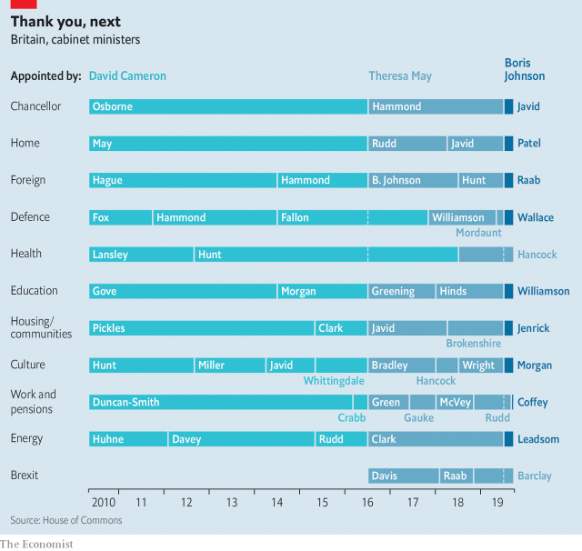

###### Out with the new

# Cabinet churn is disrupting Britain’s government 

> print-edition iconPrint edition | Britain | Sep 12th 2019 

AFTER AMBER RUDD quit the government on September 7th, Thérèse Coffey became the seventh work and pensions secretary in little more than three years. Since the 2016 referendum the cabinet has been churning, making it harder still to fix problems like Universal Credit (Ms Coffey’s task), scarce housing and rising knife crime. 

 

