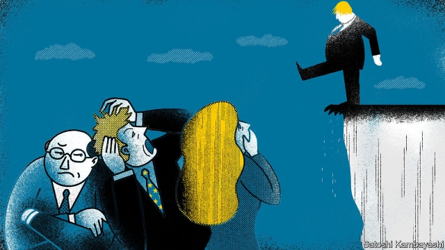

###### Watchers in the dark

# Europe ponders how to avoid blame for no-deal 

 

> print-edition iconPrint edition | Britain | Sep 12th 2019 

IT IS UNUSUAL for European diplomats to become obsessed with British constitutional niceties. But recently they have watched Westminster with rare attention—and growing concern. Some gloat over the chaos of Boris Johnson’s government, after it lost six Commons votes, its parliamentary majority, a clutch of Tory MPs and two ministers. Yet many are also alarmed by Mr Johnson’s bullheaded insistence on leaving the EU on October 31st, “do or die”, meaning deal or no-deal. 

One example concerns the new law requiring Mr Johnson to seek the EU’s agreement to extend the Brexit deadline rather than accept no-deal. His claim that he would rather be “dead in a ditch” than do this is seen as a threat to the rule of law. A second is the early suspension of Parliament, which many believe was done solely to avoid further scrutiny of the government by the legislature. On September 9th Scotland’s highest court seemed to endorse this view by ruling that Mr Johnson’s advice to the queen to suspend Parliament so that he could prepare a new legislative agenda was unlawful—in effect, accusing the prime minister of misleading the monarch. 

The government is appealing against the judgment to the Supreme Court, which will hear the case next week with appeals from similar cases in England and Northern Ireland. The English judgment was that suspension was a political not a justiciable issue, and the Supreme Court may well agree. Some lawyers suggest it could even endorse both judgments, because Scottish law differs from English law. 

Claims that Mr Johnson has misled the queen reverberate in Brussels. Next week marks 30 days since Mr Johnson met Germany’s Angela Merkel, who seemed to set this deadline for finding an alternative to the Irish backstop that the prime minister wants to excise from Theresa May’s withdrawal agreement. Yet no British proposal has been made. 

When Mr Johnson met Leo Varadkar in Dublin this week, he claimed to be working for a deal and called no-deal a “failure of statecraft”. His government’s “Yellowhammer” analysis of no-deal, published on September 11th, talks of possible food, fuel and medicine shortages, lorry tailbacks and the risk of civil disorder. But the taoiseach insisted that no backstop would mean no-deal, adding that it was impossible to replace a legal guarantee of no hard border in Ireland with a mere promise. 

Diplomats report that twice-weekly talks are now taking place with Mr Johnson’s EU adviser, David Frost. In late August there was even talk of adjusting the backstop by narrowing it to agrifoods or setting a time limit. The EU would also happily apply the backstop only to Northern Ireland, not the whole UK. A Northern Ireland-only backstop was originally in Mrs May’s deal. It was replaced by a UK-wide backstop because the Democratic Unionist Party, which propped up her majority, insisted on no new border checks in the Irish Sea. Since Mr Johnson now has no parliamentary majority, the DUP is in a weaker position. Some of Mr Johnson’s advisers want to revert to a Northern Ireland-only backstop. 

Yet the EU has hardened its position on Brexit, for three reasons. The first is that Mr Johnson has added new demands. He wants to drop promises to maintain a level playing field for regulations and distance Britain from future defence co-operation. These promises are in the political declaration about the future relationship, not the withdrawal agreement, but backing away from them still sends an unwelcome signal. The EU is clear that, without level-playing-field guarantees, it cannot offer a Canada-style free-trade deal to Britain for fear of being competitively undercut. 

Second is Mr Johnson’s loss of parliamentary control. Just as with Mrs May earlier this year, EU negotiators fret that any concession they may offer will still see the Brexit deal rejected in Westminster. They have noticed that MPs are better at saying what they are against than what they are for. They know many Tory MPs oppose Mrs May’s withdrawal agreement even without the backstop. And they see a rising prospect of an early election that Mr Johnson is by no means certain to win. 

Third is the law to force the prime minister to seek an extension if no deal is reached by October 19th. For all Mr Johnson’s threats to ignore it, EU leaders expect that, without an agreed deal, they will indeed be asked to extend the deadline. And although many are fed up with Brexit and would need a good reason for yet another extension, nobody is likely to veto one, if only because the EU wants to avoid any blame for no-deal. For the same reason, suggestions that Mr Johnson might scupper an extension by threatening to behave badly, refusing to nominate a commissioner or asking a friendly leader to block one, are unlikely to prove correct. If no-deal happens, the EU wants it to be clear that it is by British choice, not by necessity. 

A similar argument is heard against Mr Johnson’s repeated claims that the EU will give him what he wants only at the last minute if he credibly threatens no-deal. The EU does not function with a gun at its head, says one diplomat, adding that in this case the gun is anyway pointed at Mr Johnson himself. It is true that nobody wants no-deal, which would damage European exporters as well as Britain. But EU leaders value even more the interests of Ireland, the integrity of the single market and the laws underpinning it, and the need not to be seen giving in to bullying. 

What will happen when the European Council meets in Brussels on October 17th? It seems clear that there will not be a British election beforehand, so EU leaders know they will be facing Mr Johnson for the first (and, some hope, last) time. Some diplomats fear that he might produce a proposal only at the meeting in hopes of bouncing the summit into agreement rather than risk a no-deal outcome. Yet without proper preparation, summits are not good places to conduct detailed negotiations. Instead, the leaders are likely to offer to extend the October 31st deadline to the end of January—and then wait for an election. 

Mr Johnson’s team still insists Brexit will happen on October 31st. Yet a deal is a long way off. And Parliament’s intervention means a no-deal Brexit then also looks unlikely. The prime minister seems to want to fight an election in which he styles himself as the champion of the people against an anti-Brexit establishment, a category into which Brexiteers now lump the courts, along with Parliament, the civil service, the Bank of England and others. 

He may win on such a platform, although the polls are volatile. But if he does, he will face the same demands in Brussels. Only if he comes up with a credible, legal alternative to the Irish backstop that can pass in Westminster will he get a Brexit deal. It will still be a tall order. ■ 

