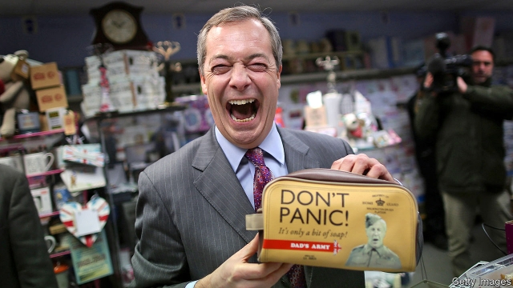

###### Divided they fall

# How pacts and tactical voting could sway the coming British election 

 

> print-edition iconPrint edition | Britain | Sep 12th 2019 

NIGEL FARAGE came bearing gifts. The Brexit Party, jogging along at about 14% in the polls, would step aside for the Conservatives in seats across the country, provided the Tories backed a no-deal exit from the European Union, he proposed. The price? The Conservatives would have to give Mr Farage’s party a free run at 80-90 seats in the Midlands and the north, where the Leave vote was strong but residual antipathy to the Tories is stronger. “Does Boris have the courage?” read the kicker of a wraparound advert by the Brexit Party on the front page of the Daily Express on September 11th. 

Downing Street quickly slapped down the idea. The Brexit Party leader and his ilk “should never be allowed anywhere near government”, declared one senior Tory source. Pacts in British politics tend to come to naught. Yet rumblings about a deal will continue until an election is called. The UK Independence Party, Mr Farage’s old outfit, came second in 120 constituencies in 2015, with 12.6% of the vote. If current polls bear out, the Brexit Party’s performance could determine the winner of the next election. 

The rarity of pacts in British politics is in some ways surprising. After all, they can work. In a by-election in Brecon and Radnorshire in August, a Liberal Democrat beat the Conservative candidate by 1,400 votes, after the Green Party and Plaid Cymru, which had won 3,000 votes between them in 2015, sat it out. The Brexit Party would have comfortably won a by-election in Peterborough in June if the Conservative Party had stood aside. Instead, Labour squeaked home by 683 votes. 

Political tie-ups do not come easily. MPs, aides and activists spend all day plotting against other parties. Asking them to work together for a few months before an election is not natural. Campaigners fear that sitting out one election will leave them playing catch-up in the next one. Mr Farage is heartily disliked by Dominic Cummings, chief adviser to the prime minister, who sees the Brexit Party leader as political kryptonite for middle-class voters. 

Pacts also come with big risks. First-past-the-post generously rewards the two largest parties, providing a big incentive for Labour and the Conservatives to stamp out smaller challengers, lest they end up usurping them. Nor is teaming up with another party risk-free for the smaller entity. After the Lib Dems entered a coalition with the Conservatives in 2010, voters rewarded them by kicking out all but eight of their 56 MPs at the next election. 

Party pride and political practicality leave tactical voting as the most viable way for parties to work together against a common enemy. In 1997, tactical voting by Labour and Lib Dem supporters cost the Conservatives about 30 seats, points out Peter Kellner, a pollster. This year, with polls predicting a close-run election, a handful of seats may determine the fate of the country. Well-organised campaigns that back staying in the EU are preparing a propaganda onslaught aimed at making Remain supporters back the right horse, just as Mr Farage is attempting to corral Leave voters into one camp. 

Not all in the Conservative Party are resistant to Mr Farage’s charms. The Brexit Party leader has already promised not to field candidates against the self-styled “Spartans”, Conservative MPs who opposed the Brexit deal all three times it was put before the Commons. The concern of those hardline Tory MPs is leaving the EU, rather than the electoral health of the Conservative Party—better a Brexit Party MP with their heart set on a “no-deal” Brexit than a Tory candidate who might compromise. An unofficial pact, with Conservative candidates playing dead in certain no-hope constituencies, is possible, suggest Tory aides. This would help the party to limit its loss of support among liberal Conservatives, who would blanch at a formal deal with the likes of Mr Farage. 

But parties that want a second referendum on Brexit, such as Labour and the Greens, or to cancel it altogether, like the Lib Dems, can do the same. This has happened before. In 2017, Labour and Lib Dem activists did not tread on each other’s toes in three marginal seats on the Sussex coast. The unofficial tactics worked: the Conservatives lost all of them. Britain is roughly equally split into two tribes, one which supported Brexit and one which opposed it. The outcome of the next election will be decided by which tribe can marshal its members in the most efficient way.■ 

