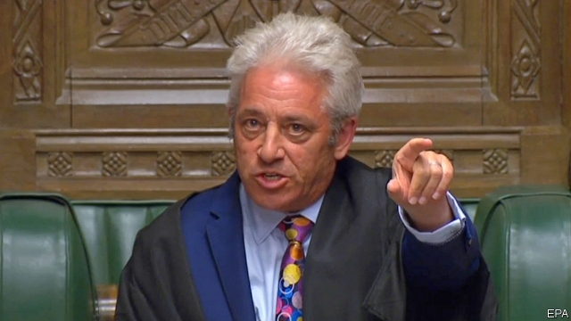

###### Speaker muted

# John Bercow is ousted—but the government will not choose his successor 

 

> print-edition iconPrint edition | Britain | Sep 14th 2019 

JOHN BERCOW was tearful when he announced his decision to retire on October 31st, or at a general election if that comes sooner. But as a connoisseur of political theatre he must have relished the rest of the day. MPs spent much of it singing his praises, sometimes in the most unctuous terms. Then at 2.30am, as Black Rod ceremonially prorogued Parliament, MPs tried to pin Mr Bercow to his chair, wielding placards saying “Silenced”. The Speaker reluctantly went along with the ceremony, but not before denouncing the prorogation as a constitutional abomination. Someone placed a “Silenced” placard on his empty chair. 

Mr Bercow has built up a following, at home and abroad, in his ten years in the Speaker’s chair, the longest stint since the war. A diminutive figure, he nonetheless dominated the House of Commons through force of personality and sheer lung-power. He enjoyed elongating words (“Orrrdurrr”), using Dickensian phrases (“chuntering from a sedentary position”) and calling on obscure MPs with odd names (“Mr Peter Bone!”). 

But he has been a divisive Speaker as well as a colourful one. He is accused of bullying his underlings and then, last year, frustrating an investigation into his behaviour (he denies wrongdoing). He has empowered MPs, creating chances for them to interrogate ministers; in his farewell speech he described himself as the “backbenchers’ backstop”. During the recent Brexit frenzy he stopped the government ramming its policies through the legislature. Yet his critics say he is an anti-Brexit partisan, willing to tear up precedent and ignore expert advice. Almost all the MPs who sang his praises this week belonged to the opposition. 

There is no doubt that Mr Bercow is a Remainer. But the accusation of left-wing bias is debatable. He was originally elected as a Tory. The theme of his speakership has been support for MPs, not for Labour. Before the referendum he championed the rights of pro-Brexit Tory backbenchers. This week’s ruling by the Scottish courts against proroguing Parliament lends independent support to his view of the matter. The problem is not Mr Bercow but the way the referendum is testing all Britain’s institutions. 

The Conservative Party is nonetheless so fed up with Mr Bercow that it intended to break with convention by contesting his seat, Buckingham (a safe Tory constituency), at the next election. His decision to retire not only deprives the Tories of the pleasure of taking his scalp. It also ensures that the job of appointing his successor will fall to this parliament, with its resurgent anti-government alliance, rather than the next. 

Nine candidates are vying to replace him, including Sir Lindsay Hoyle, his deputy, and Harriet Harman, the Mother of the House. Whoever wins must deal with the bullying and abuse that has plagued the House for so long and which Mr Bercow, for all his Brexit heroics, failed to tackle. 

