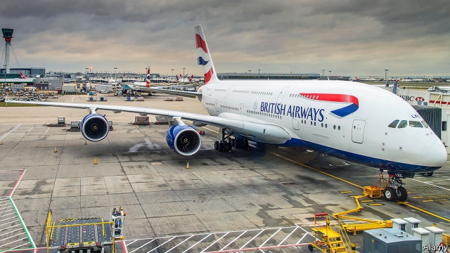
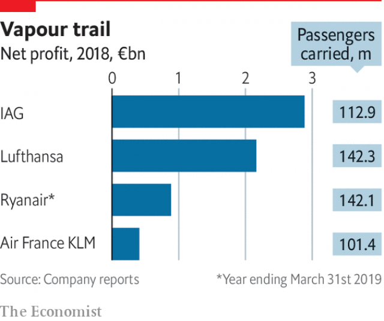

###### Labour pains

# What lies behind the strike that has grounded British Airways 

 

> print-edition iconPrint edition | Britain | Sep 12th 2019 

ON A NORMAL Monday morning Terminal 5, Heathrow airport’s busiest, is a hive of activity. Over 100,000 passengers arrive or leave for more than 150 destinations. But on September 9th its departure halls were almost completely abandoned. The only flights taking off were to Cairo, Madrid and Tokyo. The reason was a two-day strike by British Airways (BA) pilots and their union, the British Airline Pilots’ Association (BALPA). The walkout, which grounded almost 1,700 flights due to carry at least 280,000 people, was the first ever pilot strike at BA. BALPA threatens more—on September 27th and then other dates stretching until January. But far from showing the growing clout of pilots’ unions, their battle for better pay exposes their rapidly weakening position. 

At first glance, it would seem that BA’s pilots have little to complain about. In July they rejected a pay deal which would have increased their salaries by 11.5% over three years—more than average pay in Britain is forecast to rise over the period—and which would have taken the annual pay of a long-haul captain to over £200,000 ($248,000). 

But BALPA says its pilots also want a share of BA’s profits. During the last recession, in 2008-09, its members accepted a 2.6% pay cut and saw some extra allowances slashed when times were tough. So BALPA now says its pilots deserve to benefit from the carrier’s more recent success. After losing £531m in 2010, BA swallowed Aer Lingus, Iberia and Vueling, and since 2014 the combined group, IAG, has made more profit in absolute terms than any other European airline group. IAG’s announcement in February that it made record profits of €2.9bn ($3.2bn) last year was a red rag to BALPA’s bulls. 

 

BA’s refusal to budge on pay has puzzled analysts. BALPA claims the two sides were just £5m a year apart when the talks collapsed. BA claims the last-minute proposal BALPA put forward to avoid the strikes would have cost it £50m a year. But even that looks something of a bargain compared with the cost of the strikes. Alex Cruz, BA’s chief executive, has admitted that the cancelled flights will “punish the brand”. Damian Brewer, an airline analyst at RBC Capital Markets, estimates that each day of strikes will cost IAG €50m. 

BA is not the only airline with which BALPA is in dispute. Ryanair, Europe’s largest low-cost carrier, is also feeling its pilots’ new-found assertiveness keenly. In 2017 it was forced to recognise unions for the first time, after a shortage of pilots had forced it to cancel 20,000 flights that autumn. And this summer it has been hit by a long run of industrial action. Last month its British pilots called five days of strikes, and on September 4th they announced seven more days of walkouts. 

Yet the rapid growth of Europe’s airline industry, which created the shortage of pilots that unions are trying to exploit, is coming to an end. In each of the past four years global passenger numbers grew by 7% or more. But in the first half of 2019 the rate fell to around 3.5% because of slowing economic growth and the grounding of Boeing’s 737 MAX planes, due to safety problems. Ryanair and Norwegian, a low-cost rival, have now hired and trained too many pilots, and in Britain are trying to lay off hundreds of them. Several European airlines have gone bust over the past year, including WOW Air of Iceland, Flybmi of Britain and Primera Air of Latvia, leaving lots of pilots scrambling to find work. Last month Ryanair announced that pilot turnover had “dwindled to zero”—a clear sign that an employees’ market had become an employers’ one. 

Unfortunately for passengers, that is unlikely to bring a swift resolution to BA and Ryanair’s disputes. BALPA wants to get as good a deal as it can for its members before the glut of pilots gets worse. And Mr Cruz is worried that if he gives in to the pilots, cabin crew and ground staff could start making similar demands. With increasingly sluggish demand for air travel and a possible no-deal Brexit threatening to dent profits over the next year, he wants to defend his margins. Passengers should buckle up for more disruption. ■ 

