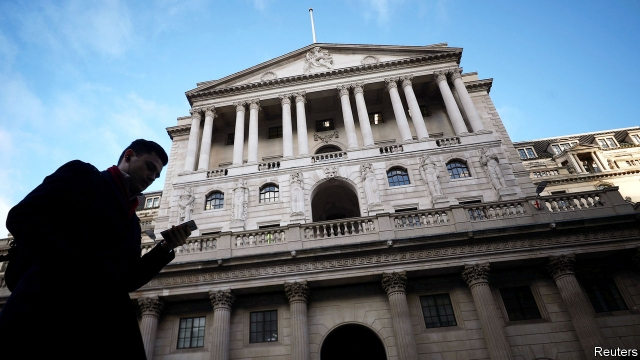

###### Floored

# What would happen to interest rates after a no-deal Brexit? 

 

> print-edition iconPrint edition | Britain | Sep 12th 2019 

IMAGINE THAT you are driving a car during a torrential downpour. You hit a puddle and start to aquaplane. Some drivers would instinctively slam on the brakes. But some petrolheads claim that the best course of action is to accelerate out of trouble. Make the wrong decision and your car could end up skidding off the road. 

The Bank of England may soon face a similar dilemma. In the event that Britain leaves the European Union with nothing agreed, should it raise or lower interest rates? Shortly after the referendum in 2016 the bank cut the base rate of interest and launched a round of quantitative easing (printing money to buy bonds). But now it argues that “[t]he monetary-policy response to Brexit, whatever form it takes …could be in either direction.” On September 19th the bank is expected to keep rates at 0.75% for the 14th month running. It may also offer some clues about what it would do if the storm of a no-deal Brexit swept over Britain. 

One impact of no-deal would be to damage the demand side of the economy (ie, how much stuff people want to buy). Worries about the future would prompt households to trim their spending. Unemployment might start to rise. Companies would postpone or cancel their investment plans. By cutting interest rates, the bank would lower the cost of borrowing and make saving less rewarding, thereby helping to stimulate demand. 

However, rate-setters have less room for manoeuvre than they did after the referendum. Back in mid-2016, consumer prices were growing at 0.5% a year. Now the inflation rate is slightly above the bank’s 2% target. Following a no-deal Brexit, sterling would almost certainly fall, further pushing up prices as imports became more expensive. A depreciation of 10% or more in the value of the pound is likely—which, according to a rule of thumb, would increase prices by 2-3%. All else equal, that calls for tighter monetary policy. 

There is another reason why bringing out the playbook from 2016 would be tricky. The referendum did not change anything fundamental about the British economy. All laws and regulations in place on June 24th 2016, the day after the vote, were the same as they had been on June 23rd. A no-deal Brexit would be different. Britain’s trading relationship with its biggest market would change overnight. The imposition of non-tariff barriers would make it more difficult to do business with the EU market. Ports would gum up. 

The shock to the supply side of the economy (ie, what it can produce) could be inflationary. In a speech in 2017 Ben Broadbent, a member of the bank’s monetary-policy committee (MPC), suggested that with the European market less accessible, British households and firms might try to source products closer to home. They might buy British cheese, say, instead of the foreign stuff. But domestic producers would not be able to satisfy all that extra demand right away. Faced with more customers for their wares, they might simply raise their prices. 

The bank must balance these competing pressures. In the past it has tolerated above-target inflation for a short while, the better to support economic growth and jobs. Mark Carney, the bank’s governor and chairman of the MPC, told a committee of MPs on September 4th that “it is more likely that I would vote to ease policy in the event of a no-deal Brexit than not.” But, he added, “It is not assured.” Other members of the MPC sound even more cautious. Most probably the bank would treat the British economy the way that you should treat an aquaplaning car—neither stepping too hard on the gas nor slamming on the brakes. Anyone looking for radical measures to save the British economy from the consequences of a no-deal Brexit is likely to be disappointed. ■ 

