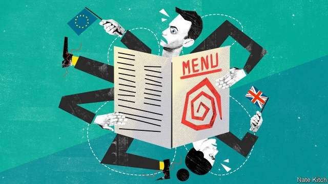

###### Bagehot

# When two tribes go to lunch 

 

> print-edition iconPrint edition | Britain | Sep 12th 2019 

THE MOST powerful tool at the political journalist’s disposal is the lunch invitation. You take a senior politician out to an expensive restaurant in the hope that good food and hot gossip will loosen the ministerial tongue. This was easier in the days when politicians frequently drank at lunch—and some drank a lot—but remains a stock-in-trade even in these abstemious times. 

This columnist recently tried a revolutionary tactic: having lunch with real people rather than politicos. His companions were a small group of Leavers one day and a slightly larger group of Remainers two days later. The first lunch took place in a riverside pub on the border of the Runnymede and Weybridge constituency, in London’s commuter belt (Bagehot paid). The second took place in a comfortable kitchen in Vauxhall, in the inner-London gentrification belt (Bagehot sponged). There was nothing scientific about any of this lunching—the groups were assembled on the basis of chance acquaintance rather than psephological profiling. But the encounters nevertheless suggest answers to two pressing questions: how are the tribes organising themselves? And why do they feel so strongly about Brexit? 

The groups had some striking things in common. They have both been radicalised by the European question. For the Leavers, radicalisation began with the Maastricht debates of the early 1990s. For the Remainers, it started with the referendum of 2016. Both groups are now super-charged. One Leaver says he is returning to referendum mode and working “24/7”. A Remainer says he is in Parliament Square “all the time”, despite having a full-time job. 

Engagement with Brexit has coincided with disengagement from established politics. The Leavers have all quit the Conservative Party, largely because of its dithering over Europe, but also because David Cameron severed the party from its roots. All but one of the Remainers have left the Labour Party, because of the rise of Jeremy Corbyn and his “ill-disguised support for Brexit”. Abandonment has been hastened by the fact that their local MPs are batting for the other side. Kate Hoey, Vauxhall’s Labour MP, is a Leaver, while Philip Hammond, Weybridge’s MP, backed Remain and is a leading Tory rebel. 

Both groups have little time for mainstream media—not just because it is biased (pro-Leave or pro-Remain, according to where you stand), but also because it is unnecessary. Modern technology means you can do it all yourself. Members of both groups constantly share articles that catch their attention. They pore over official reports, forwarding them approvingly if they agree with them or with forensic comments if they don’t. They also create their own media. The Remainers have recently posted a series of videos designed to highlight the practical pitfalls of leaving. 

The biggest similarity between the groups is that they are both very upset. “I’m not political,” says one Brexiteer, “I’m just angry.” The Remainers reject the word “angry” and highlight other emotions: “determined”, “bereaved”, “panic-stricken”, “scared”. “I feel upended,” says one. “Everything I am is being challenged.” What is it about the European issue that arouses such strong emotions in people who are enjoying such enviable lives? 

For the Leavers, the most emotive subject is democracy. They say they became involved in Brexit politics because they worried that the European Union was a fundamentally anti-democratic project, determined to hand power to unelected elites and reduce Parliament to the status of a borough council. Their involvement was deepened when the elites decided to subvert the result of the referendum by watering it down (Theresa May’s strategy) or reversing it completely (via a “People’s Vote”). The Remainers have broken the fundamental principle of losers’ consent. 

For the Remainers, the most emotive issue is deceit. They think the Leavers lied their way to victory by putting inflated numbers on the side of a bus and feeding misleading ads into Facebook. There is a lot of talk about Vladimir Putin and “malign external influences”. They also believe that a bigger lie is involved. A cabal of ultra-Thatcherites is using Brexit to tear up the social contract and turn Britain into a “US-style dog-eat-dog dystopia”. 

But again there are striking similarities in what motivates Leavers and Remainers. One regards control. The Leavers think that you need to assert sovereignty in order to regain control of your destiny. Weybridge has suffered serious shortages of doctors, school places and housing because of an influx of eastern Europeans which, thanks to free movement, the country cannot control. The Remainers think you need to be able to pool sovereignty into a larger entity in order to combat global companies, particularly American internet giants. 

The second similarity is a vision of England. For most of the people gathered in the pub or around the kitchen table, the issue is not so much Europe as Britain. The Leavers think that a country which pioneered parliamentary government and individual rights is becoming a “slave state to the EU” (they repeatedly point out that the Magna Carta was signed at Runnymede, in their constituency). The Remainers think that a country which embodied the principles of humanity and generosity in the post-war welfare state is being vandalised. “Our sense of what it is to be British—fair play, decency, compassion for the poor—is being challenged.” 

The existence of groups like these across the country makes the result of the next election unusually hard to predict. Both tribes are much more interested in Brexit than in anything else. Both are self-organising entities with their own networks and newsfeeds. And both are adamantine in their commitment. The Leavers are perhaps the wildest card in an election of wild cards. They have time on their hands, thanks to retirement, and sophisticated national networks, thanks to Silicon Valley. The youth-obsessed media ignores the power of these greying activists at its peril. ■ 

