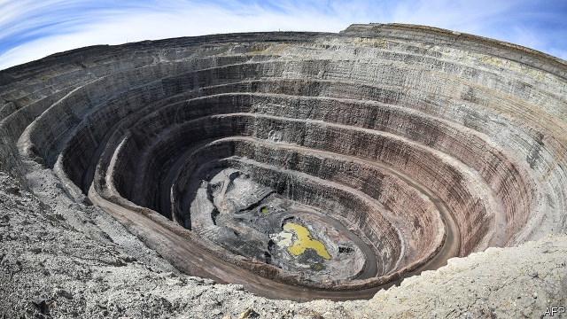
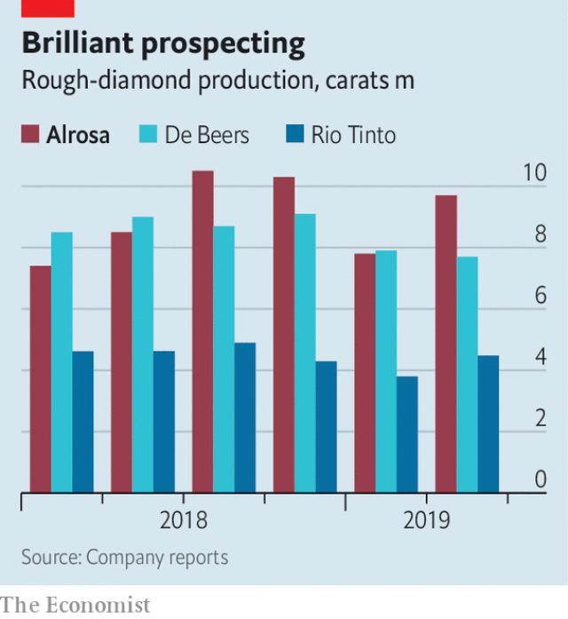

###### Romancing the stones

# Alrosa is betting on natural diamonds 

 

> print-edition iconPrint edition | Business | Sep 12th 2019 

FROM THE air, the mine in Nakyn looks as if a giant took an ice-cream scoop to the Earth’s crust. Inside the pits, in Russia’s far-eastern region of Yakutia, trucks with wheels taller than their drivers rumble along narrow dirt roads carved into the mine’s walls, carrying loads of ore. The purpose of this gargantuan enterprise is something altogether more discreet. For Nakyn harbours one of the world’s richest deposits of diamonds. 

As incongruous, at least on the face of it, is the selling point Yakutian diamonds have for the carat-crazy. “Provenance is our competitive advantage,” says Sergei Ivanov, chief executive of Alrosa, the company which owns the mine. Never mind that Alrosa’s own roots look questionable in some eyes. The diamond-miner is controlled by the Russian state, viewed with suspicion in many countries for its annexation of Crimea, its backing of Bashar al-Assad’s murderous regime in Syria and election-meddling in America. Mr Ivanov’s father was once chief of staff to Russia’s president, Vladimir Putin. But the company’s gems are not directly bloodied by strife, as some of Africa’s conflict diamonds are. For many bling-seekers, that is enough. 

Mr Ivanov’s emphasis on provenance is a response to changing consumer preferences, especially among younger buyers. This year the Gemological Institute of America has supplemented its “4C” grading scheme—colour, clarity, cut and carats—with a fifth: country of origin. De Beers, a diamond-industry stalwart (owned by Anglo American, a British mining giant), has a system for tracking diamonds from its mines to the jeweller’s display cabinet. Tiffany’s, an illustrious American jeweller, has rolled one out, too. In order not to fall behind, this summer Alrosa launched “electronic passports” for each gem, which tell buyers which craftsmen cut and polished it, as well as when and, crucially, where it was extracted. 

 

That is not the only big recent change to Alrosa’s business. The company is also trying to sell more of its own stones. It digs up around 10m carats a quarter, which translates to two tonnes, or about one bathtub-full. That is more than anyone else—and a quarter of global production (see chart). But for most of its history it relied on intermediaries to get its gems to the market. In 1957, after the discovery of diamond-rich kimberlite fields in Yakutia, Henry Oppenheimer, then chairman of De Beers, travelled to Moscow and convinced the authorities there to sell Yakutian diamonds secretly through a “single channel” operated by his firm. That practice continued in one form or another until 2009, when the EU ruled that it violated the bloc’s competition rules. Since then Alrosa has been signing long-term contracts directly with gem wholesalers and retailers. 

Mr Ivanov, who took over in 2017, has pressed on with this process, which leaves more money with the company by cutting out the middlemen. More sensible still, on his watch Alrosa is at last getting rid of pointless Soviet-era appendages. The company was “a small country”, he quips, with its own energy firms, farms, hotels and an airline. Last year it sold some of these assets for 31bn roubles ($463m). Mr Ivanov has also improved financial transparency and environmental standards. And when a flood at Alrosa’s flagship Mirny mine killed eight miners shortly after he arrived, he tightened safety protocols. 

These changes pleased outside investors, who have owned a third of the company’s shares since its listing in 2013. So has Alrosa’s generous dividend policy: last year it paid out all its free cashflow to shareholders. The Russian federal government, which owns or holds sway over the other two-thirds (some of which is held by Yakutia’s regional and local governments), has allowed Mr Ivanov to go about his business. It helps that Alrosa has avoided Western sanctions like those placed on Russian oil and metals firms. Last year it reopened its office in America, which had been shut since 2016 for “organisational reasons”. In 2018 revenue and gross operating profit rose by 9% and 23%, respectively, recouping the previous year’s losses, caused in large part by Mirny’s shutdown after the accident. Alrosa’s market capitalisation swelled by two-fifths between late 2017 and the start of this year, to 770bn roubles. 

Mr Ivanov’s clean-up was long overdue. At last, says Boris Krasnojenov of Alfa-Bank, a Russian lender, “we know what Alrosa is: a pure producer of natural rough diamonds.” Yet like other such producers, the company faces challenges. Diamonds are a precious commodity—but a commodity nonetheless, and so subject to price swings. A surplus of gems this year has depressed prices, which are down by 6% so far this year for rough stones. Polishers and traders in India are finding it harder to get credit as their economy sputters and the rupee loses value against the dollar. All this has weighed on miners. Alrosa’s sales in the year to July were a third lower than in the same period in 2018; its share price has dropped by a quarter this year. De Beers has stumbled, too. 

Another threat comes from lab-grown stones. Last year America’s Federal Trade Commission declared that they are, in fact, diamonds. Although they currently represent just 2-3% of diamond sales, consultants at Bain reckon that production is rising by 15-20% an year. At this rate synthetics could shave 5-10% from demand for natural diamonds by 2030. Last year the boss of Dominion Diamond, another large miner, left to start a synthetic-diamond company. Trendsetters have embraced them. Meghan Markle donned a pair of synthetic-diamond earrings in her first official royal appearance of 2019. Perhaps seeing the writing on the wall, De Beers has launched its own line of lab-grown jewellery, called Lightbox. 

Mr Ivanov has no such plans. Here, too, he believes that provenance matters—and that for many buyers the lab will never truly displace the lithosphere. Future generations of buyers, Alrosa hopes, will view Russia’s diamonds as they see its caviar, vodka or ballet: timeless and pure. It is betting that investors reach the same conclusion about its business model.■ 

