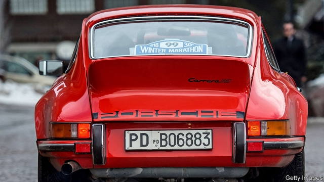

###### Profit motor

# Porsche is small but highly lucrative 

 

> print-edition iconPrint edition | Business | Sep 12th 2019 

PORSCHE’S ALLURE to car buyers is built on the growl and scream of its internal-combustion engines. That is why the firm elected not to build the Taycan, its brand-new all-electric model, at a spacious fresh site but instead cram production into a plot at its headquarters in Stuttgart, hemmed in on all sides by suburban housing. Its boss, Oliver Blume, explains that building the Taycan next to the 911 will reassure customers that the new car will embody a sporting image to compare with the model that made Porsche famous. 

Making a success of electrification is as vital to Porsche as it is to Volkswagen Group, its parent company, which also launched the ID.3, the first of a range of electric vehicles, at the Frankfurt motor show, which opened on September 10th. In some ways, Porsche is a tiny cog in Volkswagen’s machine. It made 253,000 cars in 2018, out of 10.9m vehicles at VW as a whole. And it will sell 20,000 Taycans a year, compared with millions of ID cars. But it makes so much money for VW that some investors and analysts suggest only spinning it off would recognise its true value. 

Porsche is VW’s high-revving engine. In 2018 it accounted for 10% of the group’s revenues and a staggering 30% of profits, almost what Audi, VW’s premium marque, made from 1.5m cars. In an industry where operating margins are often in low single digits, Porsche’s exceed 18%, with average profit per vehicle a turbocharged €16,250 ($17,900) compared with €3,200 for Audi and €960 for the mass-market VW brand. 

 

VW picked up the firm for a modest $8bn a decade ago, after Porsche lost a bitter battle to take over the larger firm, a misadventure that left it on the brink of bankruptcy. This also left the Piëch and Porsche families, descendants of Ferdinand Porsche, the progenitor of both firms, as the biggest shareholders. 

Porsche began to boom once it cannily realised that its coveted horse-and-antlers badge could adorn the bonnets of a range of less obviously sporty models. It sold 55,000 sports cars in 2002, when it launched the Cayenne, a bulky SUV. It and a smaller SUV, the Macan, now make up 64% of production. Ferdinand Dudenhöffer of the Centre for Automotive Research, a think-tank, reckons that electric cars could help Porsche double sales in five years. 

Now some smaller VW shareholders think it is time to turn Porsche back into a stand-alone business. They point to the value unlocked by the spin-off of Ferrari from Fiat Chrysler in 2015. Using the Italian supercar company as a benchmark, Porsche might be worth €150bn, according to Evercore ISI, an equity-research firm. VW’s entire market value is currently around half that. Frank Witter, VW’s chief financial officer, last year called the notion a “legitimate question”. Herbert Diess, VW’s boss, has promised to assess which bits of the group are really core to VW’s future. A recent partial flotation of Traton, its lorry-making arm, is a sign that he is prepared to let some parts go. 

Porsche may not be one of them. The recent initial public offering of Aston Martin stands as a warning that not all luxury marques roar ahead. Its share price has plunged by 70% or so since the listing last October, as investors have come to suspect that the historic British brand is no Ferrari. Porsche’s handsome returns rely in part on sharing the cost of developing new models across the wider group. The Cayenne’s underpinnings, for instance, are the same as VW’s Touareg and Audi’s Q7. Porsche and Audi also plan to share a platform that will underpin several new battery-powered models. Philippe Houchois of Jefferies, a bank, reckons that such economies of scale are too important to jeopardise. 

Another thing standing in the way of a Porsche spin-off is VW’s governance structure. Through a stake that confers 20% of voting rights, the state of Lower Saxony can block strategic moves. So, too, can VW’s powerful unions, thanks to representation on the company’s supervisory board. Neither is likely to support breaking up VW, which would reduce their influence over Porsche’s profitable operation. And it is unclear if the Porsche and Piëch families want to split up the vw juggernaut. Porsche’s extraordinary performance is unlikely be relinquished by VW any time soon.■ 

