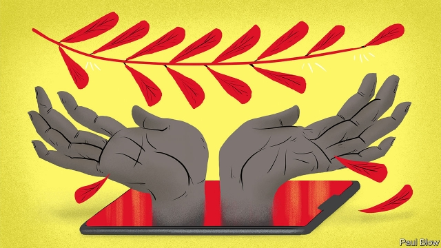
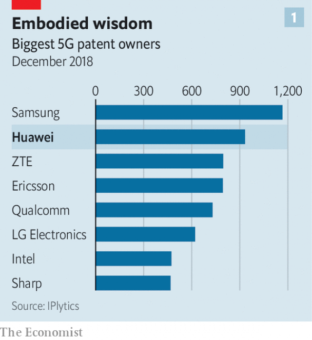
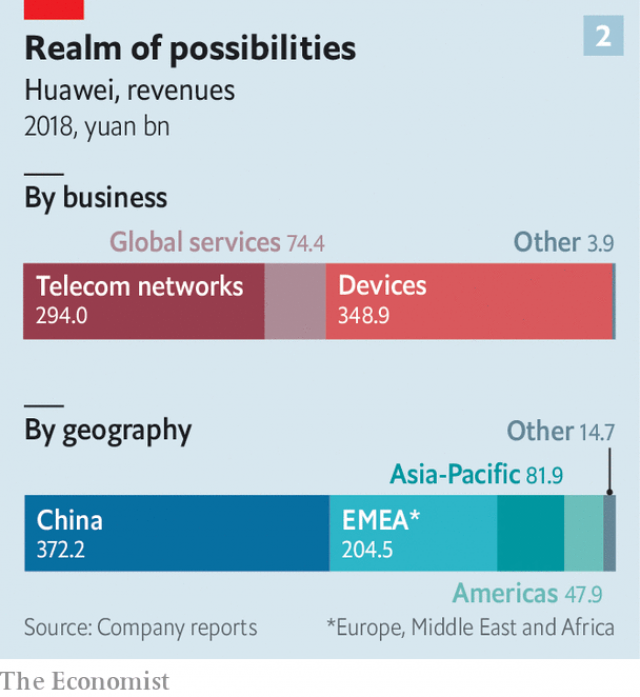

###### Piece offering

# Ren Zhengfei may sell Huawei’s 5G technology to a Western buyer 

 

> print-edition iconPrint edition | Business | Sep 12th 2019 

IN AN ATRIUM designed to evoke ancient Greece—ringed by stone columns and six towering approximations of the Caryatids—it was fitting that Ren Zhengfei, chief executive of Huawei, should extend an olive branch to the West: a piece of his company. The palatial edifice on Huawei’s sprawling campus in Shenzhen houses an exhibition hall proudly displaying the Chinese telecommunications giant’s “fifth-generation” (5G) technology. The ultra-swift, and ultra-coveted, mobile-phone networks will soon connect everything from cars to industrial robots. 

It is this 5G technology—central to Huawei’s future revenue growth—that Mr Ren said he was ready to share, in a two-hour interview with The Economist on September 10th. For a one-time fee, a transaction would give the buyer perpetual access to Huawei’s existing 5G patents, licences, code, technical blueprints and production know-how. The acquirer could modify the source code, meaning that neither Huawei nor the Chinese government would have even hypothetical control of any telecoms infrastructure built using equipment produced by the new company. Huawei would likewise be free to develop its technology in whatever direction it pleases. 

Huawei has been on a charm offensive this year. It has wheeled Mr Ren out once a month since January for interview bonanzas with international media outlets. But the idea of transferring its 5G “stack” to a competitor is by far the boldest offering to have surfaced. “It’s hard to come up with similar precedents in the history of technology,” says Dan Wang of Gavekal Dragonomics, a research firm. 

Mr Ren’s stated aim is to create a rival that could compete in 5G with Huawei (which would keep its existing contracts and continue to sell its own 5G kit). To his mind, this would help level the playing field at a time when many in the West have grown alarmed at the prospect of a Chinese company supplying the gear for most of the world’s new mobile-phone networks. “A balanced distribution of interests is conducive to Huawei’s survival,” Mr Ren says. 

No kidding. A months-long assault by America has pummelled the firm, whose global networks it suspects of allowing China to spy on others. America has also attempted to press allies not to use Huawei’s equipment as they begin to build their own 5G networks. In May American companies were barred from selling components and software to Huawei on the ground that it posed a national-security risk. Last month America restricted government agencies from doing business with it (the firm is challenging this ban in court). 

At first glance, Mr Ren’s gesture has much going for it. If the sale eventually gave rise to a thriving competitor, countries such as Australia (which has banned Huawei’s gear) would no longer have to choose between, on the one hand, technology in their networks that is both cutting-edge and cheap, as Huawei’s is, and, on the other, fears of Chinese eavesdropping. They could have the best technology from an ally instead. Decisions on the purchase of telecoms equipment could then return from politicians to pragmatic boardrooms. 

The gesture may also convince those suspicious of Huawei’s tech that the firm’s business intentions are hard-nosed. Mr Ren says money from the deal would allow Huawei to “make greater strides forward”. The value of the firm’s entire 5G technology portfolio, if it were sold, could run to tens of billions of dollars. In the past decade the company has spent at least $2bn on research and development for the new generation of mobile connectivity. 

In saying he wants to create a fairer technological race, Mr Ren is also attempting to dissociate American security fears from those of Huawei’s market dominance. His offer is “essentially calling their bluff”, says Samm Sacks of New America, a think-tank in Washington. As she points out, America’s government is working out how to create a rival to Huawei, whether by fostering American firms or helping bolster its two main global competitors, Ericsson, a Swedish firm, and Nokia, a Finnish one. Moves are also afoot to make certain components of mobile networks interchangeable with each other, to let carriers mix and match suppliers more easily. OpenRAN, a standards body, wants infrastructure manufacturers like Huawei to agree on standards for the technology in their networks that shuttles data around to make joint operation easier. Huawei has so far declined to join. 

Yet questions over the feasibility of the deal abound. Would China accept hiving off a core part of one of its few globally powerful corporations? For better or worse, 5G has become a proxy for superpowerdom. As Mr Ren told The Economist, “5G represents speed” and “countries that have speed will move forward rapidly. On the contrary, countries that give up speed and excellent connectivity technology may see economic slowdown.” 

Even if the Chinese state gave its blessing, who might be the buyer? Mr Ren says he has “no idea”. Analysts suspect that giants such as Ericsson and Nokia would balk at an offer out of pride, and would question the value of Huawei’s tech. (Having posted losses last year, they are also short of cash.) The technology may not help a smaller firm compete on an equal footing with Huawei. The Chinese company is so well entrenched with big operators, say consultants, that it would not make financial sense for most of them to take on a new supplier. Samsung, a South Korean electronics giant, has deep pockets and a smallish but growing networking-gear business—and without rival bidders, it could drive a hard bargain. A consortium of buyers is possible; who would make one up is unclear, however. 

Suitors may be put off by other considerations. If Huawei really is ready to transfer all its technology to another company, then, as Mr Wang points out, “it has to accept the risk of a major competitor in the future”. But Huawei’s dominance owes as much to technology as to its low prices and the speed at which it can roll products out, says Ms Sacks. Its willingness to serve places Western firms steer clear of is also a factor: who else besides Huawei would wade through malarial swamps in Africa and haul base stations up the flanks of Colombian mountains? Mr Ren knows this. Asked whether he thought that an American firm, with Huawei’s precious know-how in hand, would be able to pull it off, he said, with swagger, “I don’t think so.” But potential buyers know it, too. 

Lastly, few believe that a sale would placate America’s national-security apparatus, at least in the short run. A new competitor would almost certainly still need to make equipment in China, which produces half of America’s telecoms kit. Concerns about Chinese meddling would not go away. And Huawei’s latest offensive is not all charm. Last week it accused American officials of committing infractions while posing as Huawei workers, in order to “bring unsubstantiated accusations against the company”. It also accused America’s government of targeting it with cyber-attacks. That may sour relations. 

Could Mr Ren’s proposal, then, be a sign of desperation? Not a bit of it, he says. He claims that Huawei has found alternative suppliers for its network-infrastructure business that are unaffected by its blacklisting by America. He denies that the company will make a loss in the coming year. 

 

Nonetheless, the consumer business is under pressure. Half of the company’s $105bn in sales last year came from the 208m smartphones it sold around the world. So did an outsize share of profits. This business is in deep trouble. Phones that Huawei sells outside China are desirable communication devices largely thanks to proprietary software available exclusively from Google. Android, Google’s mobile operating system, which Huawei uses, is open-source and freely available. But the American tech giant’s own apps are not. Because Google is American and its apps are compiled in America, the Commerce Department’s ban on sales of American technology to Huawei applies to them. 

Mr Ren says that Google has been lobbying the Trump administration to allow it to resume supplying Huawei with proprietary Android software, but so far to no avail. Unless American policy changes, Huawei will remain stuck with the open-source version of Android, without any of the apps that consumers have come to expect. The Chinese firm is in the process of developing its own operating system, Harmony OS, but it will be no rival to the mature Android ecosystem for years to come. 

 

This means that all new Huawei phones will ship without Gmail, Google Maps, YouTube or, crucially, Google Play Store. The Play Store is what allows Android users to download apps like WhatsApp, Instagram and Facebook easily. WhatsApp in particular has become a standard mode of communication in much of the world outside America. Unless its government lets up, Huawei’s new smartphones will be little more than decent cameras that make phone calls. The firm will launch the Mate 30, the first top-end phone since its blacklisting, on September 19th in Munich. Huawei claims its hardware features will buoy sales. But a phone which lacks basic functions is unlikely to be a hit. A weakened consumer business would dent profits. 

Huawei’s share of the Chinese smartphone market, where it has never relied on Google’s apps, is growing fast. But two-fifths of its annual phone sales, or roughly $20bn, come from outside the country. Though the firm’s executives repeatedly declined to share any projections, firm-wide revenue growth in the eight months to August slowed to 20%, year on year, from 23% in the first half of 2019. If the Mate 30 and its successors flop, Huawei stands to lose billions of dollars in annual revenue. 

Similar supply-chain challenges affect other parts of its business. Its coders are busily writing software tools known as compilers and libraries, themselves used to create the software that powers all manner of electronic devices, not just smartphones but also networking gear. As with Android, Huawei would have to create its own version of these, and a technological ecosystem around them. Such ecosystems take years to evolve, and there is only so much one company can do to stimulate this evolution, which relies on third-party developers, with their own goals and incentives. Huawei’s expertise in high, hard technology is of little use here. 

And, Mr Ren’s assurances notwithstanding, Huawei’s finances are being squeezed. Even he concedes that its relations with large Western banks such as HSBC and Standard Chartered have been disrupted. Still, the firm has plenty of cash and he says that smaller banks remain willing to lend to it. The Chinese Development Bank, which has reportedly extended credit lines to Huawei and ZTE, a Chinese competitor, in the past, may stump up if needed. Mr Ren and his underlings repeatedly claim that cashflow is “healthy”, pointing to the firm’s furious building work. It has just finished a 120-hectare, $1.4bn research campus. 

Huawei is being forced to transform itself from a company that makes and sells hardware into one that also makes many components that it used to buy from others. This kind of shift strains a firm. Its cash cow is under threat even as it has to invest heavily to replace the suppliers and software it can no longer get from America. Mr Ren may hope that his mooted sale of Huawei’s 5G technology will give him sufficient fuel for the company to fly ever higher. But peer behind the showy frescoes in Shenzhen, and his showier gesture, and Huawei’s future looks decidedly hazy.■ 

Dig deeperHuawei has made a peace offering that deserves consideration, September 12th 2019Huawei’s founder defends Deng Xiaoping’s Chinese model, September 12th 2019A transcript of Ren Zhengfei’s interview, September 12th 2019 

