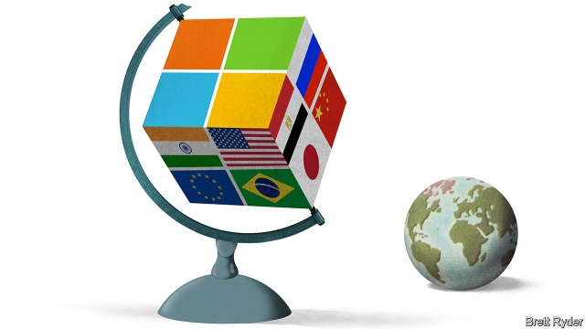

###### Schumpeter

# The Redmond doctrine 

 

> print-edition iconPrint edition | Business | Sep 12th 2019 

IS MICROSOFT A digital nation and does it have a secretary of state? The answer of Brad Smith, the software giant’s top lawyer, is, well, diplomatic. Nation states are run by governments and firms need to be accountable to them, he says. But yes, he admits, he worries a lot about geopolitics these days. 

Large companies have forever lobbied governments around the world—think Big Pharma or the oil majors. Sometimes the ties with their home countries’ diplomacy are very close indeed: in 2017 the former boss of ExxonMobil, Rex Tillerson, became President Donald Trump’s first secretary of state (albeit a short-lived one with a decidedly mixed record). And in a globalised world, multinationals can benefit from a “corporate foreign policy”, a term coined by Stephanie Hare and Timothy Fort in a paper from 2011, to align their values and priorities across markets. 

Nowhere does this ring truer than in Big Tech. Digital giants loom larger than analogue ones (Facebook has 2.4bn monthly users—two-thirds more than China has people). They upend one industry after another and penetrate every nook and cranny of society. They lord it over cyberspace and set many of its rules. Recognising this, some countries are planning to upgrade their San Francisco consulates into de facto tech embassies. Denmark was the first to send an envoy to Silicon Valley, in 2017. The European Union is considering opening a mission in the capital of tech. 

The tech firms, too, are adapting—none more so than Microsoft. Mr Smith presides over an operation as big as the foreign office of a medium-sized country. Its 1,500 employees work in departments like “Law Enforcement and National Security” or “Digital Diplomacy Group”. It has outposts in 56 countries, sending regular cables to headquarters in Redmond, near Seattle. Mr Smith is as itinerant as a foreign minister. In one year he visited 22 countries and met representatives of 40 governments. 

Microsoft, however, differs from much of Big Tech in its approach. Most firms are, like corporations before them, students of realpolitik. Apple censors apps in China when the Communist Party tells it to. Facebook dithered when the Burmese army used the social network to spread misinformation and fuel violence against the Rohingya. Google shelved a project to create a censored Chinese search engine after an outcry from employees, but is reopening an office in Egypt, a country run by a repressive junta. 

Against this cynical backdrop Microsoft’s diplomatic efforts look refreshingly principled. Its worldwide antitrust fight at the turn of the century; Edward Snowden’s leaks which revealed widespread surveillance by America’s spooks; the rise in state-sponsored cyber-attacks—such “inflection points”, says Mr Smith, forced the company to mature geopolitically, long before its rivals in the case of antitrust. In “Tools and Weapons”, a new book co-written with Carol Ann Browne, a communications executive at Microsoft, he defends multilateralism—global problems caused by technology require global solutions, he says—and warns heads of state and foreign ministers (whom he meets by the dozen) that the tech cold war between America and China may split the world in two camps, leaving everyone worse off. He advocates involving non-governmental actors (including companies like his but also civil society) in decision-making, even if this “multistakeholder” process is slower than top-down government edicts. 

It is not all idle talk, either. In 2013 Microsoft refused to hand over emails that sat on a server in Ireland to America’s feds in a drug-trafficking case, and successfully defended its decision in court—setting political wheels in motion that led America’s Congress to adopt a law allowing tech firms to challenge such warrants if they fall foul of another country’s rules. It implemented changes required by the EU’s tough new privacy law globally, helping the rules become a worldwide standard for many companies—and indeed countries. In 2017 Mr Smith proposed a “Digital Geneva Convention”, an international treaty to protect civilians against state-sponsored cyber-attacks in times of peace. Last May he helped launch the “Christchurch Call”, a pledge by 17 countries and eight tech firms to “eliminate terrorist and violent extremist content online”. Google and Facebook signed it. Apple (and America) did not. 

Mr Smith says a coherent corporate foreign policy is simply good business: it creates trust, which attracts customers. His doctrine indeed sits well with Microsoft’s business model, based on sales of services and software. It can afford to be more of a purist on privacy and the spread of disinformation, the most politically contentious tech issues of the day, than giants whose profits come from targeted advertising on social networks. 

Microsoft is not squeaky-clean. Mr Smith says it refuses to put data centres for Azure, its global computing cloud, in countries with a sketchy human-rights record. Yet it has a few of them (operated by a local partner), plus a research centre, in China. And although Microsoft has proposed sensible rules for the use of facial-recognition technology, it has previously trained its algorithms on pictures of celebrities without their knowledge. 

A dose of hypocrisy is perhaps inevitable in an organisation the size of Microsoft. Critics level a more fundamental charge against its foreign policy, however. Where, they ask, does it—and fellow tech giants—derive the legitimacy to be independent actors on the international stage? This is the wrong question to pose. As businesses, they have every right to defend the interests of shareholders, employees and customers. As global ones, their priorities may differ from those of their home country’s elected officials. And as entities which control much of the world’s digital infrastructure, they should have a say in designing the international norms which govern it. At a time when many governments refuse to lead, why should the firms not be allowed to? Especially if, like Microsoft’s, their efforts blend principles with pragmatism. ■ 

