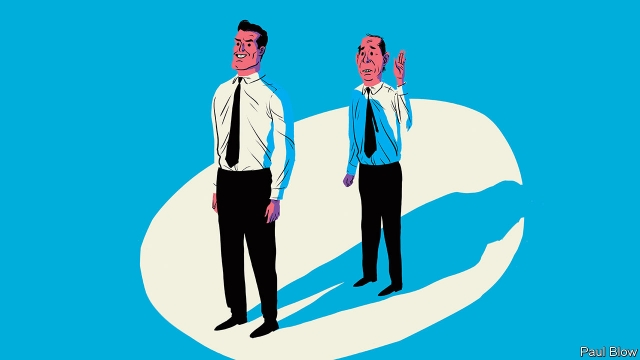

###### Bartleby

# The eyes have it 

 

> print-edition iconPrint edition | Business | Sep 12th 2019 

PICTURE IN YOUR mind the typical chief executive. The chances are that you have thought of someone male, in a suit and distinguished-looking. In part, that is because most bosses look like that. It may also be because people instinctively defer to such types. 

In their book “Messengers: Who We Listen To, Who We Don’t And Why”, Stephen Martin and Joseph Marks, two psychologists, outline how people respond to visual status signals. Just why are pedestrians likelier (three times as likely, according to one study) to defy traffic laws to follow a man across the road when he is wearing a suit than the same man dressed in denim? Similarly, motorists stuck at a traffic light are slower to honk their horn if the car in front has a prestige brand. 

One possibility is an evolved respect for those with a higher social position. This is not just about clothes or possessions. A further piece of research cited by the authors involved undergraduates who were shown photos of 50 chief executives from the Fortune 1000 list of big firms. Half of these bosses were from the most profitable groups and half from the least profitable. The undergraduates were asked to judge, on looks alone, which executives had qualities such as competence and dominance. Remarkably, the students tended to pick out those executives who led the most successful companies. 

It is hard to disentangle cause and effect. But it seems more probable that people with a certain type of appearance are likely to get promoted than it is to believe they are innately more competent than everyone else. 

Humans tend to respect men with particular physical characteristics. When participants in a study were shown pictures of male employees of a business consultancy, with similar clothes and masked faces, they perceived the taller men more positively in terms of team leadership skills. Indeed, research has shown that taller and more attractive men earn more than their shorter and plainer colleagues. 

Another business advantage for men turns out to be a face with a higher-than-average width-to-height-ratio. Research showed how square-jawed men negotiated higher signing-on bonuses for themselves than longer-faced, round-jawed peers. 

Physical characteristics also affect recruitment at lower levels. A group of Italian researchers sent CVs to a range of employers, some with photos and some without. Applicants deemed attractive by independent scorers were 20% more likely to get an interview than the same application without a photo. Things are worse for the fairer sex. When photos were included, male jobseekers deemed unattractive were contacted 26% of the time, compared with 7% in the case of unattractive women. 

All rather depressing, particularly for women trying to climb the corporate ladder. But there are some intriguing differences in the kind of personalities that boards tend to favour. The stereotype is that executives tend to be ruthless and egotistical—embodied by Gordon Gekko (or rather, the square-jawed Michael Douglas who played him). Not always, it turns out. The authors cite research on how boards choose chief executives. When choosing between two suitably qualified candidates to take charge of a company that is performing well, a board is likely to pick a leader who does not appear to be egotistical and self-interested. But if the company is in trouble, a narcissist stands a better chance. When the going gets tough, in other words, the board opts for a jerk. 

Perhaps board members don’t think of it that way. One long-established phenomenon is the “halo effect”. If a person (or company) is rated highly in terms of one characteristic, they get good marks across the board. As the authors recount, this applies when employees are being assessed by their managers for qualities such as intelligence, decisiveness and leadership. Broadly speaking, managers divided staff into “good” and bad” workers; few employees were deemed to be intelligent but indecisive, for example. 

What this fascinating book reaffirms is that people’s assessments of others are extremely subjective, and easily led astray by appearances. That suggests a lot can be achieved by using artificial intelligence in hiring and promotion decisions, providing the programming is done correctly and focuses on candidate qualifications. A computer shouldn’t be distracted by a handsome face. 

