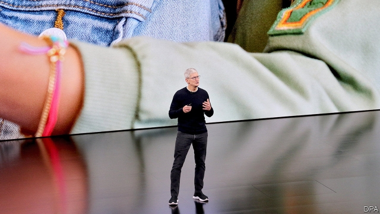
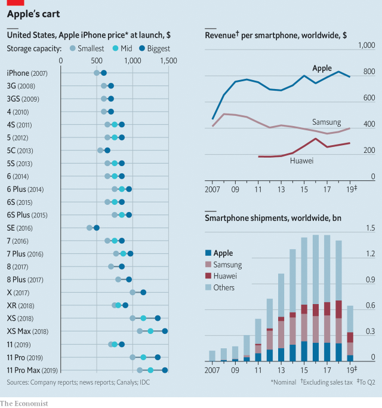

###### Apple’s cart

# Tim Cook tries to reduce Apple’s dependence on devices 

 

> print-edition iconPrint edition | Business | Sep 12th 2019 

APPLE’S PRODUCT launches are not what they used to be. A decade ago the unveiling of a new iPhone would inspire quasi-religious ecstasy; devotees would camp on pavements outside shops as the release date drew near. At the firm’s latest event, on September 10th, the format was the same: Apple’s boss stood on stage, clad in a regulation black jumper, and spoke of the world-changing power of the company’s latest wares. But the fizz was gone. The iPhone 11 looks like a merely incremental improvement on the models that have gone before it. 

Smartphones have become boring. Consumers around the world are upgrading less frequently. Sales have stagnated (see chart). That poses a problem for Apple, which has built its success on charging eye-watering prices for aspirational, frequently replaced devices. Its response—to focus more on selling services and less on selling hardware—has been widely trailed. Those services comprise everything from extended warranties to the creation of an Apple-exclusive store for video games, and for streaming video, on which it plans to spend $6bn and which is designed to undercut rivals like Disney and Netflix. 

 

The iPhone 11’s launch shows what that strategy means for the hardware side. Apple has been raising its prices for years, but that trend has slowed. The cheapest model of the iPhone 11 is the lowest-priced phone the company has launched in two years. That makes sense: a service-focused company needs a broad user-base. But it is a delicate balancing act. If prices fall too low, the firm will lose its aspirational glow (the top-of-the-range iPhone 11 Pro Max will cost you $1,449). At the same time, Apple benefits from a captive audience. Users of Google’s rival Android phones have many hardware-sellers to choose from, leading to fierce price competition. Those who prefer Apple’s ecosystem must buy iPhones. That should keep margins plump for the time being. 

