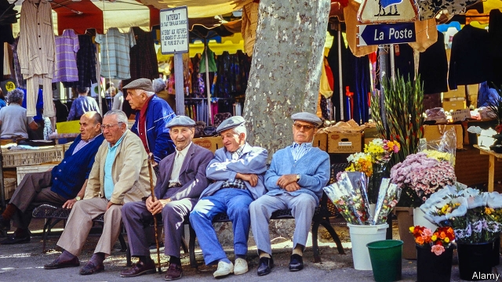
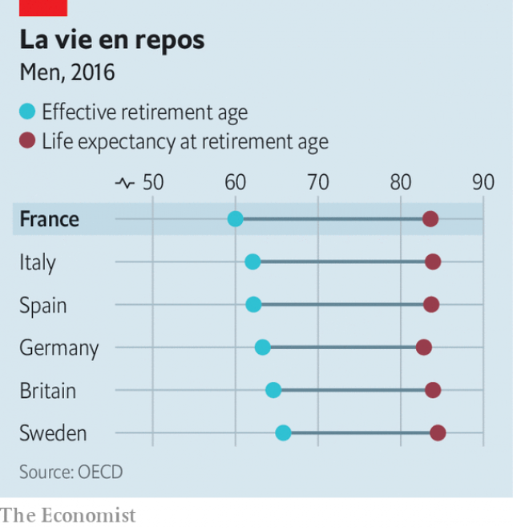

###### Emmanuel Macron faces the rage of the aged

# Another French president tries pension reform 

 

> print-edition iconPrint edition | Europe | Sep 12th 2019 

SISYPHUS HAD it easy, compared with French pension reformers. The mythical Greek was damned eternally to roll a boulder up a hill and watch it roll back down again. But he never had to persuade Gallic workers to retire later. In 1995 Jacques Chirac’s government shelved his attempt to reform the system after weeks of protests and strikes brought Paris to a standstill. He tweaked it in 2003 but faced protests of 1m workers and more. Nicolas Sarkozy made a bit more progress in 2010, but still not nearly enough. 

Now Emmanuel Macron has put a cautious shoulder to the boulder. On September 9th the president invited Laurent Berger, leader of the Confédération Française Démocratique du Travail, the country’s biggest private-sector union, to talks about pension reform at the Elysée palace. His prime minister, Edouard Philippe, held discussions last week with each of the big unions and employers’ organisations. 

After protesters wearing gilets jaunes (yellow jackets) brought the country to a standstill last year, a chastened Mr Macron wants to be seen to be listening. Reproached for his previously haughty know-it-all manner of governing, he is keen to avoid the impression that he is about to impose new rules on an unwilling public. Yet his caution raises questions about what, and how much, this reform is likely to achieve. The pension tsar, Jean-Paul Delevoye, made it clear in a report this summer that the new system would not change at all the overall amount that France spends on pensions. 

 

Given the scale of the problem, this is disappointing. The French retire earlier than workers in any other OECD country (see chart). Thanks to high life expectancy, they enjoy an average of a quarter of a century in their armchairs. Moreover, the French pension system is hugely generous. Retirees receive on average 61% of previous earnings, pre-tax—less than in Italy (83%) but far more than in Germany (38%). 

This puts strain on the public purse, all the more severe because the French system relies on taxing today’s workers to pay the pensions of their elders. In June the official pensions advisory council warned that by 2022 the public-pension deficit would rise to €10bn ($11bn), up from its previous forecast of half that figure. Overall, France spends nearly 14% of GDP on pensions, a bit less than massively indebted Italy (16%), but more than Germany (10%) and way above the 8% OECD average. 

The obvious way to close this gap would be to raise the retirement age, as many other countries have done. In France, the most recent effort to do this dates back to Mr Sarkozy. In 2010 he raised the minimum age from 60 to 62 years, and the age for a full pension (without penalties) from 65 to 67. However, thanks to France’s monstrously complex system, many people are allowed to retire much earlier than this, so that the male retirement age is, on average, still only 60. One problem is that Mr Macron campaigned in 2017 with a clear manifesto pledge not to touch the retirement age. This means that his reforms will, at best, solve only part of the problem. 

Mr Macron’s team argues that it is embarking on a redesign that will be as tough to pull off as it would have been to raise the retirement age. It will also be more complicated. France has no fewer than 42 different mandatory public pension systems, which have grown up over the decades to serve farmers, civil servants, actors, railway workers, mine engineers, notaries and so forth, including a default public scheme in which everyone not otherwise covered must enroll. Rules governing pension rights and contributions vary wildly between them, and cannot easily be combined. The system is opaque and curbs job mobility, as rights are hard to transfer. To replace this tangle, Mr Macron has promised to merge all these regimes into a single, points-based system that treats all workers equally. 

“What the French are trying to do is a big deal,” says Monika Queisser of the OECD. “France has one of the most fragmented public pension systems, and they are finally trying to get things harmonised.” To this end, Mr Macron this month brought Mr Delevoye into government. He has already spent many months conducting a review of the French system and discussing reform options. After all these talks, a bill is promised, but not till next summer. 

Up to a point, it makes sense to take the time to get it right. In the 1990s, notes Hervé Boulhol, a pensions specialist at the OECD, it took Sweden nearly a decade to put in place a similar system. The French government, wary of renewed unrest, wants to try to forge a consensus. A poll for the Institut Montaigne, a liberal think-tank, suggested that only 33% of the French currently back Mr Macron’s reform. 

If anything, such doubts will harden when details emerge. So far nothing is fixed. Mr Delevoye has said, for instance, that he wants to identify a “pivot age” of 64 years, around which incentives to work later and penalties for early retirement would be based. This could, it is hoped, help nudge people into working longer. Mr Macron, however, says that he “would prefer us to find agreement on the length of contributions rather than on age”. Either way, harmonising rules will inevitably mean some lose out. In anticipation, unions were planning a big public-transport strike in Paris on September 13th. 

The trouble is that, however ambitious they look, the reforms would not do enough. Mr Macron promises to close the pension deficit by 2025, and the idea is to put in an automatic mechanism that adjusts the contribution rules as life expectancy increases. He wants people to be able to make their own informed choice about when to leave their desks, and with what package. Yet the new universal system will do nothing to curb overall spending on pensions. Indeed, Mr Delevoye has made this a selling point, promising in July that the universal system “will keep an identical level of pensions spending”. 

At some point this will catch up with France. As it is, there have been big rows within government about the wisdom of Mr Macron spending so much political capital on a project that will not save money. It is true that once the system is in place, it will indeed become administratively, if not politically, simpler for future governments to change the rules and make savings. But in the meantime, Mr Macron is putting vast effort into a reform that will leave the task half-done. ■ 

