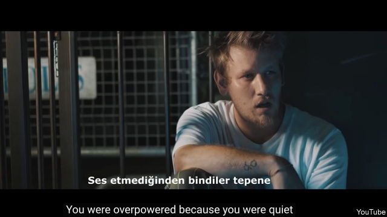

###### Not going quietly

# The Turkish rappers who rib the regime 

 

> print-edition iconPrint edition | Europe | Sep 12th 2019 

“I GREW UP apolitical, I never voted, and all I cared about was vacation, travel, and debt,” a young man in a buttoned-up polo shirt says into the camera. “Now I’m too scared to tweet, I’m afraid of my own country’s police.” The camera pulls out. The man, it is revealed, is behind bars. Seated to his side is Sarp Palaur, better known as Saniser, a popular rapper. “Sorry to say, but this hopeless generation is your creation,” Mr Palaur snaps back at his cellmate. “The justice that was supposed to protect you will come knocking and break down your door...you didn’t say a word, which means you’re guilty.” 

Packed with such lyrics and images, “Susamam” (“I can’t stay quiet”) has touched a nerve among a large number of Turks. In the week since its release, the song and accompanying video have earned praise from opposition figures, 20m views on YouTube and accusations of links to terror groups from pro-government newspapers. A searing jeremiad on the current state of Turkey’s democracy, “Susamam” pulls few punches. Over the space of 15 minutes, a parade of about 20 rappers, including Mr Palaur, who masterminded the project, fume about corruption, violence against women, the arrests of journalists, education, the lakes of concrete poured over some of the country’s natural wonders, and creeping fascism. The song does not mention Turkey’s President, Recep Tayyip Erdogan, by name. But it is as good an indictment as any of his government’s recent abuses. 

The string of losses Mr Erdogan and his Justice and Development (AK) party suffered in local elections earlier this year seems to have emboldened some previously tongue-tied government critics. Ekrem Imamoglu, the opposition politician the government robbed of victory in the Istanbul mayoral race back in March, pointedly called on artists and businessmen to break their silence before the re-run. Many did so, and endorsed Mr Imamoglu, who went on to win big. A handful of former AK bigwigs have since broken with Mr Erdogan, confirming they would launch one or more rival parties. 

Yet speaking out continues to come at a price. On September 6th, the day “Susamam” was released, a Turkish court sentenced Mr Imamoglu’s closest associate, the head of his party’s Istanbul branch, to nearly 10 years in prison for “insulting the president”, “inciting people to hatred and enmity” and “terrorist propaganda”. The evidence against her consisted of a collection of social-media posts. A couple of weeks earlier, the government unseated the newly elected mayors of Diyarbakir, Van and Mardin, three of the country’s biggest Kurdish cities, over alleged (but unproven) links to an armed separatist group, the PKK. Rumours persist that other opposition mayors may meet a similar fate. 

Many Turks are now calculating that it is better to be silent than sorry. A recent study by the Reuters Institute found that 65% of respondents said they were anxious about expressing their political views on the internet, the highest among the 37 countries examined. Only last year, over 36,000 people were investigated on charges of insulting Mr Erdogan. The artists behind “Susamam” may be next in line. One government mouthpiece has already referred to the song as the work of outside enemies and terrorist groups. “Susamam” is in fact something more dangerous to Mr Erdogan—a reminder that Turkish society is too diverse, too young and too unruly to remain quiet for long. ■ 

