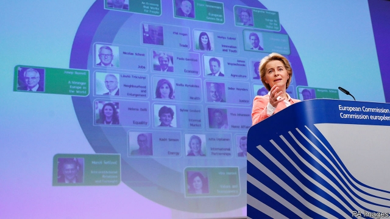

###### Von der Leyen’s line-up

# The new top jobs in Europe 

 

> print-edition iconPrint edition | Europe | Sep 12th 2019 

EMMANUEL MACRON is having a good summer. In July, at his urging, leaders of the European Union’s member states picked Ursula von der Leyen, then the German defence minister, to be president of the European Commission. In a package deal Christine Lagarde, the French head of the IMF, was chosen to lead the European Central Bank; Charles Michel, the Belgian prime minister and a Macron ally, got the European Council presidency; and Josep Borrell, Spain’s Francophone foreign minister, will be the EU’s next high representative for foreign affairs. Having narrowly won her confirmation vote in the European Parliament, on September 10th Mrs von der Leyen presented her proposed line-up of commissioners at the Berlaymont building in Brussels. It was another good day for the French president. 

Under Mrs von der Leyen’s proposal—the European Parliament will begin confirmation hearings later this month and must endorse the new commission as a group before it can take office on November 1st—the next commission will be more hierarchical than the last. Directly below her will be a team of three silo-busting “executive vice-presidents” in charge of the three broad areas which, Mrs von der Leyen has indicated, will be her priorities. Margrethe Vestager will lead on making Europe “fit for the digital age” and stay on as competition commissioner—in which role the Danish liberal has capably taken on American digital giants and made an enemy of Donald Trump. Frans Timmermans, a Dutch social democrat, will be in charge of Europe’s “green new deal”, accelerating the EU’s progress towards carbon neutrality by 2050. And Valdis Dombrovskis, a Latvian Christian democrat, will be responsible for economic and financial affairs, with an emphasis on “inclusivity”. 

The choice of the three reflects the long-term shift towards a more political and active commission. They come from the three largest political groups in the new, more fractured parliament that Mrs von der Leyen will have to keep happy in order to secure majorities for her proposals (she may also rely on Greens, hence the focus on climate change). Ms Vestager and Mr Timmermans were both “lead candidates” in the European elections, boosting the team’s democratic legitimacy. The inclusion of Mr Dombrovskis tackles central-European fears of “second-class” status. With Mrs von der Leyen the trio will form an inner quad running the EU’s executive, with an outer ring of five regular vice-presidents (three from eastern Europe and two from southern Europe, providing a geographical balance), and beyond them the remaining 18 members of the commission. 

Among the other vice-presidents and commissioners are several notable appointments. Paolo Gentiloni, a centre-left former prime minister of Italy, becomes commissioner for economic affairs with responsibility for fiscal rules—indicating that Mrs von der Leyen wants to use the opportunity of Italy’s new, more pro-European governing coalition to resolve the Brussels-Rome dispute over the Italian budget. This may, however, worry flintier Germans and northern European members of the so-called New Hanseatic League. 

Sylvie Goulard, a French former defence minister and close ally of Mr Macron, takes charge of the single market and defence. She will oversee the establishment of a European strategy for regulating artificial intelligence and, with Ms Vestager, will push forward a Digital Services Act on e-commerce. Phil Hogan of Ireland, currently the agriculture commissioner, will take over the trade portfolio, including responsibility for negotiating any deal with a post-Brexit Britain—a firm reminder that the EU’s first allegiances in such matters are to Dublin rather than London. 

Less auspicious is the nomination of Laszlo Trocsanyi as commissioner for enlargement; as an ally of Hungary’s authoritarian Viktor Orban, he is hardly well-placed to pass judgment on the rule of law in would-be accession countries. The fact that Margaritis Schinas, the Greek commissioner and a former chief spokesman for the commission, has been made vice-president for migration (a portfolio ominously dubbed “protecting our European way of life”) suggests the incoming commission will see that matter as a question of tough borders and public relations. 

Most important for the wider world is that the von der Leyen commission will be committed to making Europe a more autonomous actor in a dicey world—or extending “European sovereignty”, as it is called in euro-speak. Ms Vestager and Ms Goulard want to use their clout to develop a distinctively European way of managing new technology and finding a balance between open markets and interventionist industrial strategy in responding to new industrial giants from China and Silicon Valley (tough Ms Vestager’s liberal instincts may collide with the activist mood, personified by Ms Goulard, in Paris and Berlin). Mr Borrell, a straight-talking socialist and foreign-policy heavyweight, will also have a licence to project Europe’s voice in the world more loudly. ■ 

