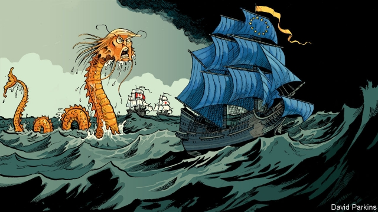

###### Charlemagne

# Why Europe should take the lead on trade 

 

> print-edition iconPrint edition | Europe | Sep 12th 2019 

“THIS IS DEEPLY offensive,” declares Cecilia Malmstrom, gesticulating around her orchid-lined office in the European Commission’s Berlaymont headquarters. “We have colleagues here whose parents fought together [with the Americans] on the Normandy coast and we are a threat to national security?” The EU’s trade commissioner is referring to Donald Trump’s imposition of tariffs on European steel and aluminium, which he preposterously claims is necessary for national-security reasons. The EU has retaliated with its own tariffs on bourbon, Harley Davidson motorbikes and other iconic American goods. 

This tit-for-tat does not come easily to Ms Malmstrom, a pro-trade Swedish liberal. When she took office in 2014 the World Trade Organisation’s (WTO’s) Doha round of multilateral tariff reductions was stagnant and European city squares thronged with protests against the Transatlantic Trade and Investment Partnership (TTIP), a mooted trade deal with America. Since then the drawbridge-up tendency has surged: first in Europe, with wins for nationalists and Britain’s vote for Brexit, and then in America with the election of Mr Trump. 

Ms Malmstrom has been one of the stars of the current commission, which will leave office at the end of October. TTIP may have vanished from the agenda—its prospects looked poor even before Mr Trump’s election, thanks to America’s Democratic Party—but elsewhere the EU has implemented bilateral deals with 15 additional countries, including Canada and Japan. It has also updated existing trade deals with Singapore, Vietnam, Mexico and clusters of countries in east and west Africa. An agreement with Mercosur, the Latin American bloc centred on Brazil and Argentina, is awaiting ratification. Exports from the EU have increased by about 15% over the past five years. 

How has all this happened? Three factors stand out. First, the EU’s size and strongly pro-trade stance make it a formidable force. In Japan, Canada and Latin America the trade commissioner has found like-minded interlocutors who share the EU’s commitment to free trade and are smaller than the EU (and therefore relatively pliant negotiating partners). Second, the EU has maintained the buy-in of its own citizens. Ms Malmstrom has insisted on transparent negotiations, has involved the European Parliament and has imposed European social and environmental standards on the EU’s partners. “I’d say we are the most transparent trade negotiator in the world,” she insists, noting that: “There were strikingly few protests against the EU-Japan deal.” Guntram Wolff of the Bruegel Institute, a think-tank, points to a related EU strength: its relatively generous welfare states cushion citizens from the negative effects of trade and thus curb anti-trade sentiment. Finally, Mr Trump has concentrated minds. The president is broadly disliked in Europe, and in the countries with which the EU has done deals. His anti-trade message has blunted domestic opposition to those accords. It has also made elites in other parts of the world keener to seek refuge in Europe’s giant economy. 

All three of these factors are now under strain, creating three big problems for Phil Hogan, her nominated successor as trade supremo in Ursula von der Leyen’s incoming commission. At the top of Mr Hogan’s in-tray will be talks not with smaller, friendly powers but with big, difficult ones. Ambitions for the next few years include an investment agreement with China (which continues to demand openness from others while shielding its own state-led industries), a free-trade deal with India (whose protectionism has stymied talks to date), a deal with a post-Brexit Britain (which remains wedded to the notion of benefits without costs outside the EU) and a deal to cut tariffs with Mr Trump’s America (already threatening new levies on European cars and wine). 

The domestic picture, too, is becoming harsher. The new European Parliament—which has a veto on trade deals—is more fragmented than the last. It contains a somewhat larger populist component, and Mrs von der Leyen’s commission may in certain votes be reliant on the flourishing Greens, who set a high bar for environmental and consumer standards that even the EU’s trade deals (green by international standards) may struggle to meet. 

Finally, the marginal benefits for the EU of Mr Trump’s anti-trade stance are drying up. In future, the American president may make life for free-traders much harder. He could yet bring down the entire WTO, leaving the EU reliant entirely on bilateral deals. And his trade war with China could yet force the Europeans to pick sides—something they are understandably loth to do. 

All of which will not be easy, concedes Ms Malmstrom, but can be managed. Transparency and better measures to combat the negative effects of free trade can suppress European voters’ protectionist instincts. Internationally, she insists that “the EU can lead if it has allies.” It has good friends in the likes of Canada and Japan; deals with others such as Australia and India remain to be done. The commissioner notes hopefully that American politicians and businessmen continue to troop through Brussels preaching co-operation. Even China, though cynical and defensive, does not want the WTO system to collapse, and might be willing to work with the EU to keep it alive or replace it if America walks out. 

The biggest challenge will be psychological. The EU does not usually have to think much about the shape and character of the world economy. That was America’s job: a reality rooted in a post-war order whose emergence began with the Normandy landings that Ms Malmstrom fears Mr Trump is forgetting. Yet today, with the president cutting America off and escalating tensions with a more assertive China, leadership is scarce. Under Ms Malmstrom, Europe has acquitted itself pretty well. To continue to do so as the going gets choppier will take a new self-confidence. The old continent must learn to lead. ■ 

