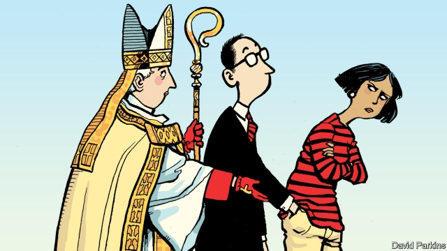

###### Render unto God

# Why so many non-religious Europeans pay church taxes 

 

> print-edition iconPrint edition | Europe | Sep 12th 2019 

IN THE Old Testament, priests are told to take a tenth of every believer’s crops as a tax to support the faith. In these latter days, they can outsource the job to the state. In many European countries, “church taxes”—levied on all registered members of religious organisations by governments—still exist. 

The governments of ten countries across Europe administer membership fees on behalf of religious organisations. In two of these, Spain and Portugal, believers can opt to pay a portion of their income tax to their religion of choice. Six others run opt-out systems, whereby registered members of certain Christian churches (and, in some cases, other religious groups) are required to pay tax. In most of these, apostasy is the only way to get out of paying. Some states in Germany require even more arduous methods of disassociation—in addition to leaving the church, you must also file a notarised deregistration form with the local government, which demands a fee. 

In Italy and Iceland churches get a cut of income tax, so it is hard for taxpayers to avoid bankrolling them. But not impossible. Italians can ask for their share to go to the state, to spend on humanitarian aid. Icelanders, meanwhile, have found a cunning way to get refunds. Their tithes are distributed to each religious group according to the size of its flock. A surprising number of people have registered as members of the Zuist Church of Iceland, a previously obscure group that preaches ancient Sumerian beliefs. It refunds the contributions of its members, greatly broadening its appeal. 

Some people are content to keep paying. A report in April found that in the six European countries that run opt-out systems, 68%-80% of people said that they pay the church tax. Not all of them are religious—in Sweden 32% of people reported paying despite being unaffiliated to any creed. 

Why would the godless choose to fund a faith? Many believe, often rightly, that churches help the needy. The sheer bother of bureaucracy probably stops others from opting out. And some find it emotionally difficult to make a formal declaration that they are leaving the faith in which they were brought up. “I can’t for some reason get myself to leave the church altogether, although I’m highly sceptical of the institution,” explains Jonas, a German who gives about €50 of his monthly salary to the Catholic church. “I know it’s a bit irrational, but there’s something that holds me back.” 

Nonetheless, many secular types wonder what business the state has in collecting membership dues for religious institutions. No other civil association is so lucky. Ironically, church taxes were first introduced to separate church and state by preventing the state from funding churches directly. 

