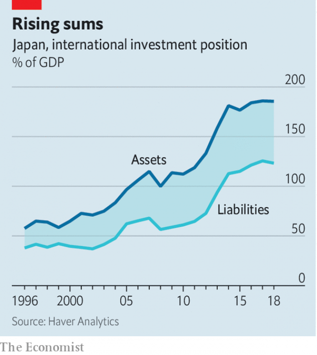

###### Buttonwood

# How rock-bottom bond yields spread from Japan to the rest of the world 

 

> print-edition iconPrint edition | Finance and economics | Sep 14th 2019 

IT WOULD BE hard to think of a business that is on the face of it quite as dull as Norinchukin Bank. A co-operative, it was founded almost a century ago to take deposits from and lend to Japanese farmers. Yet Norinchukin came blinking into the spotlight earlier this year when it emerged that it had been a voracious buyer of collateralised loan obligations (CLOs)—pools of risky business loans used to finance buy-outs by private-equity firms. At the last count, in June, Norinchukin owned $75bn-worth. 

The escapades of Norinchukin offer a parable. One part of its lesson is that when interest rates are stuck near zero for a long time, as they have been in Japan, banks’ normal source of profits comes under pressure. The other part is the lengths to which they must go to boost those profits, in this case by buying exotic foreign securities with attractive yields. Norinchukin is not alone. Japanese banks and insurance companies have been big buyers of the triple-A-rated tranches of CLOs, as well as other sorts of investment-grade corporate debt. 

For this, blame negative bond yields. When the Bank of Japan’s board meets on September 19th, it is not expected to reduce its main interest rate, currently -0.1%. But any increase in interest rates seems a long way off. And as long as rates are at rock-bottom in Japan, it is hard for them to rise in other places. Bond-buying by desperate Japanese banks and insurance companies is a big part of what keeps a lid on yields elsewhere. 

Japan’s sway on global asset markets has been felt ever since it liberalised its capital account in 1980. Later that decade Japanese investors snapped up trophy properties in America, such as the Rockefeller Centre in New York and Pebble Beach golf course in California. In the 1990s they piled into American tech firms. Both forays ended badly, but Japan’s stock of foreign securities has kept growing as its surplus savings have piled up. 

 

Japan is already the world’s biggest creditor. Its net foreign assets—what its residents (government, householders and firms) own minus what they owe to foreigners—are worth around $3trn, or 60% of its annual GDP. And that understates Japan’s influence on global asset markets. Since 2012 both sides of its national balance-sheet have grown rapidly (see chart), as Japanese investors borrowed abroad to buy yet more assets. 

Japan’s impact is felt most keenly in corporate-credit markets in America and Europe. Its pension and insurance firms, which need to make regular payments to retirees, are at least as hungry for bonds with a decent yield as are their peers elsewhere. But the grasping for yield is made all the more desperate by the struggles of Japan’s banks. It is hard to make money from lending to the government when bond yields are negative. In ageing, high-saving Japan, private-sector borrowers are scarce. So bank profits have suffered. A report last year by a financial regulator found that half of Japan’s regional banks lost money on their lending businesses. 

Though yields in Europe are lower than in America, they are nevertheless attractive to Japanese buyers who hedge their currency risk. Most currency hedges are for less than a year and many are for three months. The cost of such hedges is linked to the cost of short-term borrowing in the foreign currency. A rising yield curve thus gives the best currency-hedged returns: the yield is high at the long end but short rates are low. For that reason, currency-hedged Japanese investors have preferred to buy corporate bonds or other credit securities in Europe rather than in America, where short-term interest rates are relatively high. 

Locals lament that high-quality European and American corporate bonds are treated as safe assets, akin to sovereign bonds. Analysts’ efforts to work out which companies are more or less likely to default, and so which bonds are more or less valuable, seem almost quaint. “The Japan bid is not driven by credit risk,” complains one analyst. “It is all about headline yield.” 

Some see Japan as a template: its path of ever-lower interest rates one that other rich, debt-ridden economies have been destined to follow and will now struggle to escape. But Japan’s troubles also have a direct influence on other countries. This makes itself felt through the country’s considerable sway over global capital markets. The outworkings are strange and unpredictable. Who would have thought that the rainy-day deposits of Japan’s farmers and fishermen would be used to fuel leveraged buy-outs in America and Europe? 

