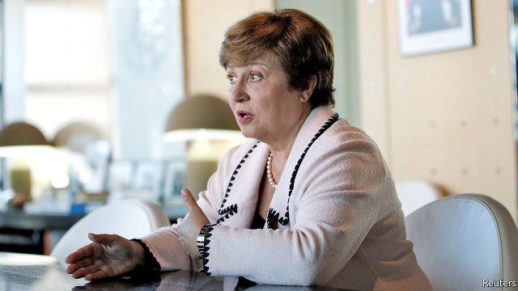

###### Sewn up

# Kristalina Georgieva is the sole contender to be the IMF’s next boss 

 

> print-edition iconPrint edition | Finance and economics | Sep 12th 2019 

KRISTALINA GEORGIEVA has been mentioned in connection with every leadership role going at international organisations, from secretary-general of the UN to the head of the European Commission. Were the presidency of the World Bank decided on merit alone, with no consideration of nationality, Ms Georgieva, its chief executive, might have been a shoo-in. She briefly stood in as president after Jim Yong Kim resigned in January, but in April the job went to David Malpass, an American. 

Now the Bulgarian seems at last to have nabbed one of the top jobs on a permanent basis. A transatlantic understanding dating back to the Bretton Woods conference in 1944 means that an American leads the World Bank while a European leads the IMF. In August Ms Georgieva became Europe’s nominee to replace Christine Lagarde at the fund’s helm. Despite noises from the British that they would put forward their own candidate, the deadline for submitting nominees passed on September 6th with Ms Georgieva the sole contender. Her official appointment by early October seems assured. 

Since 2017 she has been responsible for much of the running of the World Bank, where, before a stint at the European Commission, she also spent many years as a staffer. As chief executive she is credited with smoothing over differences between Mr Kim and the staff, and leading negotiations with the bank’s shareholders for a capital increase. 

Her good relations with large shareholders, including America and China, should prove an asset to the IMF, which risks being caught in the middle of the very trade and currency wars it was set up to avert. It may also have to advise governments on coping with a global economic slowdown. Although she has less macroeconomic expertise than some other early contenders, such as Mark Carney, the governor of the Bank of England, former colleagues point out that she was active in assessing countries’ fiscal positions while in Brussels, and helped beef up the European Union’s bailout mechanism. 

As an academic she wrote a textbook that is still used by undergraduates in Bulgaria. Her expertise in environmental economics is likely to come in handy, too. Masood Ahmed of the Centre for Global Development, a think-tank, reckons that assessing the impact of climate change on macroeconomic and financial stability will become more important for the fund. 

The first half of Ms Lagarde’s tenure was dominated by Europe’s sovereign-debt crisis. The IMF’s focus has since shifted to emerging and fragile states. Ms Georgieva will inherit a mess in Argentina (see article). One World Bank staffer notes that other European candidates would probably only have been familiar with emerging markets from their holidays. 

Ms Georgieva, by contrast, has spent decades working with the poorer countries that are the target of most of the fund’s programmes. And her home country made the transition from communism to a market economy in the 1990s. By the fund’s own classification Bulgaria is still an emerging economy, with GDP per person less than a quarter that of France, which has supplied four of the fund’s last six chiefs. 

Ms Georgieva’s stature and experience may explain the absence of challengers, which ensured that Europe retained the position despite fraught haggling over the nomination. It was the second such row of the summer. (The first, in June, had been over a package of top EU roles, which created the vacancy at the fund when Ms Lagarde was appointed to lead the European Central Bank.) For the IMF job eastern Europeans backed Ms Georgieva, whereas northerners preferred Jeroen Dijsselbloem, a former Dutch finance minister. 

When consensus eluded them, the EU’s 28 national finance ministers resorted to voting by email (though Britain abstained), at which point Ms Georgieva gained most support and Mr Dijsselbloem bowed out. Europe’s choice, though the result of much wrangling, is set to prevail. One relic of the Bretton Woods era somehow continues to defy the odds. ■ 

