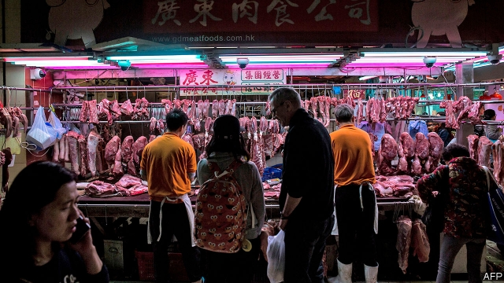
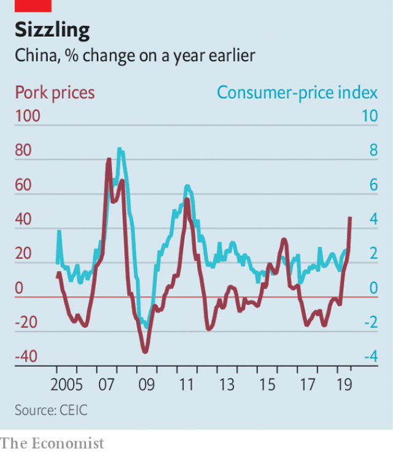

###### A porcine phenomenon

# Soaring pork prices hog headlines and sow discontent in China 

 

> print-edition iconPrint edition | Finance and economics | Sep 12th 2019 

ECONOMISTS RARELY think about the average gestation period of pigs (115 days) or the length of time a sow needs to reach sexual maturity (roughly six months). But in China, a basic knowledge of hog-breeding cycles is part of the job. Pigs are so central to the Chinese diet that the ups and downs of pork prices have an outsized impact on inflation. Once again, porcine expertise is in demand: African swine fever has devastated China’s pigs, complicating its economic outlook. 

New data show that pork prices leapt by 23% in August from July, the highest monthly jump on record. On an annual basis they were up by 47%. The feed-through to broader inflation has been modest so far. But pork is certain to become more costly in the coming months, pushing consumer prices up further (see chart). 

 

In the past, when pork prices soared farmers quickly produced more pigs. That is harder now because the population of breeding sows has collapsed. The central bank has started to ease monetary policy as growth weakens, but the spectre of pork-led inflation, even temporary, could limit its space for cutting interest rates. 

China consumes 55m tonnes of pork annually, as much as the rest of the world combined. Hu Chunhua, a vice-premier, said in August that the supply shortfall this year will be about 10m tonnes, more than is traded on international markets. The government has announced subsidies and low-interest loans to encourage pig farmers to expand. But since at least a third of China’s hog herd has been wiped out, these measures will not generate instant results. 

Several cities have started offering limited amounts of discount pork. Others are giving cash to low-income residents. China has also started to release meat from its frozen-pork reserves—created in the 1970s for just such emergencies. But they cover barely a tenth of the shortfall. On September 10th Life Times, a Communist Party-managed newspaper, had an unusual banner headline: “Pork, it’s better for you to eat less”. It dressed up its article as healthy-eating advice, but readers surmised that it was trying to put lipstick on a very pricey pig. 

 Yet the government’s big concern for now is affordability, not inflation. Pork, together with rice, has long been close to a daily necessity in China. The word “meat” by itself almost always refers to pork. But during the past decade pork has diminished in importance, as a share of both dinners and overall spending. Beef and fish have grown in popularity. Middle-class urbanites, not to mention the wealthy, are spending their money on much else besides. Analysts now reckon that pork is little more than 2% of China’s consumer-price index, down from 3% a few years ago. 

Moreover, it takes more than pork for inflation to be a problem. In 2008 and 2011, inflationary spikes followed big increases in the money supply; price rises, though pronounced for pork, were a much broader phenomenon. Over the past couple of years the money supply has grown much more slowly as regulators have pushed banks to reduce their leverage. Prices of industrial goods have fallen into deflationary territory. The central bank will thus be inclined to write off African swine fever as a supply shock. The risk is that sky-high pork prices spread to other food items, placing unwanted upward pressure on wages.  

In the meantime people are adjusting. Liu Zhiqiang, a retired factory worker in Beijing, used to treat his family to pork ribs once a week. “Now I just toss some pork shavings into fried dishes and have more eggs instead,” he says. Xishaoye, a restaurant chain popular for pork-filled crispy buns, said that it was researching whether it could use chicken as an alternative. 

All going well, China will eventually emerge from this mess with bigger, better-managed pig farms. The hog cycle would become less volatile, and pork cease to matter as an inflation indicator. China’s pigs would once more be braised by chefs rather than appraised by economists. ■ 

