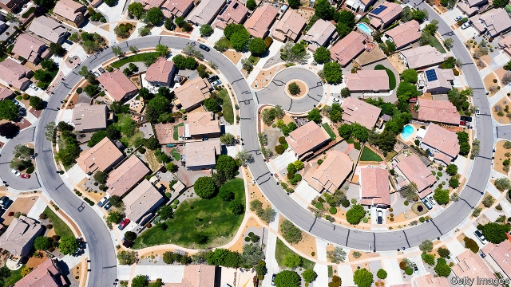
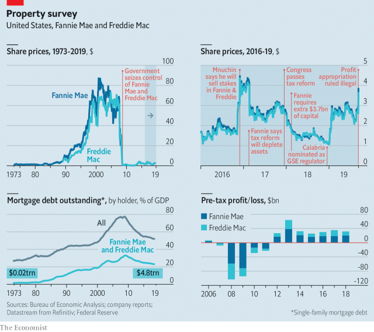

###### Home truths

# Steven Mnuchin begins reforming America’s giant mortgage-guarantee firms 

 

> print-edition iconPrint edition | Finance and economics | Sep 12th 2019 

“THE LAST unfinished business of the financial crisis”: that is the rallying cry of those seeking to reform Fannie Mae and Freddie Mac, the two giant government-sponsored enterprises (GSEs) that back much of America’s mortgage industry. In 2008, amid the wreckage of the housing market, they were bailed out by the federal government to the tune of $188bn and placed in “conservatorship”, a form of government control. On September 5th Steven Mnuchin, the treasury secretary, published a long-awaited plan to reprivatise them. “We want to make sure they are not in conservatorship on a permanent basis,” he told the Senate on September 10th. 

Mr Mnuchin set out two alternatives. The first, more sweeping, would need congressional approval. The second could be carried out by the Treasury and the Federal Housing Finance Agency (FHFA). Mr Mnuchin says passing reform through Congress is his preferred option. A senior Treasury official says administrative actions will start promptly, in part to lay the groundwork for legislation. But the administration will proceed whether or not Congress acts. The Trump administration is presenting America’s housing-finance industry with a “fork in the road”, says Jim Parrott of the Urban Institute, a think-tank. 

The two GSEs have been central to America’s housing market for decades. Fannie was founded as a government agency in 1938, during the Great Depression, and rechartered in 1968 with private capital and shareholders. Freddie was set up by Congress as a competitor in 1970. Both buy mortgages, mainly from banks, add a guarantee to repay the principal and interest if borrowers default, and bundle them into securities. These they either retain on their own balance-sheets or sell to investors. 

Their guarantees transfer some credit risk from the private sector to the government. In the run-up to the financial crisis, that transfer started to balloon. In the 1970s Fannie and Freddie held less than 10% of single-family mortgages in America. Now they hold more than $5trn of housing-related securities and guarantees, nearly half the total (see chart). 

 

Politicians often say they want the government to get out of the mortgage business entirely. But that is a distant prospect. Taxpayers’ assumption of some of the credit risk in mortgage lending is what drives the mortgage-backed-securities market (particularly since the financial crisis, which devastated private-label issuance). Investors are keen on the GSEs’ securities because they isolate the interest-rate risk associated with mortgages, allowing 30-year fixed-rate loans, which are almost unknown outside America. These are hugely popular with consumers (and voters). 

With exit politically untenable, the priority is cutting the pair down to size. Before the bail-out they operated as private companies with a public charter, implying that the government would bail them out if they ran into trouble. Rather than nationalising them during the crisis, the Treasury guaranteed to keep their net worth above zero. In return it took warrants representing 80% of their common stock. 

The result is an even odder hybrid, with private shareholders but government-run. Under public control they have been forced to hand the Treasury the bulk of their profits—and, since 2012, the lot—to repay the bail-out. Since 2008 Fannie has returned $181bn, and Freddie $120bn. Their capital buffers have also been run down and handed to the government. Last year these fell so low that both GSEs required an injection of taxpayer cash. They now have just $3bn-worth of capital apiece. 

Shareholders, whose rights were suspended in 2008, sued the government. On September 6th a panel of federal judges in New Orleans overturned a ruling that had backed the government’s appropriation of Fannie’s and Freddie’s profits. The arrangement had been made in a time of “dire calamity”, the judges acknowledged. But they added that “expedience does not license omnipotence”. When markets reopened on September 9th the GSEs’ share prices jumped by 40%. Mr Mnuchin has said he may appeal to the Supreme Court. 

By the time the legal wrestling is over, however, the profit sweep may be, too. Instead of the government getting the lot, Mr Mnuchin wants Fannie and Freddie to pay an explicit fee for their government guarantees. For the past three years they have paid, on average, $18.2bn each year. Under the new system they would retain any earnings above the agreed amount. 

Donald Layton of Harvard University says that the FHFA’s proposed capital rule for Fannie and Freddie would require them to hold (very) roughly $125bn-worth of capital. It would take at least seven years—longer if the government’s fee is high—to build this up through retained earnings. Though the Treasury could help by selling down its stakes, a balance will have to be struck between a fee that reflects the risk of default and allowing the GSEs to build up capital. Last May Mark Calabria, the FHFA’s boss, said that retained earnings might take too long and that an IPO might come in the first half of 2020. If it were to raise the $100bn-120bn needed, it would be four to five times the size of the largest initial public offering to date: Alibaba’s in 2014. 

However it is done, recapitalisation would be just the first step towards reprivatisation. Mr Mnuchin wants government support for the housing market to become explicit, rather than implied, as now. He wants the securities Fannie and Freddie issue to have a “full faith and credit” guarantee, meaning the securities, not the issuers, are state-backed. He also wants such guarantees to be offered by more firms. These putative rivals for the GSEs would be chartered and overseen by the FHFA. 

But all that would require congressional approval—hard when Congress is divided and elections are looming. More likely is that the administration will seek other ways to increase competition by lessening the privileges granted to the GSEs. They are exempt from onerous disclosure rules that apply to banks and issuers of mortgage-backed securities with private credit guarantees, for example. Their capital is a fraction of what banks must hold. Securitising loans with Fannie or Freddie protects banks from lawsuits brought by defaulting borrowers seeking to hold on to their properties by claiming failures of due diligence. 

These privileges helped the GSEs to grow so huge. It is within the administration’s power not just to end the profit sweep and conservatorship, but to level the playing field. If Congress disagrees with the administration’s vision for Fannie and Freddie, it can set out its own. Either way, the mortgage monsters will soon be finding a new home. ■ 

