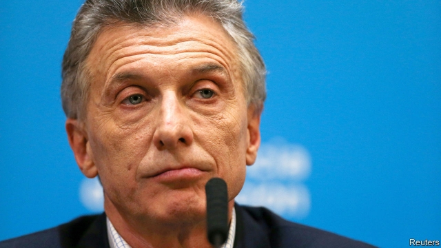

###### Exceptionable exceptionalism

# Were Mauricio Macri’s mainstream policies doomed from the start? 

 

> print-edition iconPrint edition | Finance and economics | Sep 12th 2019 

“WHENEVER I VISIT a country they always say…here it is different,” Rudiger Dornbusch, a legendary economist, once told his students at the Massachusetts Institute of Technology (MIT). “Well, it never is.” For most countries, his words are a warning. For Argentina, they are a comfort. The country has lurched from one economic crisis to another, culminating in the recent reimposition of currency controls and rescheduling of debts. Its voters, who also lurch from populists to liberals and back, look poised to oust Mauricio Macri’s liberal government in October in favour of a populist duo, Alberto Fernández and Cristina Fernández de Kirchner, the former president. It is therefore easy to believe that Argentina is different. Just not in a good way. 

Dornbusch’s words provide the epigraph for a new paper* by Federico Sturzenegger, a former MIT student and Mr Macri’s central-bank governor from when he took office in 2015 to mid-2018. It makes a contrarian defence of Mr Macri’s fiscal gradualism and inflation targeting. These policies worked elsewhere and could have worked in Argentina, he argues, had they been faithfully followed. 

Mr Macri inherited a troublesome budget deficit. To avoid the austerity associated with previous right-leaning governments, he proposed to balance the books at a politically palatable pace. The problem was not that he reduced the deficit only gradually, Mr Sturzenegger argues, but that he did not reduce it even gradually. In his first year the primary budget deficit increased from 3.8% to 4.2% of GDP (a figure flattered by a one-time tax amnesty). The improvement in 2018 owed a lot to surging inflation, which cut the cost of public pensions indexed to price increases in 2017. 

Mr Sturzenegger’s second claim is more controversial. After a brief transition, Mr Macri’s central bank adopted a conventional macroeconomic framework, using interest rates to target inflation and treating the exchange rate with benign neglect. By the end of 2017, Mr Sturzenegger argues, this policy was working. Core inflation had fallen by half, to below 20%. It was expected to drop below 15% the next year. 

Headline inflation was, however, far higher. That gave the government an excuse to relax the inflation target on December 28th (a date on which Argentines traditionally play pranks on the unsuspecting). Analysts hoped it was merely bringing the target in line with reality. In fact, says Mr Sturzenegger, it sought a gentler pace of disinflation in order to reduce the cost of those backwardly indexed pensions. The raised target, plus two cuts in interest rates in January 2018, delivered a “permanent shock” to the central bank’s credibility. 

Inflation targeting appealed to Mr Macri’s team partly because it was mainstream. But Argentina adopted it at a level of inflation far outside the norm. The targets also implied an unusually aggressive reduction in price pressure, points out Rafael Di Tella of Harvard Business School. He thinks the early success owed a lot to an economic contraction in 2016. 

To reduce the pain, Mr Di Tella says, the government should have considered limits on inflationary wage claims. One of Mr Fernández’s advisers has proposed just such a pact. Another advocate was Dornbusch himself. Keeping spending (public and private) in check is essential to killing high inflation, he argued in 1986. But the collateral damage to growth and jobs can be reduced with income policies, which serve as a co-ordination device: when inflation is high, no one will moderate their wage claims unless everyone else does too. 

According to Mr Sturzenegger, Mr Macri’s government rejected a wages pact because it was unorthodox. But if Mr Di Tella is right, then Argentina’s self-conscious attempt to act normal may have helped prevent it from becoming so. Normal countries do not need incomes policies. But, Dornbusch might have retorted, countries in Argentina’s position normally do.■ 

* “Macri’s macro: The meandering road to stability and growth”, by Federico Sturzenegger. BPEA conference draft, Fall 2019. 

