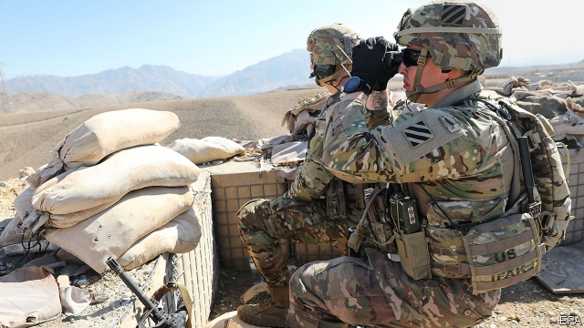

###### Talking chop

# America will have to resume negotiations with the Taliban eventually 

 

> print-edition iconPrint edition | Leaders | Sep 12th 2019 

FOR MONTHS America and the Taliban had been haggling over an agreement to end their 18-year war in Afghanistan. A deal was in sight. But then President Donald Trump learned that a Taliban bomber in Kabul had killed an American soldier, as well as 11 other people (see article). “I immediately…called off peace negotiations,” he fumed on Twitter. 

The decision came as a relief to many, who had feared that Mr Trump was ready to sign any deal with the Taliban, no matter how humiliating for America or catastrophic for Afghanistan, just to keep a campaign promise to stop America’s “endless wars” and bring the troops home. As he called off the talks, the president revealed that he had been on the verge of hosting Taliban negotiators at Camp David, his rural retreat, in the hope of sealing a deal there. Many Americans would have been shocked by the spectacle of their president welcoming the group that once sheltered Osama bin Laden, just days before the anniversary of the attacks of September 11th 2001. Instead, after Mr Trump put his foot down, the American commander in Afghanistan said he was increasing the tempo of attacks on the Taliban. Negotiations were “dead”, Mr Trump reiterated. 

The deal America was on the verge of striking looked lopsided. It was one of the sources of disagreement between Mr Trump and John Bolton, his national security adviser, who left his job this week, removing the administration’s chief hawk (see article). It involved America withdrawing 5,000 troops without the Taliban even agreeing to a ceasefire. That is not quite as abject as it sounds. America would still have had enough manpower to carry on training the Afghan army and giving it air support. In the meantime, the Taliban in effect agreed to negotiate directly with the Afghan government, although this was dressed up as part of a national dialogue. That is something the Taliban had until now tenaciously resisted. 

The problem is that the Taliban have no incentive to make big concessions, such as accepting a ceasefire or moderating their demand for a theocracy, if they believe that time is on their side. Some suspect that Mr Trump just wants to declare victory before the next election and leave Afghanistan to its fate come what may. To forge a durable peace, Mr Trump must convince them they are wrong and that he will stay if needs be. It will not be easy. 

The war cannot be won by arms alone. Even when America had 100,000 troops in Afghanistan, seven times more than today, it could not stamp out the Taliban. With relatively few troops, America suffers just a dozen or so deaths a year, and still stops the Taliban from overrunning the country. Yet thousands of Afghans perish, and life is made miserable for the remainder. 

An abrupt American pull-out would make matters worse, dooming Afghanistan to an even bloodier civil war and possibly to an eventual Taliban victory. That would destabilise the region, create another potential haven for terrorists and leave Afghans at the mercy of a group that murders girls for going to school. It is hard to imagine a worse outcome from 18 years of war. 

If military victory is unattainable and surrender unpalatable, that leaves only one option: more negotiation. The Taliban say they are still open to dialogue. Fine, let them talk with the elected government of Afghanistan. America should use all its muscle to bring both sides to the table. And it should make clear that it will support the regime in Kabul until it is no longer in danger of being overthrown by jihadists. Everyone will have to make galling compromises. The Taliban will once again have to be allowed a prominent role in government, because that is the way to give them a stake in the peace. 

Such a deal is a long way off. It will not be settled in time for anyone to brag about it on the campaign trail in 2020. So be it. Mr Trump was right not to rush into a bad deal. Afghanistan’s future and America’s credibility will depend on him, or a future president, having the patience and resolve to strike a better one. ■ 

