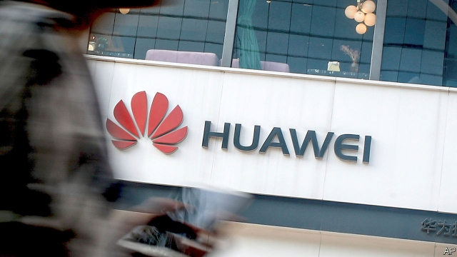

###### A way forward?

# Huawei has made a peace offering that deserves consideration 

 

> print-edition iconPrint edition | Leaders | Sep 12th 2019 

AMERICA HAS unleashed a barrage of actions against Huawei, a Chinese telecoms giant which it believes spies for the Chinese government and threatens Western interests because of its dominant role in 5G technologies. Since May, American firms have mostly been banned from supplying Huawei. The Justice Department wants Canada to extradite a top executive who is accused of sanctions-busting. Uncle Sam’s diplomats have urged other countries to stop using Huawei gear. America’s aim has been to cripple a business that it views as a menace. 

As we report this week from Shenzhen, where Huawei is based, the plan has not worked. True, Huawei is suffering. Western banks are wary of it. Silicon Valley suppliers and the owners of datasets have shied away. And on September 19th Huawei, which as well as building networks is the world’s second-biggest smartphone-maker, faces the humiliation of launching a new handset that lacks popular American apps such as Google Maps and WhatsApp. 

Yet the Chinese firm is hardly on its knees. Not many 5G contracts have been cancelled. It is doing well at home and in countries that are not close American allies. The growth in its revenues is stabilising, following a drop after May, and it expects to stay profitable. It has $36bn of spare cash. The firm says it has alternative sources for most components and it may soon launch a rival to Android, Google’s smartphone operating-system. 

Instead of Huawei’s demise, the tech world faces a split, with an increasingly self-sufficient Chinese industry active everywhere but America. America and its allies could lag behind in 5G, because Chinese firms offer cutting-edge technology at the lowest cost. Replacing existing Huawei gear would be expensive. Competition would suffer. And if Huawei develops rivals to the likes of Android it would weaken Western tech firms. 

It is right to be wary of Huawei. No Chinese firm can simply defy the country’s autocratic rulers, especially in matters of national security. The question is whether there is a mechanism to mitigate the risks and create trust where little exists. Britain and Germany have set up monitoring bodies to scrutinise Huawei products, but that has not impressed American officials. 

Now Ren Zhengfei, Huawei’s boss, has floated an alternative: cloning his 5G technology “stack” (patents, code, blueprints and production know-how) and selling it to a Western firm, which would be free to use it outside China and develop the technology as it sees fit. Buyers might include Samsung or Ericsson. 

Telecoms intellectual-property portfolios have been sold before. Microsoft bought parts of Nokia in 2014, for example. In this case the buyer would face no competition from Huawei in America, where the Chinese firm does not operate (although it would need to deal with different spectrum frequencies there). In other countries the two would go head to head, though it would take the new competitor years to ramp up manufacturing. 

The sale of Huawei’s technology would not guarantee security from Chinese spies or saboteurs. Its spooks would remain perfectly capable of hacking networks run by Western companies. But the West would gain safe access to cutting-edge 5G technologies, avoiding roll-out delays. Competition would be enhanced by a new Western contender or a stronger existing one. The world might regrettably still have two tech ecosystems, but the plan might nonetheless help defuse the tech cold war. 

The two superpowers are on a dangerous path. If it chooses escalation, America has one option: to try to put Huawei out of business outside China, which could spark a gloves-off conflict. In normal circumstances Mr Ren’s suggestion would be outlandish. In times like these it deserves a hearing. ■ 

Dig deeperRen Zhengfei may sell Huawei’s 5G technology to a Western buyer, September 12th 2019Huawei’s founder defends Deng Xiaoping’s Chinese model, September 12th 2019A transcript of Ren Zhengfei’s interview, September 12th 2019 

