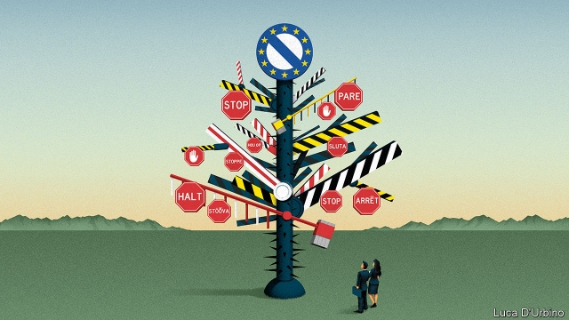

###### Growing barriers

# Why Europe’s single market is at risk 

 

> print-edition iconPrint edition | Leaders | Sep 12th 2019 

EVERY FIVE years the appointment of a new team at the European Commission is a chance to steer the European Union (EU) in a fresh direction. On September 10th Ursula von der Leyen, the incoming boss, set out her priorities: managing the transition from fossil fuels, extra dollops of American big-tech bashing and “upgrading our unique social market economy”. 

The first two at least have the benefit of being clear. On the economy, however, Europe needs a lot more than blather. In the past decade the trend of economic integration that defined post-war Europe has gone backwards. The “single market”, once breathtaking in its ambition to eliminate all internal EU barriers for goods, services, capital and people, has failed to keep up with the economies it was trying to shape. If Europe wants to create prosperity and world-beating firms, it needs not just to reinvigorate the single market, but also to rediscover that original vision in neglected areas of trade such as services. 

The single market still matters—look at the mess Britain finds itself in as it tries to extricate itself from the EU. But a policy originally devised to break down trade barriers in the era of coal and steel has not adapted fast enough to the era of bits and likes (see Briefing). In the past decade Europe’s banks have retrenched to their home markets and its firms have shifted their energies to expanding outside the EU. As a result, Europe still looks like a series of mid-sized economies patched together, not a single rival to China and America. 

That is one reason why, even as central bankers administer a drip-feed of monetary adrenalin, Europe’s economy is losing ground to global rivals. It risks becoming a business backwater. A decade ago ten of the world’s 40 largest listed firms by market value were based in the EU; now only two are—in 32nd and 36th place. Desperately few of the world’s leading startups are European. 

Policymakers who ache at the absence of a European tech success on the scale of Google or Amazon pay lip service to the importance of the single market. And yet France and Germany argue that the real answer is dirigiste industrial policy. They have called for mergers of European firms to create industrial “champions” shielded from antitrust rules and Chinese competition. 

They should be aiming to complete the single market instead. A functional single market helps firms achieve economies of scale. It is cheaper to make a product that has to meet one set of EU regulations than to try to follow 28 different national rulebooks. Stiffer competition from firms across the continent means that shoppers get better and cheaper stuff. Imagine if the dozens of mobile operators in Europe were free to pitch their data plans to those beyond their national borders. Instead, consumers have to make do with higher-charging local oligopolies. 

Innovation spreads faster in a unified market, pepping up productivity. A properly integrated energy grid would boost the most efficient (and greenest) power producers. Banks with loans out across the continent avoid trouble if their home market falls into recession. Capital markets on a continental scale can help them distribute risks beyond the banking sector. Safer banks and deeper markets mean cheaper capital and fewer bail-outs. 

For all those reasons, reinvigorating the single market ought to be at the centre of the debate on how to boost Europe’s economy. It is not. Since her appointment two months ago Mrs von der Leyen has mentioned the single market only in passing (see article). The commissioner in charge of the brief, Sylvie Goulard of France, is well regarded, but will have to split her time between internal-market duties, regulating artificial intelligence, and a new defence-industry and space brief. 

That might be understandable if the single market were beyond saving. In fact it can be revitalised in three ways. The first is to ensure that its statutes are fully implemented. Too often, national governments flout the edicts of the single market so as to protect a politically connected industry. On average, each European country regulates the workings of nearly 200 professions, making it needlessly tricky for Europeans to move to where the jobs are. No wonder bits of the continent still have double-digit unemployment. The new Brussels team should step up enforcement against governments that fail to apply the rules. 

The second way is to focus on the euro. The single currency is in some ways an extension of the single market, even if fewer countries belong to it. It would be more stable if a central fund insured bank deposits. A more substantial euro-zone budget, focused on unemployment insurance, say, could help integrate euro-zone economies. As an added benefit, this would also deepen cross-border links, notably by helping banks become truly European. Here, Mrs von der Leyen has a harder task. Her native Germany will seek to keep progress glacial. 

Most ambitious would be a fresh push to remove what structural barriers remain to cross-border European trade. Collecting value-added tax in a neighbouring country would not be so daunting for small businesses if the levy was structured in the same way across Europe, for example. Banks would pitch their wares more broadly if bankruptcy laws were harmonised, and a proper capital-markets union created. Standard contracts for business services (on professional liability, say) would make it easier for German accountants to tout for business in Italy, or for Spanish architects to pitch their offerings beyond the Pyrenees. 

A grand bargain of policies serving up tax reform, services liberalisation and a more robust euro would run into plenty of national red lines. But each country would also have lots to gain. Europe needs to shield itself from the fallout a global trade war might bring. It needs a vision after the departure of Britain, the single market’s most reliable champion in Brussels—but also, often, a brake on ambitious projects. Meanwhile, Britons tempted to say good riddance to the single market’s frustrations should reflect on how much losing a seat at the table could cost them. 

Jacques Delors, a former head of the European Commission who championed closer integration, rightly pointed out that “nobody can fall in love with the single market”. There is nothing flashy about reworking bankruptcy rules or tax regimes. But Europe’s greatest economic project is half-finished business, yielding just half the benefits it could. Europe has few such obvious levers to pull to boost its economy. Time to tug on this one. ■ 

