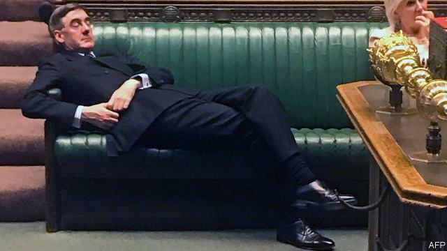

###### On sea levels, democracy, property, Taiwan, India, London, Europe, Jacob Rees-Mogg

# Letters to the editor 

 

> Sep 14th 2019 

“Higher tide” (August 17th) shone a light on the serious threat that climate change poses to the world’s coastal communities. Existing efforts to reduce carbon emissions and limit average temperature increases are insufficient. Climate mitigation must also be met with climate adaptation. 

Fostering resilience to the effects of climate change not only meets a compelling humanitarian obligation, but also makes economic sense. For example, mangrove forests are one of the most effective tools to shield the world’s poorest coastal communities from rising sea levels. Each year these forests protect 18m people from coastal flooding and prevent more than $80bn in damages. The benefits of mangrove preservation and restoration are up to ten times the costs. 

But rising sea levels are just one symptom of climate change. Its effects touch upon every aspect of our lives. In advance of the UN Climate Action Summit in New York, the Global Commission on Adaptation has just published its landmark report offering practical solutions to guide countries on how to adapt to the effects of climate change. This is a live issue and the quicker we act to adapt the greater the dividends. 

PROF. PATRICK VERKOOIJENChief executiveGlobal Centre on AdaptationRotterdam 

The most compelling explanation for the rise of today’s populism (“Democracy’s enemy within”, August 31st) can be found in the sociological study of structural-demographic theory. In the “Ages of Discord”, Peter Turchin described how America is going through a “disintegrative phase”, last seen in the 1860s. In this phase, political fragmentation grows, social democracy declines, elites take greater economic and political power (and seek more positions than the country offers), workers suffer from stagnant wages and inequality, authoritarianism grows, and the state is headed toward fiscal crisis. Mr Turchin’s book fully explains the dynamic factors at work and is supported by much empirical data. You actually described the disintegrative phase without recognising it for what it is. This phase may not be the end of some democracies (or democracy in general), but as Mr Turchin says, there is no guarantee a country will survive it. 

PAUL MCVINNEYAccokeek, Maryland 

Comparing the American residential real-estate market with other countries, as you did in “Sellers beware” (August 31st), is an apples-to-oranges comparison. The market in America surpasses other countries and encourages homeownership among first-time and low-income buyers, because these people generally do not have to add a commission to the amount they are already paying to the seller. 

Moreover, because of the Multiple Listing Service system, which lists all properties for sale in one place, we are seeing unprecedented competition among brokers, especially when it comes to service and commissions. Brokers offer varying commission models, flat fees and fee for service. A large majority of sellers choose to use a broker, demonstrating that they value the services that brokers offer and that fees are competitive.  

Furthermore, characterising brokers as “middlemen” ignores the incredibly valuable services they provide. Research has shown that while many buyers begin their home search online, they soon turn to the assistance of a trusted real-estate agent to guide them through this infrequent, complex, significant transaction. Even though there is a voluminous amount of information available to them, buyers value a qualified, local buyer broker to help them sift through this information, advise them and perform many other functions essential to the buying process. 

JOHN SMABYPresidentNational Association of RealtorsWashington, DC 

So China “never tires of reminding America that in 1982 it promised to reduce arms sales to Taiwan” (“Tsai’s prize”, August 24th). Rather, it is time for America to remind the Chinese government that promises are not a one-way street. Ronald Reagan was crystal clear on the issue in a note to the National Security Council: America’s “willingness to reduce its arms sales to Taiwan is conditioned absolutely upon the continued commitment of China to the peaceful solution” of their differences. Given that Taiwan does not threaten to invade China but China continually threatens to invade Taiwan, there can be no question that America should continue buttressing Taiwan’s defence capabilities. 

DANIEL MARTIN SCHULZHamburg 

Your article on the Indian government’s effort to revive the economy overlooked the fruits of incremental improvements (“Meagre fare”, August 31st). Since 2014 India has moved up 57 places to 77 in the World Bank’s ease of doing business index. Endemic corruption has been reduced. In the year to March India attracted a record $64.4bn in foreign direct investment. 

Big steps have been made in the banking system to deal with bad loans. Inflation is tamed and the central bank has room to manoeuvre on monetary policy. You mentioned a decrease in spending on biscuits. A more telling tale is how access to the internet is surging because Indians can buy data on their mobile phones cheaper then virtually anywhere else in the world. 

Mr Modi is doing what is needed to sustain low inflationary growth. 

DAVID CORNELLChief investment officerOcean Dial AMMumbai 

May I suggest you use the occasion of Brexit finally to ban the term “continental Europe” (Charlemagne, August 17th). Why place this tediously generalising adjective before the name of a vast continent with a few islands on the periphery? This custom of dividing Europe into Britons and continentals, as if they are somehow equal in numbers or diversity, reflects the same British-centrism and delusions of grandeur that motivated one class of Brexit supporters. But wait, maybe after Brexit the term continental becomes redundant anyway because there will be just Britain and Europe. 

GUNNAR NIELSOxford 

* Rumble in the concrete jungleYour recent article ‘London’s Tube is worryingly noisy’. As the London Assembly Member (West Central) my constituency includes Pimlico, where hundreds of residents have seen their quality of life destroyed by significant levels of Tube noise in their homes, well above World Health Organisation guidance. With ever increasing Tube frequency on the London Underground and the rollout of the night Tube under Sadiq Khan, the Mayor of London, this issue has never been more important—thank you for drawing it to the attention of your readers. 

TONY DEVENISHAssembly Member for West CentralLondon 

Bagehot described Jacob Rees-Mogg as “lying prone across the Commons benches” (September 7th). He was actually lying supine. If depicted prone Mr Rees-Mogg might make an even better election poster for the opposition. 

HUBERT DE CASTELLALondon 

* Letters appear online only 

