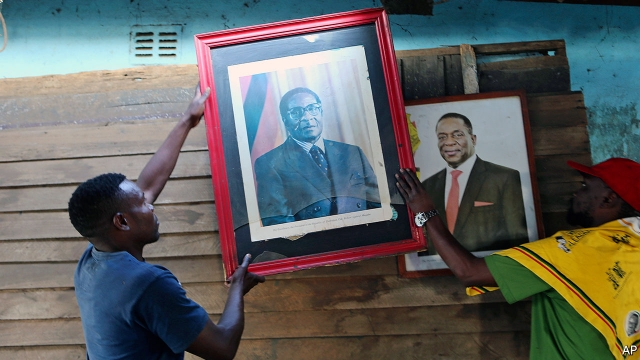

###### Grave threats

# Even in death, Robert Mugabe worries his successor 

 

> print-edition iconPrint edition | Middle East and Africa | Sep 14th 2019 

ROBERT MUGABE had been out of power for nearly two years when he died on September 6th (see Obituary). He had been far away and sick since April, so you might think his death would not rattle his successor as president of Zimbabwe, Emmerson Mnangagwa. But bones have a way of making themselves felt. 

In the past few months Zimbabwe has fallen into a pit of despond that is as deep as it was during a horrendous period in 2008 when inflation reached world-record levels and shelves in the shops went bare. Rumours of rancour and plots in Zanu-PF, the ruling party, especially among the generals, are flying thick and fast. Even the arrangements for the dead despot’s funeral have been causing confusion, consternation and bad blood. 

As The Economist went to press, Mr Mugabe’s body, after arriving from Singapore, where he died, was due to lie in state for two days in a football stadium near the centre of Harare, the capital, before being moved to the bigger National Sports Stadium. This happens to be across the road from Heroes’ Acre, a hill on the edge of the city where the leading lights of the anti-colonial liberation struggle, including Mr Mugabe’s first wife, Sally, are buried. A place has long been reserved next to her. 

The funeral service is expected to take place in the bigger stadium on Saturday. Mr Mnangagwa, the dead man’s bloodstained, long-serving enforcer, who ousted him in a coup in 2017, is expected to preside. The government says Mr Mugabe is to be buried in Heroes’ Acre the next day. But his family, led by his widely reviled and notoriously acquisitive second wife, Grace, wanted him buried in his home village, Kutama, an hour’s drive to the west. Wherever it takes place, the prospect of huge crowds, swelled by rising anger and desperation among the poor, leaves Zimbabwe’s rulers nervous. 

That is not surprising. Electricity is available for barely six hours a day. Clean water runs once a week. A civil servant’s monthly salary barely buys two days of groceries for a family of four. Drivers queue for hours for scarce supplies of petrol, the price of which has more than quintupled this year. Annual inflation is reckoned to be about 500%. The value of Zimbabwe’s newly introduced currency, which is meant to take the place of the American dollars that have been used for a decade, has slumped. 

Western governments and bodies such as the IMF will not lend unless Zimbabwe clears its arrears with the World Bank and the African Development Bank. The finance minister, Mthuli Ncube, has cut subsidies and sought to reduce the state payroll but seems increasingly erratic. Harsher austerity risks a popular explosion. Moreover, he is hobbled by party bigwigs and generals who fiddle the foreign-exchange rates and continue to plunder the treasury. 

Outsiders also insist that, if Mr Mnangagwa (pictured on the right) is to get foreign help, he should be less repressive, first by repealing two laws that have long enabled the government to lock opponents up and muzzle independent voices. He is moving towards doing so, but has yet to complete the task. Human-rights campaigners say his proposed security bill looks a lot like the repressive old act, and that abuses have surged even in the past month. They report more than a score of new charges of treason, abductions and cases of torture of opposition campaigners, mainly belonging to the Movement for Democratic Change (MDC). Civil-society groups say they are being threatened as viciously as ever. 

Mr Mnangagwa has long been adept at suppressing dissent, though street violence could erupt again as the economy melts down. The MDC insists that, before it might agree to co-operate in a “transitional mechanism” to implement reforms, he should first admit that last year’s parliamentary and presidential elections were rigged, something he is unlikely to do. 

In any case, the biggest threat to his survival comes from within his own party, especially from the generals who helped him seize power in the first place. His first vice-president, Constantino Chiwenga, the armed-forces chief behind the coup, is said to be gravely ill. Other army types are reported to be plotting for the succession. Some prominent holdovers from the Mugabe era may, it is speculated, at last be charged with corruption. Mr Mugabe’s widow and her family, whose bid for power sparked the coup, may finally be dispatched into political oblivion. And the lethal internecine struggles within the ruling party that marked the despot’s 37 years in power will persist beyond his grave, wherever it may be. ■ 

