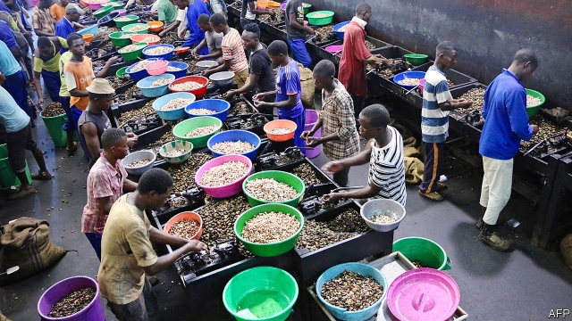
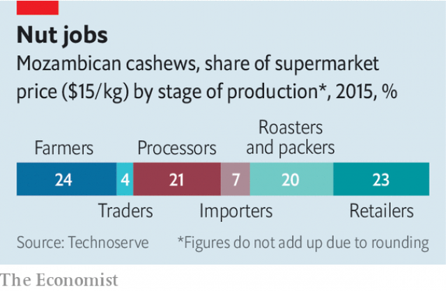

###### Of cashews and cash

# Mozambique’s nut factories have made a cracking comeback 

 

> print-edition iconPrint edition | Middle East and Africa | Sep 12th 2019 

INDUSTRIALISATION, UP CLOSE, is organised monotony. For eight hours a day workers at a cashew factory in northern Mozambique scoop nuts from their oily shells. It is hard to talk above the thrum of machines. The pay is a modest 4,600 meticais ($76) a month. But it is a job. There are precious few good ones in Mozambique. 

African countries are trying to climb the industrial ladder, and the processing of agricultural commodities seems a natural first step. By roasting coffee and spinning cotton they hope to boost export earnings and create jobs. For example, a fifth of the retail price of cashews goes to primary processors (see chart). By reviving its industry, Mozambique has captured some of that value. But its story also shows why industrial policy is hard to get right. 

 

In the 1960s Mozambique produced half the world’s raw cashew nuts and processed much of the crop domestically. Then the industry was brought to its knees by a long civil war. The knockout punch came in the 1990s, when the World Bank told the government to remove controls and cut taxes on the export of raw nuts. Trading firms shipped out cashews and processed them elsewhere. Domestic processors shut down and 8,000 jobs were lost. Mozambique’s cashew industry became a cause célèbre for anti-globalisation activists. 

Then the government changed tack. Since 2001 it has levied an export tax of 18-22% for raw nuts, and zero for processed kernels. It also bans exports entirely during the first months of the harvest. In practice, many nuts are smuggled out, hidden in crates of beans. Industry insiders say this informal trade helps launder money for politically connected cartels, which ship heroin the other way. Even so, the export tax has revived the processing industry. With less competition from foreign buyers, processors can squeeze farmers to sell them nuts more cheaply. There are now 16 factories employing 17,000 people, which process about half the cashews sold. 

Without the export tax the domestic processing industry would not survive, says one factory-owner. After each season he buys enough nuts to last for the full year ahead, paid for with costly bank loans. His competitors in India and Vietnam import nuts from all over the world, so need inventories of only 4-6 weeks. 

Of course, the export tax hurts nut-growers by pushing down the price of their crop. Most cashews in Mozambique are grown by smallholders. The government is neglecting these 1.3m families to protect a few thousand jobs in processing, says Carlos Costa, a cashew expert in Maputo, the capital. Farmers have little incentive to replace old trees or use anti-fungal sprays, despite subsidies, and the quality of raw nuts is one of the lowest in the world. Harvests have increased more slowly than in other African countries. 

This is a classic dilemma for agro-processing: governments that want to protect a nascent industry end up hurting much larger numbers of farmers. Past World Bank reforms came down on the side of the nut-growers. And yet the trade-off is rarely as simple as theory predicts, because farmers connected to markets by rutted roads are often at the mercy of a small number of middlemen. “It is a Wild West,” says Daria Gage of TechnoServe, a non-profit helping to develop the cashew industry. “Usually the farmers don’t win out.” The reforms of the 1990s made the average cashew-growing household richer by just $5.30 a year. 

The government is holding consultations about changes to the export tax. Ilidio Bande, the head of the state-run cashew institute, harrumphs that the tax is “crucial” to the survival of the industry. He points out that nobody else is playing fair. India, the biggest consumer and processor in the world, raised its import duty on processed kernels to 70% this year. Mozambique’s export tax is likely to stay. ■ 

