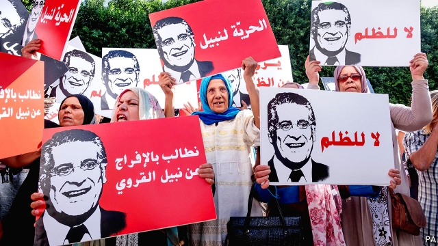

###### A wide-open race

# Tunisia’s election features fed-up voters and bizarre candidates 

 

> print-edition iconPrint edition | Middle East and Africa | Sep 12th 2019 

IT WAS THE first true presidential debate in the Arab world, yet the front-runner was nowhere to be seen. Nabil Karoui was not entirely to blame for his absence from the stage, though. The businessman and media mogul is campaigning to be president of Tunisia from jail. 

On September 15th Tunisians will choose a new president for the second time since their revolution in 2010. The democracy that emerged has endured assassinations, terrorist attacks and a moribund economy. Most recently it survived the death of a president: Beji Caid Essebsi, the winner of the election in 2014, who died in July. In a country that had only two rulers for the first half-century after independence, 26 people are now competing to replace Essebsi. With the winner needing at least 50% of the vote, a run-off is likely. 

The televised debate that began on September 7th was spread over three nights and featured most of the candidates. Some appeared nervous and hesitant. The format precluded any real discussion. Still, Tunisians were riveted. Cafés that showed the debate drew the sorts of crowds usually reserved for a big football match. 

Whether the people turn out to vote is a different matter. The electoral commission, known as ISIE, has worked hard to sign up new voters. Almost everyone eligible is registered. But voters seem increasingly frustrated with politics. Turnout for presidential and parliamentary elections in 2014 was 63% and 68%. In last year’s municipal election just 34% of voters showed up. “There have been other elections and nothing really happened,” says Khmais Boungisha, a student from Bizerte. “I can’t see why I should be optimistic.” 

Such frustrations have drawn eclectic candidates into the race. There are no recent polls (ISIE forbade their publication in July), but earlier surveys offered encouragement to outsiders such as Mr Karoui, who promises a “war on poverty” with new infrastructure spending. He says little about how Tunisia will pay for this. The government is in the middle of an IMF-backed reform programme that seeks to reduce the budget deficit from 6.3% of GDP in 2016 to 3.9% this year. 

Not everyone is a populist, of course. The race features stalwart members of the establishment, such as Moncef Marzouki, who led the country after the uprising. Ennahda, the moderate Islamist party that won Tunisia’s first free legislative election, is putting forward Abdelfattah Mourou. The prime minister, Youssef Chahed, a technocrat, announced his candidacy for president with a promise to “challenge old mindsets”. Yet for many voters Mr Chahed himself represents an old mindset. His economic reforms have been painful. 

As Mr Karoui soared in the polls, parliament passed a controversial law this summer that barred him (and a few other candidates) from running. To his credit Essebsi refused to sign the measure, which was eventually declared void. In August the authorities tried a new tactic: the police arrested Mr Karoui for tax evasion and money-laundering, charges that his aides insist are political. Under Tunisian law, however, he is still eligible to stand, even from jail. He will split the populist vote with candidates like Kais Saied, a law professor dubbed “the robot” for his tendency to speak in stilted classical Arabic. Mr Saied wants to bring back the death penalty and thinks homosexuality is a foreign plot to weaken Tunisia. Another candidate, Abir Moussi, views the revolution as a mistake and seeks to abolish parliament. 

Whoever wins will soon realise that the president has little say over domestic affairs. Elections for parliament, scheduled for October, will do more to shape economic and social policy. The presidential vote will be a protest against the status quo. In a region mired in autocracy, perhaps even that is something to cheer. ■ 

