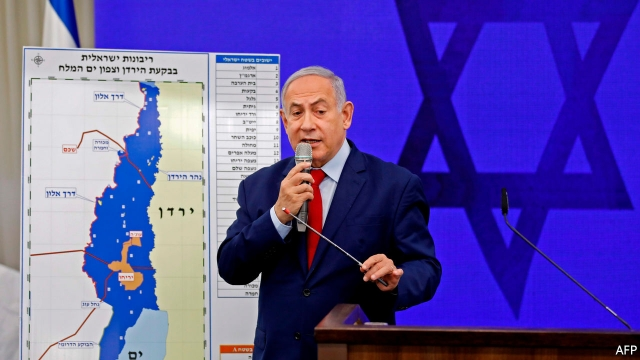
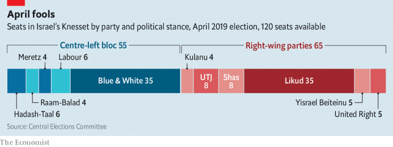

###### The magician’s latest trick

# Will Binyamin Netanyahu’s vow to annex part of the West Bank work? 

 

> print-edition iconPrint edition | Middle East and Africa | Sep 12th 2019 

BY NOW IT is something of an Israeli ritual. As an election looms, Binyamin Netanyahu digs deep for ways to scare or thrill his hawkish supporters. He says unkind things about Israel’s Arab minority. He warns of voter fraud. He invites nervous conservatives to imagine a cabinet minister named Ahmed. On September 10th he offered a carrot: if re-elected, Mr Netanyahu said, he would annex the occupied Jordan Valley in the West Bank. Such a move—indeed, any discussion of it even—would be reviled abroad, including by Israel’s allies. But foreign criticism worries him far less than the threat of defeat at home. 

This will be Israel’s second election since April. The previous ballot gave 65 seats to hawkish and religious parties, which should have let Mr Netanyahu form a government (see chart). But Avigdor Lieberman, the leader of the nationalist Yisrael Beiteinu party, refused to join unless the government agreed to pass a long-delayed law to make it harder for ultra-Orthodox Jews to avoid military service by attending religious schools. Mr Netanyahu could not agree to this without spurring his ultra-Orthodox allies to quit any potential coalition. He was left humiliated, one seat short of a majority. 

 

In an earlier era the Israeli president would have asked another party to form a coalition. But Mr Netanyahu is eager to avoid this. He faces looming indictments for corruption and fraud. Remaining in power will make it easier for him to defend himself. Perhaps for this reason, Mr Netanyahu persuaded the newly elected Knesset to break with political tradition and dissolve itself, forcing a snap election. And so, on September 17th, Israeli voters will trudge to the ballot box yet again. 

If polls are accurate, Mr Netanyahu will again fail to win a majority. Mr Lieberman’s gambit proved popular; surveys show his small party doubling in size since April. This would not make him a serious contender for the premiership. But it does make him a bigger obstacle for Mr Netanyahu. The ultra-Orthodox parties adamantly oppose a conscription bill and will not support a government that plans to pass it. 

This ought to be good news for Mr Netanyahu’s rivals—but they too have little prospect of winning. The largest centre-left party, called Blue and White, has run a desultory campaign plagued by infighting and gaffes. It has no easy path to forming a coalition. Meanwhile Ehud Barak, a former prime minister, re-entered politics to great fanfare this summer. Instead of shaking up the race, though, he merely muddied the waters for centre-left voters confused about whom to support. 

Five months after the previous election, public opinion has barely budged. If Mr Lieberman sticks to his position, a majority of the Knesset will probably be held by parties eager to see Mr Netanyahu leave. That is the only thing that unites them—hardly enough to make left-wing Arab parties sit with Jewish nationalists in the same government. Deadlock beckons again. 

Turnout in April was 68%, down four points from the previous vote in 2015. Much of the drop was due to a poor showing among Israeli Arabs. Their turnout was just 49%, a 15-point decline. The ultra-Orthodox will show up en masse at the urging of their rabbis, which helps Mr Netanyahu’s allies. But he no doubt worries about whether his own supporters will bother. 

For years Likud pollsters have noticed that even staunch right-wing voters are tiring of Mr Netanyahu’s long rule and his seemingly endless personal scandals. They are not willing to cross party lines and vote for the centre-left. But they may decide to stay home or go to the beach. 

In the past Mr Netanyahu has overcome “Bibi fatigue” with fear. On election day in 2015, for example, he warned that Arab voters were “coming to the polls in droves”. This year he is at it again, accusing Arab citizens of voter fraud and trying to “steal the election”. Less than two weeks before the vote, he tried to rush a bill through parliament to permit observers to film in Israeli polling stations, an effort seen as an attempt to intimidate Arab voters. (The bill did not pass.) 

Now comes his promise of annexation, a long-cherished dream of the far right. In one sense it is a desperate stunt, similar to one before the election in April. But it was still jarring to hear an Israeli prime minister speak of annexing one-third of the West Bank, land the world sees as part of a future Palestinian state. It is far from clear that Mr Netanyahu will keep his promise—he has been in power for 13 years and has never taken any actions towards annexing the territory. But even if he does not act, his words help to normalise the idea. A future leader may be less restrained. 

A new bloc is coalescing at the centre of Israeli politics, motivated by resentment at the influence of religious parties, Mr Netanyahu’s largely dependable allies. Both Mr Lieberman and Benny Gantz, the leader of Blue and White, call for the formation of a “secular national-unity government”. Together with Likud, and the much-diminished Labour, such a coalition would have a comfortable majority. 

They cannot agree on who will lead it. Mr Gantz has ruled out serving under an indicted prime minister. Mr Netanyahu will not relinquish power voluntarily. His own party could push him out—but Likud has never deposed one of its own leaders. Unless Mr Netanyahu defies the polls, Israel looks set for further instability. ■ 

