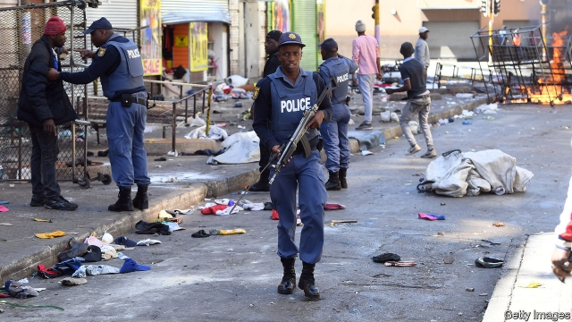

###### Hate thy neighbour

# Xenophobic violence flares in South Africa 

 

> print-edition iconPrint edition | Middle East and Africa | Sep 14th 2019 

WAVING FIGHTING sticks, improvised spears and shields, they advanced like an army through the streets of central Johannesburg, chanting and singing in Zulu: “Foreigners must go back to where they came from.” As they went they looted and burned shops, attacked a mosque and killed two people. The murders on September 8th came after more than a week of attacks—mostly by South Africans against migrants from other African countries—that had already led to ten deaths. 

This is not the first time South Africa has experienced such horrors. Dozens of people were killed in anti-foreigner riots in 2008 and 2015. But the most recent outbreak of violence shines a particularly harsh light on the rabble-rousing of South African politicians, some of whom have blamed migrants for supposedly taking jobs from locals and committing crimes. 

Two years ago the deputy minister of police complained in a press conference that South Africans had allowed foreigners to take over the centres of cities such as Johannesburg. “We fought for this land...we cannot surrender it to the foreign nationals,” he said. Aaron Motsoaledi, then the health minister but now in charge of home affairs, last year blamed overcrowded hospitals and the spread of infectious diseases on sick foreigners. 

Anti-foreigner sentiment is not confined to politicians from the ruling African National Congress. Herman Mashaba, who was elected mayor of Johannesburg for the opposition Democratic Alliance, regularly scapegoats foreigners for crime in the city. 

The killings are straining diplomatic, trade and cultural relations between South Africa and others on the continent. Nigeria has started flights to evacuate hundreds of its citizens affected by the violence. Some Nigerian lawmakers have called for South African firms operating in their country to be nationalised. Rioters have attacked South African-owned companies in Nigeria and prompted the closure of South Africa’s diplomatic outposts. Protests have also been staged outside South African embassies in Zambia and the Democratic Republic of Congo. 

Some locals whisper that clandestine forces are whipping up the violence in South Africa for political ends. Perhaps, but it is not unusual for riots to break out spontaneously. Youth unemployment is a staggering 40%, so there are plenty of frustrated young men with time on their hands. Economic growth is slow, and the gap between rich and poor is vast. Trust in the police and government has been weakened by years of corruption scandals. The provision of basic services such as water and electricity is woeful. Many South Africans would like someone to blame, and many politicians are keen for them to blame someone else. 

Mangosuthu Buthelezi, a veteran Zulu leader, was one of the few politicians to try to quell the anti-foreigner rage on September 8th. Speaking to a crowd, he asked them to remember how other African countries had supported the fight against apartheid. “Is this how we repay them?” he asked. But his appeals were drowned out by the angry mob as it turned is back on him and set about its grim business. ■ 

