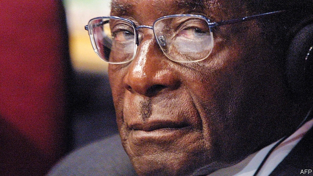

###### Rule by the whip

# Obituary: Robert Mugabe died on September 6th 

 

> print-edition iconPrint edition | Obituary | Sep 12th 2019 

BOOKS HE TRUSTED. One was usually in his hand in those first, mostly happy, years as Zimbabwe’s leader. He would be home at State House by 5.30pm, slamming doors so that his beloved wife Sally would know to come rushing. They crumpled together on a low armchair, almost on each other’s laps, she eating custard as he sipped tea. Then he would drape a long arm round her while turning with the other the pages of a favourite novel, usually British, often a Graham Greene. 

Written words Robert Mugabe could love. It was real live people who proved difficult. A shy, surly boy, he sought no friends in Kutama, his village. Later he admitted it frankly: “I lived in my mind a lot. I liked talking to myself, reciting little poems and so on; reading things aloud to myself.” A loner, he hated scrapping with sticks, running, boys’ boisterous games, communal life. A brother, Donato, thought him “lazy, just reading all the time”. Even at chores, in the shade of the bush while snaring birds or tramping in the dust to herd cattle, he would read. “He held the book in one hand and the whip in the other. It was a strange thing for all of us to see,” recalled Donato. 

The Irish priest at the Catholic mission in Kutama thought he had “unusual gravitas” and would “be an important somebody”. He was at mass daily, most dutifully after his brother, Michael, was poisoned. Years of teaching study followed: first in Southern Rhodesia, then at Fort Hare, South Africa, the crucible for so many African nationalist leaders, and lastly in Ghana, where he met Sally. 

As an African nationalist in Rhodesia, ruled by Ian Smith in the name of white supremacy, jail was inevitable. His 11 years behind bars he recalled as a chunk of life pointlessly stolen away. Again, books sustained him. He acquired seven degrees. As it did for Mandela, Nkrumah and Kenyatta, prison also earned him political credibility. Outdoor activity was harder. In Mozambique after his release, as his fellow liberation fighters strutted in fatigues, he sweltered in a suit. 

Throughout his life, rivals somehow met timely deaths. Cars were flattened by lorries on remote roads; flames devoured a farmhouse; opponents learned to fear high open windows. Few loved him. The British sometimes sneered. At Lancaster House in London, amid talk of independence and elections, the British foreign secretary found him “reptilian”, “not human”. At home, voters thought otherwise. He swept to glorious, genuine victory in the first free elections in 1980. To the shock and relief of Smith and the white farmers, he let them stay on, keeping their land if they abstained from politics. Though he had declared himself a Marxist-Leninist-Maoist, he now preached reconciliation. And the teacher flourished. Zimbabweans were among the best educated people in Africa, and evenings at State House saw the prime minister personally tutoring his staff. 

He blamed Britain for all ills, including his country’s complete economic collapse in the first decade of this century. Inflation soared to 500trn%; a generation of people fled. The British, he claimed, had broken their word on paying for land reform. Yet he hankered for England, London shopping, Savile Row, cricket and high tea with “Johnny” Major. He was fonder still of royalty, telling with a twinkle of the queen’s happiness on visits to Zimbabwe. 

For all his literary habits, the whip was never far away. In the early 1980s he turned to North Korea to train soldiers to crush the main minority tribe, the Ndebele. He admitted his security men had committed some “excesses” when entire village communities were burnt in their huts. He denied talk of 20,000 victims and called himself forgiving—“otherwise I would have slaughtered lots of people”. The rest of the world did not much notice, or care to bring him to book. Yet his fear of prosecution for crimes against humanity may have encouraged him to cling to office, despite his conviction that only God could remove him. 

His rule grew darker, possibly because Sally had died and been replaced by Grace, an ex-secretary 40 years younger than he was, even fonder of shops and more ambitious for political power. His opponents had once been co-opted; now he crushed them. Young thugs, egged on by him, punished white farmers by taking their land away. It was given to his friends, “war veterans” like himself, whether or not they had any idea how to work it. As a farming economy, Zimbabwe collapsed. 

He never saw tragedy in his country’s immiseration, only meddling by outsiders or vicious threats by rivals. The army and his Central Intelligence Organisation ensured his grip on power, rigging elections, killing opponents, closing newspapers and wiping away a generation of bright and tolerant Zimbabweans who could have led Africa. His people succumbed to hunger, AIDS, cholera and despair. Each year he held a more lavish public birthday party, beaming with delight as he cut a massive cake. 

In the end it was the dismissal and flight abroad of his most trusted lieutenant, Emmerson Mnangagwa, that led to his downfall in 2017. Grace had overplayed her hand in having him sacked, and the army rolled into Harare. The generals glibly insisted this was not a coup, saying they were dealing with “traitors”. By this, they did not seem to mean him. But they duly installed Mr Mnangagwa as president. 

Asked why people feared him, he said he thought it was “perhaps because I’m quiet, and also because I believe in what I say.” His life was mostly frugal: rising early to practise yoga; working daily at his desk, in his mustard-yellow chair beside a huge map of the world; nibbling rice and cornmeal by hand, the African way. He showed few of the vices—women, booze, feasts—associated with the caricature of an African dictator. But he had the usual vanity. Asked by The Economist, well into his 80s, when he would retire, he laughed that he would rule until he was “a hundred years old”. The tragedy for Zimbabwe was how close he got to keeping his word.■ 

