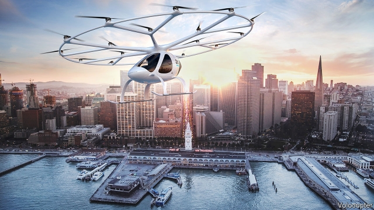
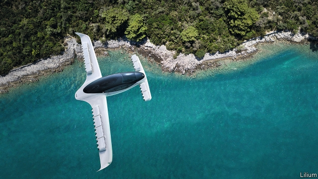

###### Urban aviation

# Flying taxis are taking off to whisk people around cities 

 

> print-edition iconPrint edition | Science and technology | Sep 12th 2019 

IN OCTOBER 1908, on a windy field at Farnborough, south-west of London, a handlebar-mustachioed former Wild West showman named Samuel Cody completed the first official controlled flight of a powered aeroplane in Britain. Since then many other pioneering aircraft, from Concorde to the giant Airbus A380, have flown at what became the biennial Farnborough air show. The aerospace centre that stages the show is now preparing for another sort of revolutionary aircraft to take to the sky. 

These new planes are variously described as flying taxis, passenger drones or, as the industry terms them, urban air mobility (UAM) vehicles. Around 200 such craft are at various stages of development around the world, according to experts at Farnborough’s first global urban air summit in early September. Some prototypes are already carrying out test flights and operators hope to begin commercial services within the next few years. Uber, which runs an app-based taxi-hailing service, aims to start flying passengers in Dallas, Los Angeles and Melbourne, Australia by 2023. 

Yet a number of obstacles remain. “No one really knows exactly how it is going to happen,” admits François Sillion, head of Uber’s Advanced Technologies Centre in Paris. That is because the obstacles are not particularly technological, but regulatory. Regulators are still working out how to certify that these new aircraft are safe, particularly as many will be flown without pilots, carrying passengers aloft as they buzz autonomously around a city. 

Although UAM designs are many and varied, they sport some common features. The aircraft are invariably electrically powered, although some are hybrids with a backup combustion engine. They usually take off and land vertically like a helicopter, but unlike a helicopter use multiple small rotors. Two- and three-seater versions can fly between 30km and 160km between charges at 100-200kph. As the multiple rotors are driven directly by individual electric motors, each rotor can be controlled by computerised flight systems. This provides a high level of stability, in theory making such aircraft easier to fly than a helicopter, and easier to automate. Reassuringly, multiple rotors also mean that such aircraft can rapidly compensate if one or more of their motors fail. 

Some aircraft are moving beyond the experimental stage. The 18-rotor VoloCity is being developed by Volocopter, a German firm, based on a prototype (illustrated above) which has flown numerous test flights. One was an autonomous flight in Dubai. On September 9th, Geely, a Chinese carmaker which also owns Volvo Cars, took a minority stake in Volocopter and led a €50m ($55.1m) funding round to help bring the VoloCity to market. The aircraft can carry two people (one of whom may or may not be a pilot) plus luggage for 35km. 

Other types of air taxis use a “tilt wing”. This has multiple rotors mounted on the wings, which tilt up for a vertical take-off and landing, but tilt ahead to operate like a fixed-wing aeroplane with propellers for forward flight. This saves power and increases the range of the aircraft. 

Lilium, another German company, uses a variation of the theme with 36 electrically powered fan jets. These look like miniature versions of the turbofans on passenger jets, except they use electric motors. The fans are mounted on the fixed wings of its aircraft and blow downwards for a vertical take-off or landing and backwards for forward flight. The company’s five-seater (pictured below) can travel 300km in an hour. 

Kitty Hawk, a firm backed by Larry Page, boss of Google’s parent Alphabet, has teamed up with Boeing, the world’s largest aerospace company, to develop Cora. This two-seater uses 12 lifting rotors on a fixed wing and is pushed along by a rear-mounted propeller. It has a range of about 100km and will be used by Air New Zealand to run an air-taxi service. 

Most UAM operators are getting into the air with experimental flying permits, which restrict how their prototypes can be flown and usually only with a pilot. Some aircraft are starting to go through full certification procedures, as all commercial aircraft must before carrying fare-paying passengers. Air-safety authorities are still establishing what the standards should be. In July the EU’s Aviation Safety Agency released a “special condition” for the certification of hybrid and electrically powered vertical take-off and landing aircraft. The idea is that the rules will be developed further as flight trials continue. As with conventional aircraft, certification could take several years and cost millions of dollars. 

Regulators have set strict operating conditions for people flying small drones, whether as a hobby or for commercial purposes, such as filming, surveying or delivering pizza. This usually involves drones being kept well away from people, buildings, airports and other aircraft. But as air taxis are being designed to provide journeys in just such places, from an airport to the centre of a city for example, these new aircraft will have to be integrated into air-traffic-control systems, says Jay Merkle, the executive director of the Office of Unmanned Aircraft Systems at America’s Federal Aviation Administration (FAA). 

Various efforts are under way to automate air-traffic-control systems so that air taxis, piloted or autonomous, can be merged with flights by airliners and light aircraft. Fundamental to that will be fitting all aircraft with transponders, similar to those already used on large aircraft. These transponders would transmit and receive the flight plans of other aircraft in the vicinity automatically so that pilots, or in the case of autonomous aircraft their flight computers, can see and avoid one another. Next year NASA, America’s aerospace agency, will begin field tests of systems that could manage such operations in an urban environment as part of a “grand challenge” to industry to find workable solutions. 

Some countries, though, are pressing ahead faster than others. Operators already complain they can use a drone to deliver blood in Rwanda but not in America, says the FAA’s Mr Merkle. Working with UAM firms on flight trials and sharing information is the best way to reach global standards, reckons Tim Johnson, policy director of the Civil Aviation Authority in Britain. The agency has more than 20 groups planning air-taxi flight trials in Britain. Japan aims to undertake such flights in rural areas, where airspace is less congested, before allowing air taxis into urban locations, said Ito Takanori of the Future Air Mobility Office of his country’s Ministry of Economy, Trade and Industry. 

Meanwhile, Uber is trying to learn how to run an air-taxi service. To this end it has begun operating a somewhat old-fashioned helicopter service between Lower Manhattan and JFK airport in New York. One thing this has brought home to the company, says Uber’s Mr Sillion, is that UAM operators will inevitably get drawn into property and infrastructure projects. 

This means building “vertiports”, which are landing pads with passenger facilities, parking for air taxis and recharging points for their batteries. Skyports, a London-based startup, is building a prototype vertiport due to open in October in Singapore. It will be used by Volocopter for test flights. 

 

EHang, a Chinese dronemaker, is using a passenger-carrying version it has been testing to develop an air-taxi business in Guangzhou, a city in southern China. It is working with the municipal government to set up a command centre for flying operations and a series of vertiports. 

But behind all these plans lurks one more problem. Planning permission for helicopter landing pads is hard to obtain in some cities, largely because of noise objections. Flying taxis, being electrically powered, should be much quieter than helicopters but are still likely to be heard buzzing away overhead, just as drones are. The leaders of some cities, such as Dubai, Guangzhou and Singapore, might be prepared to accept that as the sound of progress. Others might not. And noise, it should be remembered, can ground many an aviator’s ambitions. Despite the allure of supersonic travel, Concorde had its wings clipped because of the noise it made going through the sound barrier.■ 

