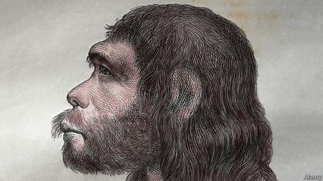

###### Human evolution

# Neanderthals had a propensity for earache, nudging them to their doom 

 

> print-edition iconPrint edition | Science and technology | Sep 12th 2019 

THE LAST Neanderthals vanished from Earth about 40,000 years ago. Exactly what drove them to extinction, however, remains a mystery, with their disappearance variously attributed to anything from climate change to inferior cognitive abilities or even cannibalism. 

Anthony Pagano, a medical researcher at Seton Hall University in New Jersey, has a new explanation. He thinks Neanderthals might have been unusually prone to severe ear infections, which left them struggling to compete against their Homo sapiens cousins. In modern humans, ear infections can happen at any age but it is mainly young children who get them; five out of six will have at least one such infection before their third birthday. In 2017 Dr Pagano suggested this could be because of the orientation of the Eustachian tube, which is located just inside the eardrum, and connects the middle ear to the back of the throat. The throat end of this tube opens when a person swallows, allowing air to be sucked in or pushed out of the middle ear so that its internal air pressure matches the outside world. This is why swallowing during take-off or landing on a plane can relieve painful pressure in the ears. 

When air is sucked into the tube, however, harmful bacteria from the throat can be carried along too. This is not such a problem in adults, because the Eustachian tube is oriented vertically and it is difficult for pathogens to rise upwards to reach the middle ear. 

In young children, however, the Eustachian tube lies horizontally between the throat and ear, meaning pathogens can more easily get in and cause infections. “The tube doesn’t take on the adult vertical form until the six-year mark,” says Dr Pagano. “And at that age clinical rates of middle-ear disease drop off.” 

For Neanderthals that drop-off might never have come. Dr Pagano and his team examined three well-preserved adult Neanderthal skulls, two of which came from Italy and the third from Gibraltar. Their measurements, reported in the Anatomical Record, indicate that the Eustachian tube was horizontal in all three, suggesting adult Neanderthals may have been as likely to develop ear infections as today’s infants. Long before antibiotics, those infections could have been lethal, potentially leading to meningitis or pneumonia. 

Some researchers questioned whether Neanderthals could have existed for as long as they did—around 400,000 years—if they carried such a fundamental anatomical problem. Dr Pagano says that ear infections would have raised Neanderthal mortality rates only slightly, and not enough to doom the species in ordinary circumstances. 

But a few thousand years before the Neanderthals vanished from Europe, modern humans reached the continent. Competition with the newcomers put Neanderthal populations under extreme pressure and, in those circumstances, small factors might have made a big difference. Ear infections can lead to deafness, for example, and that might have been significant. If Neanderthals were more likely than modern humans to have hearing problems then they would have had more trouble communicating and hunting, with dire consequences for their long-term survival. ■ 

