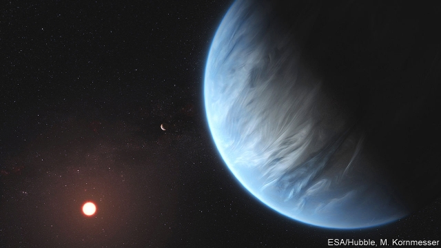

###### Exoplanets

# The first planet beyond the solar system confirmed to have water 

 

> print-edition iconPrint edition | Science and technology | Sep 12th 2019 

SINCE ITS discovery by astronomers in 2015, the exoplanet K2-18b has elicited much excitement. Swirling around a red-dwarf star about 110 light-years away from Earth, the distant world sits in a so-called Goldilocks zone—not close enough to its host star to be too hot and not far enough away to be too cold—that could allow liquid water to flow across its surface. That is a crucial condition for life as we know it. 

Now astronomers have cranked up the speculation. Follow-up images taken by the Hubble Space Telescope suggest K2-18b (artist’s impression below) has an atmosphere containing large amounts of water vapour—the first exoplanet in a habitable zone to have this confirmed. Most exoplanets previously found with atmospheres have been gas giants, similar to Neptune or Jupiter. K2-18b instead looks like it could be a rocky planet twice as big as Earth, perhaps covered in vast ice-covered seas. 

To make the discovery of atmospheric water, Angelos Tsiaras, an astronomer at University College London, and his colleagues looked at how light filtered through the atmosphere of K2-18b as it passed in front of its star between 2015 and 2017. This spectroscopic technique is a common way to analyse the atmospheric composition of exoplanets, based on which wavelengths of light make it through and which are blocked. But it is difficult—especially for the relatively small and cold rocky worlds that could hold the conditions for life. 

Writing this week in Nature Astronomy, Dr Tsiaras describes how his team wrote software that could analyse the data collected by Hubble to try to do the same job—up to a point. They were not able to pinpoint the exact form and amounts of the water they found. Instead they used computer models to simulate the most likely scenarios, and concluded that as much as half of the atmosphere of K2-18b could be water vapour. They also found evidence of large amounts of hydrogen and helium gas. 

This is just the start of such study of planets beyond our solar system. Astronomers plan to launch two new orbiting telescopes in the next decade—the American James Webb Space Telescope and the European ARIEL survey—that will be powerful enough to peer into the atmospheres of exoplanets more closely. Powerful enough, perhaps, to detect telltale molecular signatures of life. 

With Dr Tsiaras’s analysis, K2-18b is now the best candidate for a life-supporting exoplanet out there. The temperature on the surface could be about the same as Earth and there could be similar clouds hanging in the sky. However, the planet’s adjacency to the star—it whizzes around once every 33 days—could produce intense space weather from the stellar activity. And it would be advisable to pack sun cream: the ultraviolet radiation would be off the scale. 

