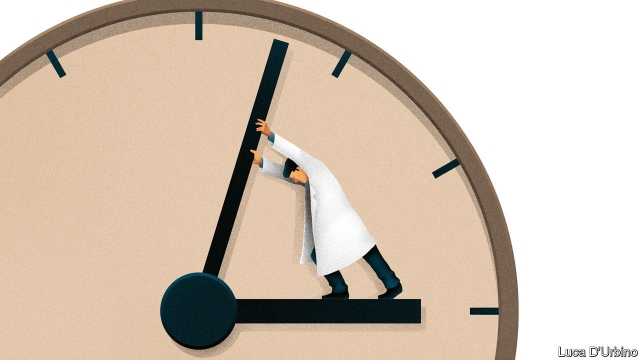

###### Fountain of youth

# Uncovering how the body ages is leading to drugs to reverse it 

 

> print-edition iconPrint edition | Science and technology | Sep 12th 2019 

IN 2016 A startup in California called Ambrosia began offering its customers transfusions of blood from the young. At $8,000 per litre, it was a service for the wealthy who believed that young blood could slow down or reverse the ageing process, thereby reducing their chances of developing cancers, Alzheimer’s disease and heart disease. 

Earlier this year America’s Food and Drug Administration (FDA) cautioned potential customers that there was no proven scientific benefit to receiving such blood. In response, Ambrosia shut down its clinics. But ill-fated startups aside, there is a kernel of truth to the idea that young blood can be rejuvenating. Experiments in the early 2000s in which mice of different ages had been stitched together to share their circulatory systems, known as heterochronic parabiosis, had demonstrated dramatic improvements in the cognition, muscle repair and liver function of the elderly partners. The race this work sparked to translate the idea into something useful to humans, however, raises issues, not least in the squeamishness and hazards associated with sharing blood. 

Perhaps no longer. One of the pioneers of parabiosis, Irina Conboy, a bioengineer at the University of California, Berkeley, has now developed a way to get some of the benefits of parabiosis without any of the gruesome methods. She and other scientists in the field had previously found that not only did old partners benefit from parabiosis, but young partners suffered: the old blood aged them prematurely. Some of the decline was caused by a protein called transforming growth factor beta (TGF-beta). This is normally responsible for regulating everything from cell proliferation to differentiation and death. As people age, TGF-beta accretes in the blood and this leads to problems such as inflammation or fibrosis. 

In a new study published in Ageing, Dr Conboy describes a way to slow down this damage. Her team gave ageing mice a cocktail of oxytocin, a hormone, and ALK5 inhibitor, an enzyme. Previous studies showed that these had positive effects on some of the symptoms of ageing. By suppressing the amount of TGF-beta in cells, the ALK5 inhibitor had been shown to stimulate the growth of new brain cells and improve muscle and tissue health. And oxytocin, which activates stem-cell formation in response to tissue damage or atrophy, declines naturally with age. 

However, to have any effects, ALK5 inhibitor usually had to be given at very high doses. And when researchers tried to add extra oxytocin by itself, the hormone’s benefits were overwhelmed by waste accreted in old blood. By putting them together, however, it was possible to reduce the dose of ALK5 inhibitor by a factor of ten and reap the benefits of the oxytocin. 

After seven days on this cocktail, the mice had less inflammation in their brains, more neural stem cells in the brain area responsible for memory and learning, and better cognitive capacity. Their livers had less scarring and fat, and their muscles healed better and faster. In short, their bodies and brains looked a lot like the old mice after parabiosis—but without the drawbacks of a blood buddy. 

Because both ingredients of this chemical cocktail are already approved by the FDA, Dr Conboy’s team is now planning a clinical trial of 20 volunteers over 65, to see if the cocktail’s rejuvenating powers will work in people. 

The latest findings have been welcomed, albeit cautiously. Scientists at the American National Institute on Ageing say the latest work may show a way forward in a field that currently seems stuck. But they think it is too early to advance the research into human trials. The concern is that the drugs being used have not previously been tested together in people. Dr Conboy points out, however, that prescribing approved drugs in multiple combinations is a standard procedure in medicine. 

Entrepreneurs in Silicon Valley might have jumped the gun in selling the rejuvenating effects of parabiosis to their clients. Nevertheless, this vampire-like concept is not gone yet—and could still rise up from the dead someday soon. ■ 

