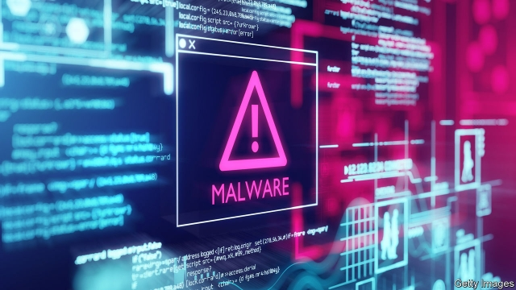

###### Cyber security

# A connected world will be a playground for hackers 

 

> print-edition iconPrint edition | Technology Quarterly | Sep 12th 2019 

AS WAYS TO break into casinos go, a fish tank is an unusual route. Yet that is what was used in an unnamed American gambling house in 2017. It had invested in a fancy internet-connected tank in which the temperature and salinity of the water were remotely controlled. Its owners were not naive: when they installed it, they isolated its controls on their own specific part of their company network, away from all their sensitive systems. 

It made no difference. According to Darktrace, a computer-security firm, attackers from Finland managed to break into the tank’s systems, then used it as a stepping stone for the rest of the casino’s networks. They made off with around 10GB of data. 

Computer security is already hard. Everyone from the central bank of Bangladesh to America’s National Security Agency has suffered hacks or data breaches. The IoT will make things worse. A world in which more objects are computers is a world with more targets for miscreants. 

David Palmer, Darktrace’s director of technology, reels off a list of examples. “We’ve seen corporate espionage between suppliers inside a power station,” he says. “One supplier was using [their] access within the network to look at the performance characteristics of another supplier’s equipment.” His firm also discovered an attack on fingerprint readers that controlled access to a luxury-goods factory, and malware which spread through a hospital department after infecting a connected fax machine. 

Other incidents have been spectacular enough to make the news. In 2016 millions of people in America found themselves struggling to reach many websites, including those of Twitter, Amazon, Netflix and Reddit. The culprit was a piece of IoT-focused malware called Mirai. By exploiting a list of default usernames and passwords, which most users never change, Mirai had infected hundreds of thousands of connected devices, from smart energy meters to home CCTV cameras and connected baby monitors. 

Each infected gadget became part of a “botnet”, a group of computers in thrall to the malware. The botnet then performed a “distributed denial-of-service attack” against Dyn, a company that helps maintain the routing information that allows browsers to reach websites. By deluging Dyn’s servers with junk messages generated by the subverted devices, the botnet prevented them from responding to legitimate requests. 

But the IoT will do more than simply give hackers new targets. As computers spread into objects that can interact with the physical world, it will enable attacks that endanger life and property. 

In 2015 a pair of security researchers from Twitter, a social network, and IOactive, a cyber-security firm, staged a demonstration for Wired, a technology magazine, in which they remotely took control of a car while it was being driven. They were able to turn on the stereo and the windscreen wipers, cut the engine, apply the brakes and even, in some circumstances, control the steering wheel. As a result Fiat Chrysler, the car’s manufacturer, announced it would recall 1.4m vehicles. Security researchers have demonstrated an ability to hack into medical devices, including pacemakers and insulin pumps. 

Hacking an insulin pump would be a convoluted way to kill someone. But less drastic sorts of crime will be possible, too. Ransomware, which prevents use of a computer until cash is paid, is a natural fit for a world where everything is connected. Ransomware for cars or home-lighting systems is a popular near-future prediction at computer-security conferences. Some accidental infections have already happened. In 2018, 55 speed cameras in Victoria, Australia, were infected by a piece of ransomware that was designed to attack desktop computers. In June Avast Software, a Czech cyber-security firm, demonstrated how to install ransomware on a networked coffee machine, making it gush boiling water and constantly spin its grinder until the victim pays up. 

Companies are aware of the danger. A survey of managers by Bain & Company, a consulting firm, found that worries about security were the single biggest barrier for companies thinking of adopting IoT technologies. Consumers are worried, too. A survey of 2,500 of them by Ernst & Young, a management consultancy, found that 71% were concerned about hackers getting access to smart gadgets. 

Patching up the holes will not be easy. One reason is that computers, and computer software, are complicated. Ford’s best-selling F150 pickup truck, for instance, is reckoned to have around 150m lines of code. A general rule is that good programmers working under careful supervision average about one bug per 2,000 lines of code. That means that almost any computerised gadget will be riddled with bugs. 

Another problem is that few of the companies making connected gadgets have much experience with cyber security—or the incentives to take it seriously. Good security costs money, and the better it is, the less its benefits are visible to the end-user. Attacks like Mirai, in which the costs fall not on the gadget-makers or their owners but on unrelated third parties, muddy things even more. The upshot is that basic precautions are routinely ignored. A paper published in June by Stanford University analysed telemetry from 83m connected devices and found that millions used old, insecure communication protocols or weak passwords. 

One option is to learn from others. In February the Industrial Internet Consortium, a trade body focused on industrial deployments of the IoT, published a guide to security written by experts from veteran firms such as Fujitsu, Kaspersky Labs and Microsoft. Another is to outsource the problem to those better suited to dealing with it. Arm has fortified its chip designs with built-in security features, as has Intel, the world’s biggest chipmaker. 

Big computing firms are trying to turn security into a selling point. Microsoft sees the IoT as an important market for its cloud-computing business. Under the Azure Sphere brand it has developed a security-focused, low-power microcontroller designed to be the brains of a wide range of IoT devices (these are smaller, cheaper and less capable than a microprocessor). Those micro-controllers run a security-focused version of the Linux operating system and communicate through Azure’s cloud servers, which have extra security features of their own. Mark Russinovich, Azure’s chief technology officer, says many of the security features were inspired by lessons from the firm’s Xbox video-gaming division, which has plenty of experience designing hack-resistant computers. Starbucks, a coffee chain whose connected coffee machines can download new recipes, is one early customer. 

Governments are getting involved, too. In 2017 America’s Food and Drug Administration issued its first cyber-security-related product recall, having found that some wireless pacemakers were vulnerable to hacking. The following year California became the first American state to mandate minimum security standards for IoT products, including a ban on the use of default passwords. Britain’s government is mooting similar laws to require manufacturers to provide contact details for bug-hunters and to spell out how long products can expect to receive security updates. 

But whereas widget-makers can learn much from the computing giants, some lessons will have to flow in the other direction, too. The computing industry moves at high speed. Smartphones, for instance, rarely receive security updates for more than five years. That sort of institutional neophilia is not going to work with products like cars or factory robots, which can have much longer lifespans, says Mr Palmer. Employing the programmers necessary to provide support for dozens of models for decades, he says, will be an expensive proposition. 

Looming over everything, says Angela Walch, an American lawyer who specialises in tech, is the question of legal liability. The software industry uses licensing agreements to try to exempt itself from the sort of liability that attaches to firms that ship shoddy goods. Such an exemption, she says, amounts to an enormous de facto subsidy. 

So far courts (at least in America) have been broadly happy to enforce such disclaimers. Ms Walch says any attempt to change that would be fought by the software industry, which has long argued that holding it liable for mishaps would stifle innovation. But that line will become harder to defend as software spreads into the sorts of physical goods that, historically, have not been granted such legal exemptions. “What are we saying?” she asks. “That if buggy software or compromised software kills someone, you won’t be able to claim?” 

Bruce Schneier, an American security expert, thinks that, in the long run, the consequences of poor security could mean that businesses and consumers reach “peak connectivity” and begin to question the wisdom of connecting everyday objects. He draws an analogy with nuclear energy, which enthusiasts once saw powering everything from cars to catflaps. These days “we still have nuclear power,” he writes, “but there’s more consideration about when to build nuclear plants and when to go with some alternative form of energy. One day, computerisation is going to be like that, too.” ■ 

