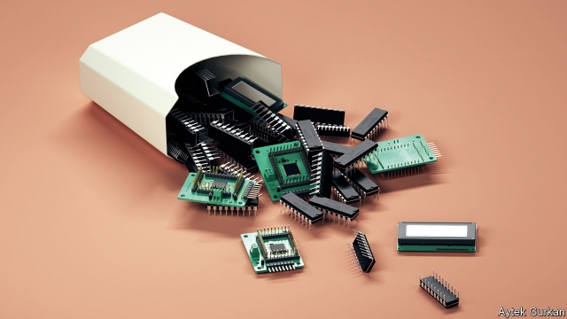
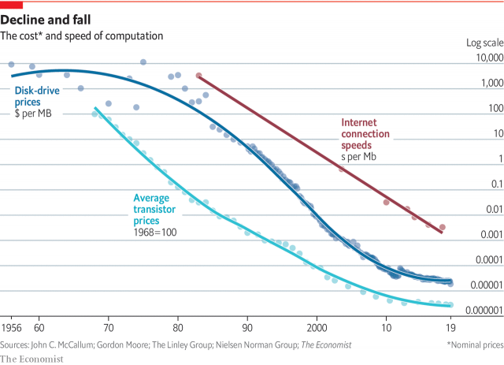

###### Ubiquitous computing

# Drastic falls in cost are powering another computer revolution 

 

> print-edition iconPrint edition | Technology Quarterly | Sep 12th 2019 

THE INTERNET OF THINGS (IoT) is a clumsy name for a big idea. It holds that, despite all the changes the computer revolution has already wrought, it is only just getting started. The first act, in the aftermath of the second world war, brought computing to governments and big corporations. The second brought it to ordinary people, through desktop PCs, laptops and, most recently, smartphones. The third will bring the benefits—and drawbacks—of computerisation to everything else, as it becomes embedded in all sorts of items that are not themselves computers, from factories and toothbrushes to pacemakers and beehives. 

The magic of computers is that they provide in a machine an ability—to calculate, to process information, to decide—that used to be the sole preserve of biological brains. The IoT foresees a world in which this magic becomes ubiquitous. Countless tiny chips will be woven into buildings, cities, clothes and human bodies, all linked by the internet. 

Up close, the result will be a steady stream of quotidian benefits. Some will arise from convenience. Microchipped clothes could tell washing machines how to treat them. Smart traffic systems will reduce waiting times at traffic lights and better distribute cars through a city. Some will be the sorts of productivity improvements that are the fundamental drivers of economic growth. Data from factory robots, for instance, will allow algorithms to predict when they will break down, and schedule maintenance to ensure that does not happen. Implanted sensors will spot early signs of illness in farm animals, and micromanage their feeding. Collectively, those benefits will add up to a more profound change: by gathering and processing vast quantities of data about itself, a computerised world will allow its inhabitants to quantify and analyse all manner of things that used to be intuitive and inexact. 

One way to understand the IoT says Martin Garner at CCS Insight, a firm of analysts, is by analogy with another world-changing innovation. Over the past century electricity has allowed consumers and businesses at least in the rich world, access to a fundamental, universally useful good—energy—when and where they needed it. The IoT aims to do for information what electricity did for energy. 

As befits such a dramatic ambition, the heralds of the IOT are fond of very big numbers. Bain & Company, a management consultancy, reckons total spending on it will reach $520bn by 2021. McKinsey, another consultancy, is giddier still about the future: it reckons the economic impact of the IoT could be as much as $11.1trn every year by 2025. Arm, a chip-design firm specialising in the sort of low-power chips the IoT needs, thinks there could be a trillion such devices by 2035, meaning that computerised, networked gizmos would outnumber the humans that control them by well over a hundred to one. 

Like most futures, a lot of the IoT is already here—it is just not (yet) evenly distributed. The idea of building computers into other things is not new. Nuclear missiles, jet fighters and the billion-dollar spacecraft that carried astronauts to the Moon were all early uses. At first, computers were prohibitively expensive. But costs have fallen steadily and rapidly. The price of computation today is roughly one hundred-millionth what it was in the 1970s, when the first microprocessors became commercially available (see chart). According to figures collected by John McCallum, a computer scientist, a megabyte of data storage in 1956 would have cost around $9,200 ($85,000 in today’s prices). It now costs just $0.00002. 

 

Operating costs have fallen, too. Jonathan Koomey of Stanford University reckons that between 1950 and 2010 the amount of number-crunching possible with a kilowatt-hour of energy grew roughly a hundred-billion-fold. That means that even cheap, battery-powered chips now offer performance better than the supercomputers of the 1970s. Giving those computers access to the world is also cheaper. Partly thanks to smartphones, which are packed with everything from miniaturised cameras to gyroscopes and accelerometers, the cost of tiny sensors is dropping. Goldman Sachs, a bank, says that the average cost of the sort of sensor used in the IoT fell from $1.30 to $0.60 between 2004 and 2014. 

Over the past few decades those trends have transformed airliners and cars, which have become networks of computers with wings or wheels. They have spread to washing machines and smoke alarms, to thermostats and to medical devices implanted into human bodies. In July, 50 years after the computer-assisted landings on the Moon, Pampers, an American firm, announced Lumi, a sensor designed to be clipped to disposable nappies. It monitors sleep patterns and sends smartphone alerts to parents whenever their little darlings need changing. 

To create an IoT you need more than just a trillion cheap computers. You also need ways to connect them to each other. Data on telecoms costs are fuzzier than those on computing. But better technology has cut costs there, too. In 1860, sending a ten-word telegram from New York to New Orleans cost $2.70 (about $84 in today’s money). These days, speeds are measured in megabits per second. (A megabit is equal to roughly 2,700 ten-word telegrams). Connection speeds of tens of megabits per second can be had for a few tens of dollars a month. As telecommunications have got cheaper, they have spread. The International Telecommunications Union, a trade body, reckons that 51.2% of the world’s population had internet access in 2018, up from 23.1% ten years ago. 

The final ingredient is a way to gather all the data that a trillion-computer world will generate and to make sense of it all. Modern artificial-intelligence techniques excel at extracting useful patterns from large quantities of raw data. Ubiquitous communications mean that data gathered by comparatively simple chips can be analysed by much more powerful machines in the data centres that make up the cloud.  

Attracted by the lure of new business, and fearful of missing out, firms are piling in. Computing giants such as Microsoft, Dell, Intel and Huawei promise to help industries computerise by supplying the infrastructure to smarten up their factories, the sensors to gather data and the computing power to analyse what they collect. They are competing and co-operating with older industrial firms: Siemens, a German industrial giant, has been on an IoT acquisition spree, buying up companies specialising in everything from sensors to office automation. Consumer brands are scrambling, too: Whirlpool, the world’s biggest maker of home appliances, already offers smart dishwashers that can be controlled remotely by a smartphone app that also scans food barcodes and conveys cooking instructions to an oven. 

The computerisation of everything is a big topic, and one that will take decades to play out. This report aims to serve as a guide, and to offer a way to think about what such change might mean. It will look at consumer and industrial applications. It will also examine the new sorts of chips that might make the IOT work, which will cost less than a cent each and will be able to harvest the energy they need to run from sunlight or ambient heat. 

It will examine the downsides, too. A world of ubiquitous sensors is a world of ubiquitous surveillance. Consumer gadgets stream usage data back to their corporate makers. Smart buildings—from airports to office blocks—can already track the people who move through them in real time. Thirty years of hacks and cyber-attacks have proved that computers are insecure machines. As they spread, so will that insecurity. Miscreants will be able to exploit it remotely and at a huge scale. 

The place to start is where the new computing revolution has already made its most visible mark, and where most people will—or do already—encounter the IoT: in their homes, and the consumer gadgets that fill them. ■ 

Correction: In a previous version of this article we confused Bain Capital, a private-equity firm, with Bain & Company, a management consultancy. We regret the error. 

