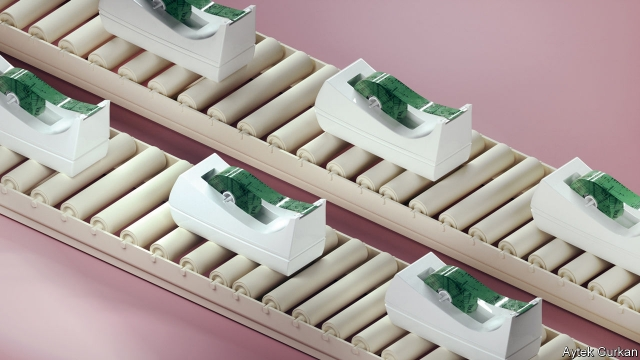

###### Throwaway technology

# How to build a disposable microchip 

 

> print-edition iconPrint edition | Technology Quarterly | Sep 12th 2019 

EVERY RESEARCH project needs a striking name, and it is hard to think of a better one than “Plastic Armpit”. The idea is to design and build a chip with an electronic nose, which can sample the odours and chemicals in its environment. Such a chip, says James Myers, a senior engineer at Arm, a British-based chip designer, could be usefully attached to all sorts of consumer goods. Its name came from the idea of weaving such a chip into items of clothing, where it could let oblivious wearers know when the need for a shower was becoming urgent. 

Despite the jocularity, the project—a collaborative venture between Arm, the University of Manchester, Pragmatic, a firm which makes flexible electronics, and Unilever, a British-Dutch consumer giant—is a serious one. Gartner, a research firm, reckons that 259m PCs were sold last year. Pew, a pollster, puts the number of smartphones in the world at more than 2.5 billion. Arm, whose designs dominate the market for the sorts of low-power microprocessors that go into everything from smartphones to televisions, organises its business around the assumption that there will be a trillion computers in the world by 2035. 

A prototype looks like a stiffer-than-usual piece of tape festooned with circuit traces 

Plastic Armpit is an attempt to design the sort of chip that might meet that demand. The goal is to produce a robust, bendable, mass-producible computer, complete with sensors and the ability to communicate with the outside world, for less than $0.01 apiece. A prototype version, shown off at Arm’s headquarters in Cambridge, looks like a stiffer-than-usual piece of tape festooned with circuit traces. 

Mr Myers is keen to talk about applications beyond personal hygiene. He points out that such a sensor could be built into food packaging, where it could replace printed use-by dates with an accurate assessment of when the contents of a package had gone off. That, in turn, could help supermarkets and shoppers reduce waste. 

The chip in the Plastic Armpit is cheap and simple. Its logic gates, the basic components of information processing, are crude things as big as those that were standard in the 1970s, and it has only 1,000 of them. The sensors, each tuned to a different class of odiferous chemical, are simple too, generating imprecise, rough and ready signals. Most computer scientists would look to the modern cleverness of machine learning to make up for the sensors’ deficiencies. But how to do so on such a simple chip? 

Cramming a machine-learning algorithm into such a limited machine required cutting everything to the bone. The chip uses a simple form of machine learning called a naive Bayesian classifier. Flexibility of use was sacrificed, too: to keep things as cheap and simple as possible the algorithm is etched directly into the plastic, meaning the chips are not reprogrammable. A chip designed to monitor the chemicals given off by strawberries would be useless for chicken. “If you want it to do something new, you’ll need to design and print a new circuit,” says Mr Myers. 

Since chip design is expensive, and chip designers scarce, he and his team have been working on software tools to simplify that task. The idea is to describe a new algorithm in Python, a widely used programming language, and then have software turn it into a circuit diagram that can be fed into Pragmatic’s chipmaking machines. That approach has attracted interest from DARPA, the Pentagon’s most ambitious research outfit, which is looking into ways to do simple, quick chip design as part of its $1.5bn Electronics Resurgence Initiative. 

The Plastic Armpit demonstration model is, for now, powered by a battery. A reliable source of power means the chip can keep a constant eye on the things it is looking after. In future, says Mr Myers, and for applications where only intermittent monitoring is necessary, it should be possible to do without. The chip has an antenna etched onto its plastic substrate to allow it to communicate with the outside world. The idea is that a smartphone, or a specialised wireless reader device, can be held near the chip. The reader emits radio waves that are used to transfer data, but which also induce enough of a current in the chip to jolt it into life (contactless credit cards work in a similar way). 

Some chips are already capable of harvesting more common sorts of ambient energy, capturing everything from sunlight to heat to vibration. Matt Johnson, a vice-president at Silicon Labs, an IoT-focused American chipmaker, says that, for now, such harvesting is mostly used to supplement a battery rather than to replace it. The chief constraint is wireless data transmission, which uses much more energy than data processing. “But things are improving with every generation,” he says. Soon there will be an “alignment” between what sort of consumption is required and what harvesting can provide. A report in 2018 from Semico Engineering, a market-research firm, reckoned that the market for energy-harvesting devices might be worth $3.4bn by 2022. 

Self-powering chips would be especially useful, says Mr Johnson, for situations where battery replacement is a chore—monitoring devices in structures such as bridges or tunnels. It may prove necessary for other reasons, too. Arm estimates that powering each of the trillion chips it forecasts by 2035 with a single button cell, the sort used in watches, would require three times as much lithium (vital to high-performance batteries) as the world produces in a year. After all, says Arm’s Paul Williamson, a trillion is “quite a big number, when you think about it”. ■ 

Correction:In a previous version of this article, we inadvertently promoted Mr Johnson to CEO of Silicon Labs. He is in fact a vice-president. Apologies for the mistake. 

