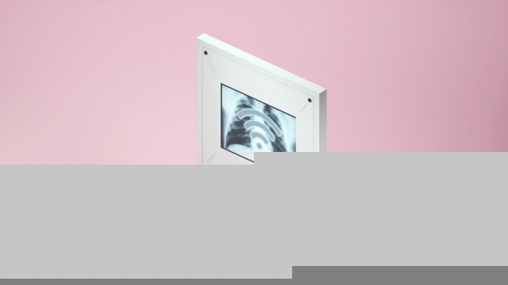

###### When humans are connected

# Hugo Campos has waged a decade-long battle for access to his heart implant 

 

> print-edition iconPrint edition | Technology Quarterly | Sep 12th 2019 

A WORLD FULL of connected sensors will generate huge amounts of data. It will also generate arguments about who can use and analyse those data. For Hugo Campos—an American campaigner whose vital organs are connected to the internet via a medical implant—such arguments have consumed the past decade of his life. 

Mr Campos has hypertrophic cardiomyopathy, a disease in which the heart muscle becomes abnormally thick, to the point where it can interfere with the patient’s blood flow. In Mr Campos’s case, it also interferes with the delicate electrical system that controls how his heart beats. In 2007 he was given an implanted cardioverter-defibrillator (ICD). The device monitors his heart rhythm, looking for dangerous abnormalities. When it spots one, it administers a corrective electrical shock. 

Such devices have existed since the 1980s. But Mr Campos’s model was one of the first that could be monitored online. “I was really excited,” he says. “I remember thinking that I’d be able to get alerts from the device, to see what it was doing. I asked my doctor to point me to the patient website. And he looked at me and said, ‘Oh, this is all for us, not for you’.” Data from the device were streamed to its maker, Medtronic, and from there to doctors. The patients, for whose benefit the ICD had been designed, had no access, and not just those with heart conditions, says Mr Campos. Similar restrictions applied to people with positive airway-pressure machines (used to treat sleep apnoea) and to diabetes sufferers fitted with connected insulin pumps. 

Mr Campos has been lobbying for change ever since. He has had sympathetic press coverage; in 2015 he was honoured by the White House. Yet the data remain locked away. Part of the problem, he thinks, is cultural. “For the manufacturers of a lot of these devices, the patient is not the customer,” he says. Instead, companies must persuade doctors and hospital administrators to buy their products, so firms focus on features that appeal to them, rather than to the patients into whose bodies the devices will be put. And, he says, companies question whether patients would be able to make sense of the data even if they were made available. 

In 2012 Mr Campos lost his health insurance. Without easy access to a doctor, he took matters into his own hands. He obtained a device from eBay designed to reprogram his ICD and set about trying to hack his way in. Wary of experimenting on his own device, he tracked down an undertaker who would sell him used ICDs which had been removed from bodies before they were cremated. 

In recent years, though, that kind of do-it-yourself approach has become harder. The medical-device industry has become more conscious of computer security, says Mr Campos, particularly after an incident in 2011 when researchers at a security conference remotely hacked a pacemaker live on stage. These days, he says, the devices are hardened against intrusion, and the data they stream are encrypted. 

Doctors in some areas of medicine, such as diabetes, seem more willing to let patients see what the devices they carry are up to, perhaps because such data can directly help them manage their condition (for example by watching their diet). New entrants, more focused on consumers than doctors, are emerging: Mr Campos points to Apple’s latest smart watch, which can detect atrial fibrillation, another sort of abnormal heart rhythm, and which shares all its data with its wearer. 

America’s medical regulators have been prodding device-makers. In 2016 they confirmed that rules controlling where patient data can be sent did not prevent sharing the data with patients themselves. But Mr Campos is frustrated: “If you’d asked me a decade ago, would I have access to these data by now, I’d have said of course I would. But I don’t.” 

