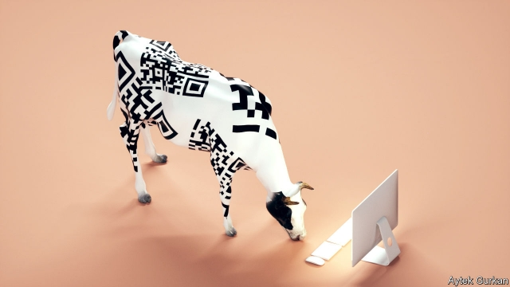

###### Computerised farming

# Sensors and AI are finding their way into the barnyard 

 

> print-edition iconPrint edition | Technology Quarterly | Sep 12th 2019 

LIKE ELITE athletes, dairy cows have exacting nutritional requirements. “If you’re slightly up on protein, or down on carbs, you’ll see a drop in milk production,” says Robbie Walker, the boss of Keenan Systems, an Irish firm which makes feed-mixing wagons. 

For that reason, the firm’s latest products have gone digital. With the help of Intel, a big American chipmaker, Keenan has developed a computer that can be attached to its wagons. Every day the firm’s nutritionists load the computer with the herd’s dietary requirements. Sensors on the wagon weigh what the farmer puts into the mixer and compare it with what the recipe calls for. “It’s a bit like making a cake,” says Mr Walker. “Even if you’re being careful, you usually put in a little too much of one ingredient, or not enough of another.” 

The collected data are transmitted over the mobile-phone network to the nutritionists, who can analyse any deviations from the ideal in what the animals were fed. A big deviation triggers a text message to the farmer. Smaller ones are noted, and the feed mix for the following day tweaked to correct any nutritional deficits that might have crept in. 

Keenan is not the only firm trying to computerise cattle-farming. Cainthus, another Irish company, is one of several startups hoping to use computer vision to boost farmyard productivity. It uses cameras to track cows in barns and fields, relying on machine learning to analyse the images. The technology is sensitive enough, says David Hunt, the firm’s boss, to track individual animals, and to alert farmers if a cow is not feeding when it should be, or moving in a way that suggests it might be sick. 

For now, he says, the company is working mainly on Friesian and Holstein cows, whose distinctive markings “mean they’re basically walking QR codes”, though he hopes to expand to other breeds eventually. The technology works well enough to have persuaded Cargill, an agriculture-focused conglomerate and America’s largest private company, to take a minority stake in Cainthus in 2018. 

An alternative approach is to put the sensors inside the cows themselves. An Austrian firm called smaXtec has developed a sensor that can be swallowed. It lodges inside the reticulum, one of a cow’s four stomachs, and stays there for the rest of the animal’s life, monitoring body temperature, movement and stomach acidity, and uploading the results when the cow is near a wireless detector. 

When fed to machine-learning algorithms, says Stefan Rosenkranz, smaXtec’s co-founder, those data can be used for all kinds of things. They can detect when animals are in heat, and spot the early signs of calving up to 15 hours before it happens. They can identify diseases several days before they become obvious to human observers, allowing early treatment and a 15-30% drop in antibiotic use. A new sensor, due out next year, will add the ability to monitor digestion. Sales are doubling every year, says Mr Rosenkranz. And with 278m dairy cows in the world, there is no shortage of customers. 

