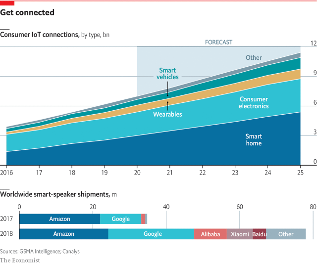

###### Smart homes

# Tech firms think the home is the next big computing platform 

 

> print-edition iconPrint edition | Technology Quarterly | Sep 12th 2019 

FILM BUFFS will tell you that watching a movie on the big screen is a much more immersive experience than watching it at home. But if Matthew Ball gets his way, that might not be true for much longer. Mr Ball—who used to be head of strategy at Amazon Studios, the tech firm’s TV division—spends a lot of time thinking about the future of film and TV. He is especially interested in the possibilities offered by connected, computerised homes. 

Imagine an action film, he says, in which a smart television, equipped with the sorts of gaze-tracking cameras already used in smartphones, can wait until it has a viewer’s full attention before showing a monster leaping out from behind a door. Or a horror film which commandeers a house’s lights and makes them flicker at the appropriate moment, or plays eerie sounds—even whispering the viewer’s name—from speakers in another room. 

For now, Mr Ball admits that such ideas are experimental. But many of the technologies necessary to make them work already exist. Consumers can buy smart light bulbs, such as Hue from Philips, a Dutch electronics giant, which can be switched on or off by phone or voice and can generate thousands of tones and shades. Viewers of “12 Monkeys”, an American science-fiction TV series released in 2015, can download an app that will sync with their light bulbs, automatically changing their colour and brightness to match the mood of an episode moment by moment. 

Consumers can use voice-activated window-blinds and mattresses that track heart rate and sleep patterns 

GSMA Intelligence, the research arm of a mobile-industry trade body, reckons that smart homes will be the biggest part of the consumer side of the IoT (see chart). For now, most of the applications are more prosaic than powering a futuristic home cinema. Besides light bulbs, technophile consumers can use voice-activated window-blinds, robotic vacuum cleaners and mattresses that track heart rate, movement and sleep patterns (and also nag you about your poor “sleep hygiene”). Wifi-connected, camera-equipped fridges can let you check their contents from anywhere in the world. 

 

Security is another popular use, says Alexandra Rehak, who heads the IoT division of Ovum, a firm of tech analysts. Smart doorbells have built-in surveillance cameras and motion detectors. Their users can choose to let visitors in by unlocking the door over the phone. 

IDC, a market-analysis firm, reckons 833m smart-home gadgets of various sorts will be sold in 2019, a number that it forecasts will double by 2023. Most of these devices sell themselves on a combination of comfort, convenience and cost-saving. 

It all sounds good in theory. But Ben Wood, the chief of research at CCS Insight, another firm of analysts, says that installing and maintaining smart gadgets—let alone trying to get them to work together—can be a chore. “It’s a very Heath Robinson kind of patchwork, a jigsaw puzzle of connectivity.” He should know: besides his day job, Mr Wood is a keen tinkerer who has converted his own house into a home smart enough to win a European award in 2017, complete with voice-activated lighting and windows, room-by-room heating, phone-controlled speakers and a camera-equipped door that can be locked or unlocked from anywhere in the world. 

Making it work required installing 2km of network cabling, all of which feeds back into a cupboard containing a set of rack-mounted computers that would not look out of place in a data centre. Another problem is that products from one manufacturer often fail to work well with those from another. Standards do exist: Zigbee and Z-wave are wireless networking protocols designed for the type of low-power radios found in smart-home gadgetry. But many firms either use proprietary standards or implement existing standards in ways that prevent their products working with those from other companies. 

Many companies are involved. Tim Hatt at GSMA Intelligence says that telecoms firms are keen to find new, higher-margin businesses rather than simply acting as “bit pipes”, so they have built smart-home offerings as well. Vodafone, a telecoms company, advertises the V-Home hub as a central control point for smart-home devices. SK Telecom, a South Korean firm, has the Nugu. AT&T, an American company, offers its Smart Home Manager. Others are startups, such as Wink, which launched with backing from General Electric. In Britain, even British Gas, a former state-owned energy monopoly, has got in on the act. It launched Hive, a smart-home ecosystem in 2013. 

That fragmentation means risks for early adopters and highlights some of the problems involved in installing gadgets that rely on external services. Last year Logitech, a Swiss company, stopped supporting its Harmony Link smart hub, which was designed to get smartphones to act as universal remote controls. In 2016 Revolv, a smart-home startup that had been bought by Google, announced that its app and home hub were being abandoned, leaving the firm’s customers high and dry. “My house will stop working,” wrote one disgruntled user. 

The companies best placed to solve the fragmentation problem, and thus to dominate the business, are the existing internet giants—and specifically Google and Amazon, thanks to their lead in the fast-growing smart-speaker market. Until fairly recently, says Mr Wood, the assumption was that smart homes would be controlled from phones. But, he says, the reality is different. “Pulling out your phone, unlocking it, tapping an app, then using it to turn the lights on, is much more complicated and annoying than simply walking across the room and pushing a button”. Voice, he says, is by far the most convenient user-interface. 

Amazon’s Alexa and Google Home, the two firms’ smart-speaker products, already have greater market penetration than rival smart-home hubs. Canalys, a market-research firm, reckons that 78m smart speakers were sold in 2018, more than double the number in 2017, with Amazon and Google accounting for roughly a third each, and products from Alibaba, Xiaomi and Baidu, a trio of Chinese tech giants, making up most of the rest (see chart). According to surveys, around a quarter of American smart-speaker owners already use them to control at least one other device. 

Having a home’s smart gadgets controlled via a central hub simplifies things for consumers. Consumer-goods firms are increasingly keen to ensure that their devices are capable of working with Google and Amazon’s speakers. Many tech firms have set up certification programmes, as well as smartphone-style app stores aimed at third-party developers keen to integrate Alexa and Google Home with their own products. 

The tech firms are chasing two prizes, says Ms Rehak. The first is that, through a combination of standardisation and convenience, those who master the smart-speaker market will come to occupy the same dominant position as Google and Apple do in the smartphone market. 

The second is that connected homes offer a rich seam of data to be mined for consumer preferences. “What these companies are really good at is making use of data to sell you things you think you want,” she says. Smart televisions report the programmes their users are watching. A camera-equipped fridge might reveal useful information on its owners’ eating habits. Even simple data on when the lights are on can reveal occupancy patterns, or when a home owner is awake or asleep. There are already reports of arguments between smart-device makers and the tech giants over who has access to those data, and how much must be collected. 

As for consumers, Ms Rehak thinks that many are still ignorant about the basic trade-off of the smart-home model, in which a service is provided in return for “collecting a whole bunch of personal data”. Even among the cognoscenti, there are differing opinions. “I love this stuff,” says Mr Wood. “But I have some colleagues who refuse to have any of these things in their houses at all.”■ 

