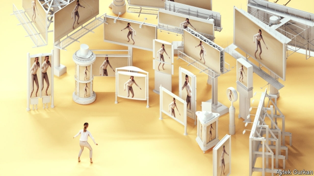
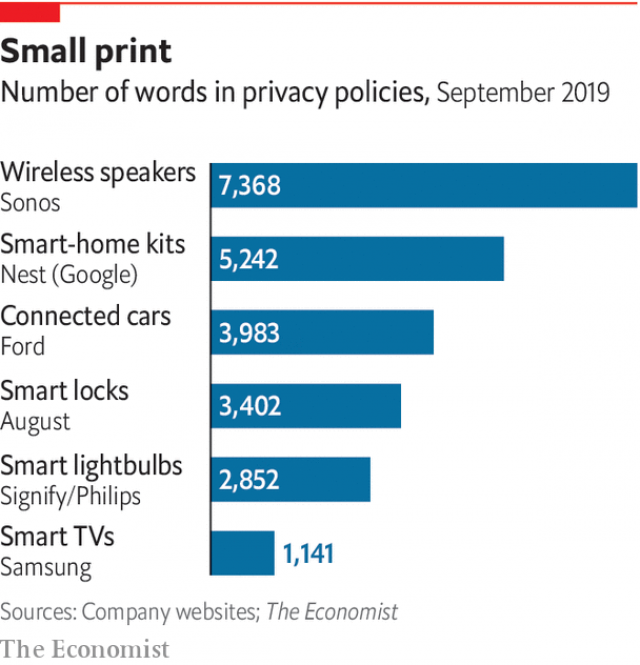

###### Connected future

# The Internet of Things will bring the internet’s business model into the rest of the world 

 

> print-edition iconPrint edition | Technology Quarterly | Sep 12th 2019 

IN JULY THE Bank of England announced that its new £50 note would carry a picture of Alan Turing, a British mathematician widely regarded as the intellectual father of computer science. Along with excerpts from a seminal paper in 1936 and a binary representation of his date of birth, the new note contains a quotation from 1949, when only a handful of computers existed in the world. “This is only a foretaste of what is to come,” it begins. 

Turing’s remark remains true today. Computers have already changed the world in ways that their inventors could never have imagined. Turing could no more have predicted Instagram celebrities and high-frequency trading than Karl Benz, an automotive pioneer, could have predicted suburbs and strip malls. And that is in a world with tens of billions of computers. If predictions about the IoT are correct, that number could rise a hundred-fold. 

Clues about what is to come can be glimpsed in changes that have already happened. In the quarter of a century since the internet first became a consumer phenomenon, it has upended businesses. Data are the currency of the online world, gathered, analysed, sold and occasionally stolen in a business model that has built some of the world’s most valuable companies—but which is attracting increasingly unfriendly scrutiny from governments and regulators, and which its critics decry as “surveillance capitalism”. 

Ubiquitous computing offers the companies which master it the ability to mine data from the real world in the way that big tech firms now mine them from the virtual one. The result will be a slow-burning revolution of quantifiability in which knowledge that used to be fuzzy or incomplete or even non-existent becomes increasingly precise. That will give rise to what sports coaches call “marginal gains”. A 10% decrease in costs or a 15% cut in energy use are individually unexciting. Put enough of them together, though, and they will amount to a revolution in productivity. 

This will change how companies operate. In a world in which more things are computerised, more companies will come to resemble computer firms. In expensive, high-tech industries, where the economics of the IoT have made sense for decades, the results of this are already visible. Rolls-Royce, a big British maker of jet engines, launched its “Power by the Hour” service in 1962, offering to maintain and repair its engines for a fixed cost per hour. Its digital transformation began in earnest in 2002, built around the ability to do continuous, real-time monitoring of its products. Real-time data mean that the firm’s engineers can watch engines wear out as they fly. When something needs fixing, they can arrange for repair teams to be waiting on the ground. The firm’s data offer flying tips to pilots that can result in fuel savings worth hundreds of thousands of dollars. 

A changing business has meant a changing culture. The firm now hires computer programmers as well as aeronautical engineers. It has an internal software division, called r2 Data Labs, which is run like a startup, to look for new ways to turn the flood of data into new businesses. It even plans to remodel parts of its industrial-looking campus, replacing the low brick buildings with the manicured-lawn-and-mirror-glass architecture popular in Silicon Valley. After all, says Andrew Hutson-Smith, the chief business officer of r2, “We’re competing with Facebook and Google for staff.” 

Rolls-Royce is not alone. General Electric, its chief rival in the jet-engine business, offers similar services. As costs falls, the model will spread. At an IoT conference in London earlier this year, companies from TVH, a Belgian firm that makes forklifts and industrial vehicles, to ABB, a Swedish heavy engineering firm, were lining up to describe the benefits of what Alexandra Rehak, an IoT expert at Ovum, a firm of analysts, describes as “servicisation”. 

If ubiquitous computing will turn companies of things into companies of services, the IoT will transform consumers of things into computer users, with all that implies. Like social networks or email, smart gadgets offer convenience and comfort, at the price of turning everything done with them into fuel for an ever more pervasive data economy. 

Smart televisions already watch the users watching them, sending back data on programme choices and viewing habits; some even monitor background conversation. These data, sold on to advertisers and programme-makers and crunched by machine-learning systems, subsidises the price of the televisions themselves (which explains why non-connected, “dumb” televisions have become very difficult to buy). Consent is murky. In 2017 Vizio, an American TV-maker, was fined $2.2m by the Federal Trade Commission after regulators found it was not properly seeking users’ permission to harvest and resell information on viewing habits. 

 

Nor is it just televisions. Smart scales monitor weight and fat percentage, a gold mine for the fitness industry. IRobot, maker of the Roomba line of robot vacuum cleaners, caused a furore in 2017 when it revealed plans to share the maps its products build up of users’ homes with Google, Amazon or Apple (it has since said it would not share such data without its users’ explicit consent). Gadgets from high-tech locks to new cars come with privacy policies running to thousands of words (see chart). 

Refuseniks might choose not to put such gadgets in their home. But outside, in public places, they will be surveilled anyway. The advertising industry is already experimenting with “smart” billboards, which can use cameras and facial-recognition software to assess people’s reactions to their contents. Hundreds of American police departments can request access to video recorded by Ring, an Amazon subsidiary that makes camera-equipped doorbells. Internal company emails also show Ring providing suggested talking points for police officers to help them persuade homeowners to buy its products, and to allow their recordings to be shared. The American Civil Liberties Union, a campaigning organisation, complains that the result is a half-private, half-public, murkily regulated video-surveillance network. 

Consumers may discover other downsides. Computerisation allows data to flow from users to companies, but it also allows power and control to flow in the other direction. Most smart-home services require a durable connection to remote servers that can fail without warning. Apple is famously unwilling to allow its customers to have broken iPhones repaired anywhere except in its own shops, going so far as to use software updates to disable replacement touchscreens installed by cheaper third-party fixers. John Deere, an American tractor-maker, has spent four years facing down a rebellion from farmers angry at being subject to similar restrictions. Its products have become so computerised that the firm has argued that farmers no longer own their tractors, but merely purchase a licence to operate them. 

If the IoT continues along these lines, it has the potential to reshape the entire world in Silicon Valley’s image. One reading of the history of the internet is that, for all the hand-wringing about privacy and control, they are dogs that have never truly barked. The rise of surveillance capitalism proves that, in the end, consumers are willing to trade their data for the products and conveniences that it offers. A survey in 2016 by the Interactive Advertising Bureau, a trade body, reported that 65% of IoT users seemed happy to see advertising on their devices, presumably in return for lower prices. 

Another reading, though, is that the business models of the internet established themselves early, at a time when neither regulators nor consumers properly understood the technologies underlying them, and when not even the most avid techies could have predicted all their implications. 

These days, things are different. Blamed for everything from addicted children to nurturing terrorism, Big Tech has lost its Utopian shine. That disillusionment has fed back into gloomy predictions about the IoT. In many ways, that is valuable, for if problems can be foreseen they can be more easily prevented. But if the techno-optimism that infused the 1990s and 2000s now looks naive, the techno-pessimism that is fashionable today can be similarly overdone. Like the original internet, the IoT promises huge benefits. Unlike the original internet, the IoT will mature in an age that has become sceptical about where a connected, computerised future might lead. If it has to earn the trust of its users, it will be the better for it in the long run. ■ 

