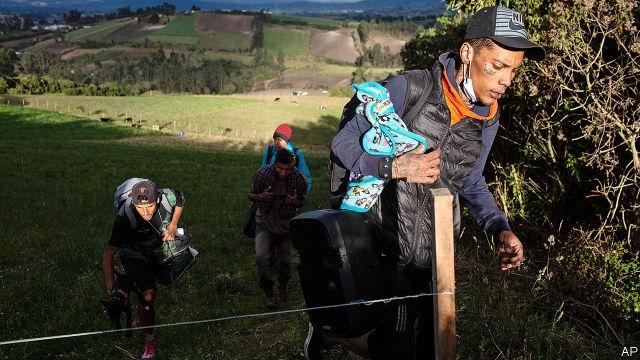
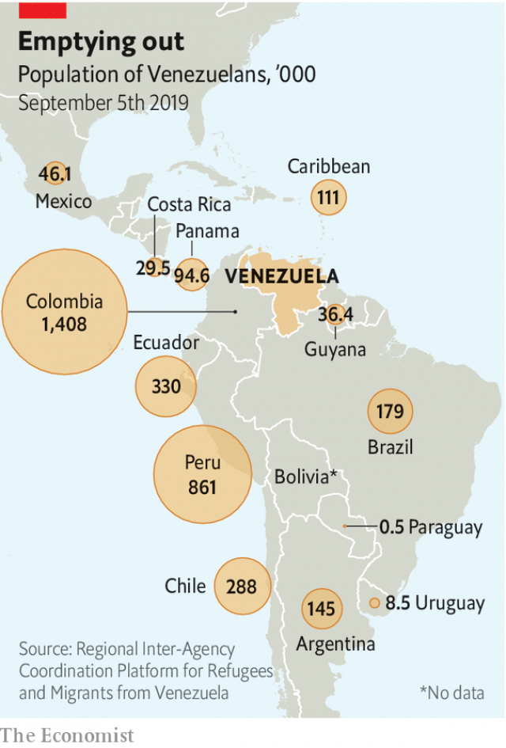

###### Darkness falls

# Millions of refugees from Venezuela are straining neighbours’ hospitality 

 

> print-edition iconPrint edition | The Americas | Sep 12th 2019 

KATALINA, A 20-YEAR-OLD nursing student from Barquisimeto in north-western Venezuela, fled last year as living conditions became intolerable. She spent 11 months in Peru, but her hosts were hostile towards Venezuelan migrants, especially women, and she found little work. So in June she moved to Chile, arriving just as its government tightened rules for Venezuelans entering the country and began expelling those without the right papers. She sneaked across the border at night, dreading that she would step on a landmine planted by Chile in the desert in the 1970s. Now she is staying with a friend in Santiago, Chile’s capital, waiting for permission to remain. “All I want is for my situation to be regularised,” she says. 

Katalina’s obstacle-strewn odyssey is becoming the norm for Venezuelans joining the 4m who have fled since 2014. Perhaps half a million more have not been counted because they sneaked across borders. On August 26th Ecuador became the latest country to tighten entry requirements, joining Peru and Chile in obliging most Venezuelans to present a passport and evidence of a clean criminal record, which are difficult to obtain. Brazil and Colombia have so far kept their borders open. 

Barriers will not stop Venezuelans from fleeing chaos and repression at home. The exodus could exceed 8m, a quarter of the population, by the end of 2020 unless democracy and stability return, predicts the Brookings Institution in Washington (see Bello). Even then, not everyone will go back; those who do will take time. “We are looking at a complex set of needs for the next two years, even if there is a political solution today,” says Eduardo Stein, the representative for Venezuelan migrants of the UN’s refugee agency and the International Organisation for Migration. 

 

Until now, the largest displacement of people in Latin America’s history has occurred without much international fuss. In part that is because it has taken place mostly by land, unprompted by war or natural disaster. Four-fifths of migrants have stayed within the region (see map). The good grace with which most neighbouring countries have received them up to now has allowed others to ignore the crisis. Outside donors have given just $100 for each Venezuelan migrant, compared with $5,000 for each of the 5.6m refugees from Syria. 

But as Venezuela’s crisis has dragged on, destination countries are withdrawing their initial warm welcome. Recent refugees are poorer than those in earlier waves. They are arriving in countries where economic growth is slow, good jobs are scarce and budgets for health and education are stretched. Early promises to co-operate in dealing with the flow of migrants are being broken. Door-slamming adds to the number of unlawful migrants, who are vulnerable to exploitation by employers and recruitment by criminal groups. 

It increases the burden on Colombia, which remains the most open of the destination countries. That is partly because it cannot police its 2,200km (1,400-mile) border with Venezuela. The influx adds to disorder on a frontier already plagued by Venezuelan-backed guerrilla groups. Now Colombia must cope with a build-up on its southern border of refugees who had hoped to enter Peru and Ecuador. Although Venezuelans are likely to boost economic growth in their new countries, few governments appreciate the opportunity. 

Destination countries have largely avoided setting up camps, wisely preferring to integrate Venezuelans into their societies. Brazil is relocating migrants from the border state of Roraima to cities farther south. Venezuelans do all kinds of work. Three-fifths of people who took Chile’s medical exam in July were Venezuelan doctors seeking recertification. In Colombia Venezuelans ease labour shortages in the flower and coffee industries. 

More visible are those who appear at street corners to sell sweets or beg. Unskilled workers swell the informal labour force, in countries where a huge proportion of jobs are informal. Many women in Trinidad find work in bars and clubs, sometimes a gateway to prostitution. In Boa Vista, Roraima’s capital, the population of 400,000 now includes more than 50,000 Venezuelans. “We lost control of the city,” says its mayor, Teresa Surita. Homelessness in towns on Colombia’s border with Venezuela has shot up. 

Though they are letting in fewer Venezuelans, governments are trying to provide services to those who have already arrived. That is a struggle. Hospitals in Roraima have staff shortages, in part because Cuba recalled its doctors in the face of hostility from the country’s right-wing president, Jair Bolsonaro. Colombia’s government estimates that the cost of providing health care, schooling and other services to Venezuelans will be 0.5% of GDP this year, about a fifth of its expected budget deficit. Ecuador, whose highly indebted government has had to go to the IMF for financial help, will spend $170m a year on health and education for holders of an “exceptional humanitarian visa” and Venezuelans who arrived before the visa rule took effect. 

“People used to feel sorry for [Venezuelans], but now there’s fear of crime,” says Amparo Goyes, a resident of Tumbaco, a suburb of Quito, Ecuador’s capital. In January the stabbing of a pregnant Ecuadorean woman by her Venezuelan ex-boyfriend triggered attacks on migrants in the northern city of Ibarra and contributed to the decision to tighten entry requirements. A survey by Peru’s government found that 86% of Peruvians expect to be the victim of a crime in the coming year. 

Such strains are hardening attitudes. A Gallup poll published in June showed that support among Colombians for accepting refugees fell below 50% for the first time. Venezuelans’ “negative image” rose to 67%, its highest-ever level. A survey of Chileans by CADEM, a pollster, published in July found that 73% approved of the government’s crackdown and 83% backed restrictions on immigration. In Trinidad opposition politicians have called for tighter controls on Venezuelans. 

Colombia does not have that option. It has been an exemplar, issuing permits that allow 700,000 Venezuelans to work and receive public services for at least two years. It plans to issue a permit for migrants without the right papers, allowing them to stay if they find an employer. In March most parties with members in congress signed a pact promising not to stir resentment against Venezuelans in campaigns for regional elections due next month. 

But its neighbours’ new barriers are making Colombia nervous. A senior official says co-operation among destination countries started well, but in the past four months it has moved backwards. Colombia recently asked its neighbours to open a “border-to-border humanitarian corridor”. Ecuador agreed to let through migrants with visas for other countries. The UN has urged all countries in the region to give Venezuelans the rights of refugees, on the presumption that staying at home puts them at risk. 

The one thing receiving countries all agree on is that they need more outside help. The UN has collected less than a third of the $738m it sought in 2018, mostly from the United States. At the UN General Assembly this month, Colombia’s president, Iván Duque, will lead a regional appeal for more. “Unfortunately, the world has not seen this as a global crisis,” says David Smolansky, an exiled Venezuelan mayor who leads the migrant working group of the Organisation of American States. If Latin America is to continue coping as well as it has, that must change. ■ 

