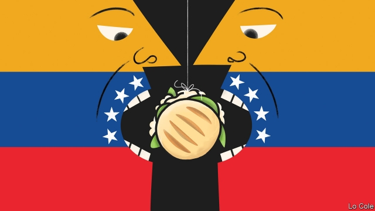

###### Bello

# Negotiating a way out of Venezuela’s morass 

 

> print-edition iconPrint edition | The Americas | Sep 12th 2019 

GIVEN THAT their home country was built on oil, it is appropriate that the social hub of Venezuelan exiles in Miami should be a diner at a petrol station. El Arepazo is in Doral, a suburb near Miami’s international airport with a golf resort belonging to President Donald Trump. It is a shrine to a Venezuela lost. It is wallpapered with blown-up black-and-white photos of Caracas in the 1950s and 1960s. Along with strong coffee it sells arepas, the cornmeal griddle-cakes that are a Venezuelan staple. 

Morale among the clientele is sagging. “Trump is deserting us,” says Pedro Pereira, who abandoned his dairy farm near Lake Maracaibo in 2017 because of threats, extortion and chronic shortages of electricity and animal medicines. He was full of hope in January this year when Juan Guaidó, the head of the national assembly, proclaimed himself interim president and was recognised by 55 countries who shared his view that Nicolás Maduro’s second term as Venezuela’s ruler is illegitimate. “But everything was just words,” fumes Mr Pereira. Like many exiles, he favours an American invasion, citing the one that dislodged Manuel Noriega, a Panamanian strongman, in 1989 at the cost of about 300 civilian dead. 

But Venezuela is far bigger than Panama, its regime is better armed and it has Cuba and Russia as allies. Despite much bluster from American officials earlier this year (“all options are on the table”), there is no sign that Mr Trump, a war-averse president, has any intention of invading. Instead, to restore democracy in Venezuela his administration trusts in sanctions, ramped up to target Mr Maduro’s oil exports and finances as well as 118 regime officials. The confident expectation in the National Security Council (NSC) in Washington was that they would quickly cause the army to turn on its boss. 

It hasn’t happened. And on September 10th the NSC’s hawkish chief, John Bolton, was sacked. But the economic squeeze did prompt Mr Maduro, who rules as a repressive dictator, to start seemingly serious talks with the opposition under the auspices of Norway’s government. In late July, according to several sources, the government delegates agreed to an early presidential election next year. On August 5th the United States slapped on additional sanctions without consulting the opposition. The Venezuelan government said it was “suspending” the talks. 

This does not mean they are dead, though some in the Trump administration have never believed in them. Elliott Abrams, the State Department’s special representative for Venezuela, says: “We’re not trying to torpedo the talks. We think our policies have made the talks possible.” His position in the administration has been strengthened by the failure of the NSC to oust Mr Maduro, and by Mr Bolton’s firing. But several obstacles remain. 

Top of the list is the position of Mr Maduro in a transition. “There’s no way to hold a free election with him in power,” says Mr Abrams, adding that Mr Maduro could be a candidate. Hardliners on both sides might reject whatever negotiators agree to. Then there are Mr Maduro’s allies. Russia has reportedly sent security specialists to Venezuela. The Trump administration has given Cuba no incentive to help dislodge Mr Maduro, having stepped up sanctions against the communist island in what looks like a bid to secure the Cuban-American vote in Florida. 

Critics of American policy point out that sanctions have never toppled determined dictators. Although the humanitarian crisis in Venezuela is of Mr Maduro’s making, the longer sanctions last the more they will add to it. But what is the alternative? Even if a military coup were possible, “we know that a negotiated solution is more likely to produce a stable democracy,” says Mr Abrams. He is frustrated that the European Union has not widened sanctions on individuals in order to make agreement easier. 

Mr Maduro’s people are likely to agree to a transition only if they have credible guarantees that they will not be jailed or expelled from politics. Rather than an amnesty, that means a national-unity government in which they have sufficient power to protect themselves, argues an experienced former American diplomat. “All negotiated transitions have involved guarantees for the losers.” 

Without such an agreement, El Arepazo’s customers may be in for a long wait. Beside the café, groups of men sit at tables under an awning playing dominoes. The scene could be that on Miami’s Calle Ocho, where the Cuban exiles’ domino games have lasted 60 years. 

