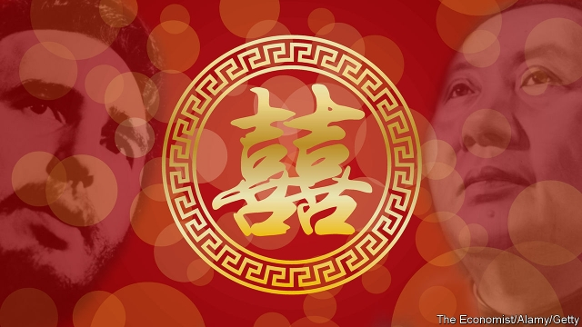

###### Double happiness

# What a new Chinese restaurant in Havana says about Cuba 

 

> print-edition iconPrint edition | The Americas | Sep 14th 2019 

A PHOTO OF Fidel Castro, the late Cuban dictator, shaking hands with Xi Jinping, China’s living one, hangs in the entrance to the newly opened “Beijing” restaurant in Havana. Around it are snapshots of Chinese and Cuban bigwigs past and present. One from 1961 shows a smiling Mao Zedong and Osvaldo Dorticós Torrado, then Cuba’s president, on a balcony. On a flight in 2014 from Havana to Santiago de Cuba, the birthplace of Cuba’s revolution, Mr Xi promised Raúl Castro, then its president, a fine Chinese restaurant. That visit, too, is memorialised in the vestibule. 

It took five years, and millions of dollars in rent and renovation, before the Beijing was ready to serve its first dandan noodles. It opened in August at last, two years later than planned. Even when the Chinese and Cuban autocrats bless the enterprise, doing business in Cuba is hard. 

The restaurant, which was the first firm in Cuba to be wholly owned by a foreign one (state-owned Beijing Enterprises Group, or BEG), has long mystified habaneros. They watched as Chinese builders refurbished the structure, which was built in the 1930s. Fussy building inspectors and slow clearance of equipment and ingredients through customs held up its opening. 

Now Chinese executives, ferried to the portico in German cars, enter through circular front doors painted with a huge red shuang xi, which means double happiness. The phrase is often emblazoned on cash-stuffed red envelopes given as wedding presents. Small fans display table numbers. (There is no table four, an inauspicious number in China.) Cuban waitresses dressed in red qipao—high-necked dresses—take orders on tablets made by Huawei, a controversial Chinese maker of telecoms kit. 

Cuban complications intrude. Unlike eateries in China, where diners can pay by reading a barcode on the table with their mobile phones, the Beijing accepts only cash. It aims for authenticity, but must buy most ingredients through Cimex, the state-run export-import company. Ducks for Peking duck come from Canada. Their skin is thicker than that of Chinese ducks, and so does not become as crispy, explains Li Sha, who helps run the restaurant. The sweet-and-sour fish is Cuban pargo (red snapper), not mandarin fish. Though tasty, it is a clumpier meat that resembles fried cauliflower. Egg and tomato stir fry is off the menu because the chefs cannot buy enough eggs and tomatoes. Although BEG owns Yanjing, a Chinese brand of beer, do not assume you can order it to wash down your spicy cumin lamb. Crates of it await clearance through the ports. 

Despite gastronomic glitches, BEG plans investments in Cuban hotels, condominiums and a golf course. The Trump administration’s hostility towards Cuba and economic chaos in Venezuela, Cuba’s main foreign backer, are strengthening its relationship with China. The country is Cuba’s largest creditor. A fleet of Chinese-made trains—the first Cuba has bought in 45 years—arrived in May. A $150m loan from China helped pay for them. Most of the vehicles joining elderly classic American cars on Cuba’s roads are made by Geely, Yutong and other Chinese brands. The machinery that is gradually replacing cow-drawn ploughs, still the usual method of tilling Cuban fields, is made in China. Huawei routers provide the outdoor hotspots that make it possible for Cubans to go online. 

So far, China has profited little from its friendliness. From 2000 to 2018 it forgave $6bn of Cuban debt, about 60% of the total foreign debt that it wrote off during that period, according to Development Reimagined, a consultancy, and the student-run Oxford China Africa Consultancy. The two communist states may be in for a period of double disappointment.■ 

