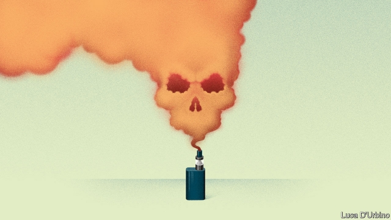

###### Vaped and confused

# A deadly outbreak casts a dark cloud over e-cigarettes 

 

> print-edition iconPrint edition | United States | Sep 14th 2019 

WITH SIX PEOPLE dead and more than 450 suffering from serious pulmonary disease across America, doctors and federal officials are trying to identify the cause of a mystery illness tied to e-cigarettes. Although the dead have largely been older, the wider outbreak is unusual in hitting young and otherwise healthy people. A recent study of 53 cases in Illinois and Wisconsin found the median age was just 19. 

Much of the investigatory work is focused on agents that may have been added to illicit black-market cartridges containing cannabis extracts. On September 9th health officials in New York issued subpoenas to firms selling thickening agents, such as vitamin E, used in black-market vaping products. Then on September 11th the Trump administration announced plans to ban flavoured vaping products. 

Although the Centres for Disease Control (CDC) has recommended that people should stop vaping until the source of the outbreak is identified, the Food and Drug Administration (FDA) has issued different advice. The FDA—now conducting product testing to work out the source of the problem—has advised consumers to avoid buying vaping products on the street and to stop vaping with products containing cannabis. This warning includes products bought legally in states that allow cannabis to be sold. 

Many of the patients have similar symptoms. Daniel Fox, a pulmonologist with WakeMed, a health-care system in North Carolina, says a small cluster of cases in his state had symptoms such as shortness of breath, nausea, vomiting and fever. All had consumed cannabis by vaping. Dr Fox says the diagnosis was lipoid pneumonia, a rare non-infectious condition that occurs when oils or lipid-containing substances enter the lungs. The finding that immune cells in the lungs have oil inside them also indicates that oil is causing the injuries. 

The current outbreak is acute and seems to be a reaction to something toxic found mostly in illicit products. But the news could not come at a worse time for vaping firms. They are under pressure for marketing e-cigarettes to children, enticing them with fruit flavours. The National Youth Tobacco Survey found that e-cigarette use among high-school pupils increased by 78% between 2017 and 2018, from 11.7% to 20.8%. Among American teenagers, e-cigarettes are now the most commonly used tobacco product. Bloomberg Philanthropies said this week that it would spend $160m to discourage their use by the young. The non-profit organisation will back the end to flavoured e-cigarettes. 

The FDA is on the warpath, too. On September 9th it sent a warning letter to Juul Labs, an e-cigarette firm in San Francisco, about its marketing. The FDA wants companies to show evidence that vaping is less harmful than smoking cigarettes before claiming as much—a message the agency says Juul has given to students. Gregory Conley, president of the American Vaping Association, a non-profit group, called the letter a “colossal” waste of resources aimed at appeasing congressional Democrats. 

Although public concern over marketing and sales to children is understandable, vaping by adults trying to quit or reduce smoking needs to be put in perspective. E-cigarettes have been on the market around the world for over a decade and are used annually by about 11m adults in America. Legal, regulated vapes typically use a water-soluble solvent, as putting oil in the lungs is known to be dangerous. While e-cigarettes are not harmless, evidence from trials suggests that vaping causes no serious short-term harm, though in the long term it may. Public-health experts are also keen to point out that vaping is less harmful than smoking, contrary to the FDA’s scepticism. 

Peter Hajek, an expert on tobacco dependence at Queen Mary University of London, says the scare is being used to deter cigarette smokers from switching to less risky vapes. Overall, 450,000 smokers die each year in America. Dr Hajek said the current outbreak of serious lung disease is more like the methanol poisoning that occurs when contaminated alcohol is sold. These are unusual, but can be deadly. Despite the evidence, in the unfolding panic, facts are the first thing to go up in smoke. ■ 

