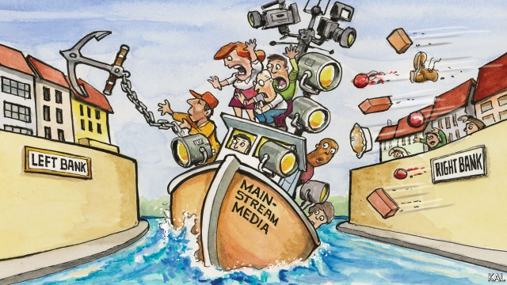

###### Lexington

# A full-court press 

 

> print-edition iconPrint edition | United States | Sep 12th 2019 

NOTWITHSTANDING THE help he got from fake news reports, Donald Trump probably owes his presidency more to the traditional kind. Only a small minority of voters absorbed made-up accounts of Hillary Clinton’s endorsement by Islamic State, lesbianism and links to a child-sex ring. Yet most were subject, indirectly or directly, to an incessant drumbeat of negative reporting by mainstream outlets such as the New York Times, Washington Post and network news channels on the Democratic candidate’s wooden public speaking and the largely confected scandals she was said to be embroiled in. 

In a multi-part study of the media’s role in the election, Thomas Patterson of Harvard’s Kennedy School of Government found that Mrs Clinton’s use of a private email account at the State Department, among lesser supposed scandals, received four times as much coverage as Mr Trump’s alleged record of harassing women. That unrelenting focus opened the gates for Mr Trump’s wilder attacks on his opponent. It also helped persuade many voters, who had initially balked at the Republican’s character, that the two candidates were comparably flawed. “If everything and everyone is portrayed negatively, there’s a levelling effect that opens the door to charlatans,” wrote Mr Patterson. 

Could history be about to repeat itself? Hostile coverage of Joe Biden’s presidential campaign suggests it might. The septuagenarian former vice-president is increasingly coming across in the same mainstream outlets as outdated, forgetful and sloppy with the truth. The question of his relative fitness for Mr Trump’s office, by contrast, has rarely surfaced. Last month an inaccurate account Mr Biden gave of a conversation with a war hero—in which he conflated exchanges with two different medal-winners, mashing up their heroism—made the Washington Post’s front page. Meanwhile the paper consigned to page ten the president’s use of a crudely doctored government map to try to justify his false and apparently politically motivated insistence that Alabama lay in the path of a hurricane. Such coverage will exacerbate an existing argument among left-leaning journalists and academics over whether America’s mainstream journalistic traditions, which strive for non-partisanship and balance, can handle such an unconventional figure as Mr Trump. 

It was evident in the leaked transcript of a meeting of the New York Times newsroom last month, in which the paper’s executive editor, Dean Baquet, fielded criticism from reporters who wanted to call the president a “racist” more unambiguously and often. Mr Baquet pushed back because—as a native of the segregated South—he said the word lost its power with frequent use. In a subsequent interview he suggested that preserving the Times’s hard-pressed reputation for non-partisanship was another concern. “We don’t want to change all our structures and rules so much that we can’t put them back together—we don’t want to be oppositional to Donald Trump.” 

Yet that is what many left-wing commentators, and perhaps a good few in Mr Baquet’s newsroom, want. Some consider the risk of becoming aligned with the Democratic Party worth running in an effort to give the most accurate measure of Mr Trump’s failings. Others just want to be aligned with it, either out of political conviction or, as Nathan Robinson of Current Affairs magazine has argued, because they also believe the increasing strain apparent in the mainstream outlets’ claim to be non-partisan is undermining public trust in them. Only by being more upfront about their leanings, as the Republican Party moves to the right and their newsrooms to the left, it is argued, can such outlets hope to restore it. 

Without wishing to minimise the challenges of covering American politics—with which this newspaper also grapples, not always successfully—these arguments should be dismissed as the attempted left-wing power-grab they are. The media has much less potential to give Mr Trump an unwarranted advantage over his opponent next year than it had in 2016. The election is likely to be a referendum on his presidency, not a face-off between two novel candidates, and most voters have already made up their minds on that. This is not ground for emergency media measures. 

Americans’ calamitous loss of trust is also fuelled by the extreme partisanship that has made their politics and related institutions so dysfunctional. The fact that a dwindling number of mainstream outlets have retained readers and viewers from both sides of the divide makes them, despite their imperfections, the closest thing to a neutral arbiter going. This was underlined by a study suggesting Mr Trump performed best in 2016 in areas with the lowest levels of subscription to newspapers, whether of the centre-left or centre-right. A more partisan media environment is the last thing America needs. Those who doubt that should consider that it would be squarely in Mr Trump’s interest. The president’s attempt to gin up his supporters by depicting the media as biased is one of his most powerful lines. Why vindicate it for him? 

Retrofitting American political journalism to defend it against populists—to which, mind, the left has historically been as susceptible as the right—calls for more modest change. It should start with an acknowledgment that the country’s style of election coverage can seem frivolous—especially compared to the rigour of its reporting on government. The characteristic features, including an obsessive focus on the candidate’s personality and details of the campaign—especially glitches—are as entertaining as any soap-opera, but rarely useful in appraising the relative merits of a politician’s qualities for public office. This is a lesson with broad application. Mr Trump’s relentless attacks on America’s institutions have, by and large, done damage only where he has hit on some pre-existing weakness. For those who would defend them, steely self-criticism may be more effective than outrage.■ 

