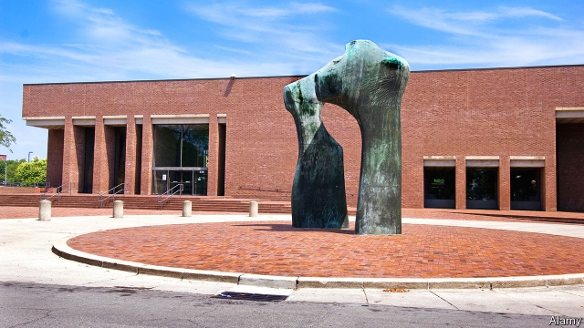

###### I.M.probable

# A small Indiana town boosts its big architectural legacy 

 

> print-edition iconPrint edition | United States | Sep 12th 2019 

YEARS BEFORE I.M.Pei designed the Louvre Pyramid in Paris or the Bank of China Tower in Hong Kong, he planned a squat yet elegant library in a midwestern city of 50,000 people. In Columbus, Indiana, Pei’s Modernist Cleo Rogers Memorial Library sits across 5th Street from Eliel Saarinen’s First Christian Church. The imposing glass-fronted structure is only the second-most attractive of Saarinen’s churches in Columbus. North Christian Church, with its slender spire and vaulted concrete interior, takes pride of place. Across town, the white bricks of Robert Venturi’s Fire Station 4 recline in a sly number four. 

Some argue that America’s best city for architecture is Chicago. Others favour Miami’s Art Deco legacy, the dilapidated elegance of New Orleans or the jumbled cosiness of San Francisco. But to see the greatest collection of Modernist masterpieces in the smallest space, fly to Indianapolis and drive south-east for about an hour to Columbus, the Hoosier State’s 21st-largest city and birthplace of America’s vice-president, Mike Pence. 

It was also home to Joseph Irwin Miller, a native son who built the Cummins Engine Company into an industrial powerhouse. In the middle of the last century, he began commissioning rising young architects to design the city’s public buildings in the hope of attracting young engineers to southern Indiana. 

The town boosts its legacy in Exhibit Columbus, an annual festival that alternates between a symposium and installations across town. This year’s 18 installations include a garden between Pei’s library and Saarinen’s church, and a glass and carbon-fibre tower outside the other Saarinen church. 

But Columbus also showcases its legacy in the care paid to design in its elegant downtown. Across from a school designed by Gunnar Birkerts sits a Lutheran church. Parishioners liked his work so much they hired him to build an addition. The University of Indiana recently opened an architecture school in an old newspaper building; two professors designed a set of lattice panels leading to the front door. Miller did not just give his home town some important buildings. He gave it an identity. 

